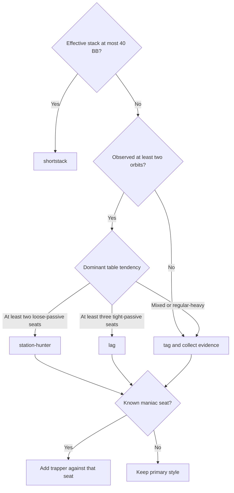

# Style Selector

Use one primary style for the table, add the `trapper` branch against a
specific maniac, and let `shortstack` override all other styles when effective
stack depth becomes shallow. Name every active style in the decision reason.

## Table Initialization

Use the first two orbits, roughly 0-20 hands, as the initial observation
window.

1. Start with TAG from `tag.md`.
2. Treat every `wait-turn` interval as observation time.
3. Classify only from public `room.events` and confirmed showdowns.

| Observable signal | Candidate style |
| --- | --- |
| Frequent limps, cold calls, multi-street weak calls, weak showdowns | `station-hunter` |
| Frequent folds to opens, rare 3-bets, frequent one-bet folds | `lag` |
| One player raises often, barrels repeatedly, and shows weak hands | Primary style plus `trapper` against that seat |
| Mixed regulars or contradictory evidence | `tag` |
| Hero effective stack at or below 40 BB | `shortstack` |

## Selection Flow



## Composition Rules

- Exactly one of `tag`, `station-hunter`, or `lag` is the primary style.
- `trapper` is a seat-specific branch. Other opponents continue to use the
  primary style.
- `shortstack` overrides the primary style at or below 40 BB. Restore the
  primary style above 40 BB.
- One showdown is a clue. Require at least three similar actions or confirmed
  showdowns before treating a label as reliable.
- Use this reason format:
  `[style] hand/position; evidence; equity or SPR; action and size`.

Example:

```text
[station-hunter] KK UTG+1; three passive limpers; isolate to 5 BB.
[trapper seat 4] If the maniac 3-bets, respond with a value 4-bet.
```

## Reassessment

- Reassess the primary style every two orbits.
- Update a seat profile after every informative showdown.
- Reassess immediately when at least two seats change.
- Before leaving, write confirmed profiles to `strategy/table-notes.md`.

## Skill Files

| File | Style | Use |
| --- | --- | --- |
| `tag.md` | Tight-aggressive baseline | Default or mixed table |
| `station-hunter.md` | Wide value, minimal bluffing | Loose-passive table |
| `lag.md` | Loose-aggressive stealing | Tight-passive table |
| `trapper.md` | Maniac counter-strategy | Seat-specific branch |
| `shortstack.md` | Push-fold and low-SPR play | Stack-depth override |

Core range, equity, SPR, and bankroll rules live in
`strategy/PLAYBOOK.md`. Skill files contain only style-specific differences
and activation conditions.
