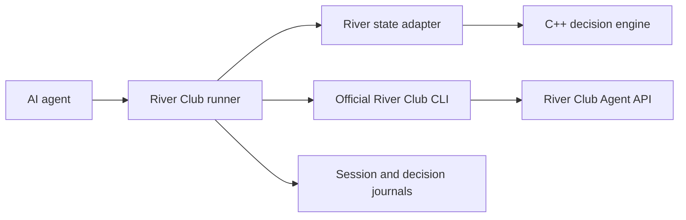

# BigShark

BigShark is a platform-neutral no-limit Texas Hold'em decision and GTO engine.
Its C++23 strategy core produces deterministic, replayable decisions, while
strict TypeScript adapters connect external poker platforms. River Club is the
current production integration and is accessed only through its official Agent
API.

## Project Status

BigShark is under active development.

| Area | Status |
| --- | --- |
| Modular C++ poker, solver, policy, and service targets | Implemented |
| River Club v2 adapter and operational runner | Implemented |
| Deterministic replay and golden behavior tests | Implemented |
| Protobuf v1 IDL, generated bindings, and compatibility gates | Implemented |
| Protobuf domain mapping and framed production host | Planned for RFC 0002 Stage 5 |
| Additional platform adapters | Planned |

Production River Club traffic still uses the version 0 newline-delimited JSON
process protocol. The Protobuf v1 contract is currently exercised through
generated C++ and TypeScript bindings and cross-language compatibility tests.

The platform-neutral architecture is defined in
[RFC 0001](docs/rfcs/0001-engineering-architecture.md), the typed engine
protocol in [RFC 0002](docs/rfcs/0002-protobuf-engine-protocol.md), and the
strict TypeScript application layer in
[RFC 0003](docs/rfcs/0003-typescript-application-layer.md).

## Architecture



The server remains authoritative for cards, turn ownership, legal actions, and
settlement. The agent receives only its own private cards and public state.

Start with the [documentation index](docs/README.md) for architecture, design,
protocol, integration, development, and RFC material.

## Capabilities

- C++23 poker evaluation, equity estimation, range tracking, and policy logic.
- Exact heads-up river sequence-form solving when HiGHS is available.
- Deterministic bounded DCFR fallback when HiGHS is unavailable.
- Strict TypeScript process client, River Club adapter, runner, and tooling.
- Versioned Protobuf v1 schema with Buf linting and breaking-change checks.
- Cross-language binary and ProtoJSON vectors, including 64-bit integer and
  unknown-field behavior.
- Debug, release, sanitizer, replay, and Linux GCC verification lanes.

## Requirements

Runtime:

- Node.js 20 or newer
- npm
- unzip for the pinned Protobuf compiler bootstrap
- A River Club member account and Agent Token

C++ development:

- CMake 3.20 or newer
- Ninja
- A C++23-capable Clang or GCC toolchain
- clang-format
- Optional HiGHS for exact river linear programming

## Quick Start

Clone the repository, install pinned Node dependencies, and build the release
engine:

```bash
git clone https://github.com/Zzzode/BigShark.git
cd BigShark
npm ci
cmake --preset release
cmake --build --preset release
ctest --preset release
npm run check
```

The release preset publishes the local executable at `bin/bigshark-engine`.
That generated binary is intentionally excluded from Git.

## River Club Setup

1. Install dependencies and compile the TypeScript application layer:

   ```bash
   npm ci
   npm run build:ts
   ```

2. Open the River Club web application.
3. Create an Agent Token from the AI Agent integration page.
4. Configure the official CLI from your own terminal:

   ```bash
   ./bin/river-club configure --token 'YOUR_TOKEN'
   ```

   The CLI writes the token to
   `~/.config/river-club-agent/config.json` with mode `0600`. You may instead
   use `RIVER_CLUB_TOKEN`.

5. Verify access:

   ```bash
   ./bin/bigshark.mjs state
   ./bin/bigshark.mjs rooms
   ```

## Playing

Ask the agent to join, create, observe, play, stop, or review a table. The
agent follows `AGENTS.md`, the official River Club contract, and
`strategy/PLAYBOOK.md`.

Manual CLI examples:

```bash
./bin/bigshark.mjs rooms
./bin/bigshark.mjs join <ROOM_ID> --buy-in 2000
./bin/bigshark.mjs state
./bin/bigshark.mjs act fold
./bin/bigshark.mjs act check
./bin/bigshark.mjs act call
./bin/bigshark.mjs act bet --amount <TARGET_TOTAL>
./bin/bigshark.mjs leave
```

See [River Club Integration](docs/integrations/river-club.md) for the state
machine, safety invariants, and runtime files.

## C++ Development

The root `CMakePresets.json` defines `debug`, `release`, and `asan` workflows.

```bash
cmake --preset debug
cmake --build --preset debug
ctest --preset debug

cmake --preset release
cmake --build --preset release
ctest --preset release
```

Only `release` publishes `bin/bigshark-engine`. See
[Build and Test](docs/development/build-and-test.md) for formatting,
sanitizers, compilation database behavior, and the full release gate.

Run the reproducible Linux GCC lane with:

```bash
docker build -f tools/ci/Dockerfile.linux -t bigshark-linux-verify:stage4 .
docker run --rm bigshark-linux-verify:stage4
```

GitHub Actions runs the same containerized Linux gate for pushes to `main` and
for pull requests.

Validate documentation and local links with:

```bash
npm run check
```

Validate the Protobuf IDL and generated C++/TypeScript bindings with:

```bash
npm run proto:check
cmake --build --preset release --target protobuf-check
```

The authoritative schema is
[`proto/bigshark/engine/v1/engine.proto`](proto/bigshark/engine/v1/engine.proto).
See the [Protobuf protocol reference](docs/reference/protobuf-engine-protocol.md)
for amount semantics, generated output ownership, compatibility policy, and
current integration status.

Material architecture and protocol changes follow the
[RFC process](docs/rfcs/README.md) and the repository
[`rfc-authoring` skill](.codex/skills/rfc-authoring/SKILL.md).

## Security and Fair Play

- Never place a token in source, logs, chat, or a commit.
- Revoke compromised tokens through River Club.
- Never inspect hidden application state or undocumented endpoints.
- Never infer unrevealed cards or coordinate through hidden information.
- Never reveal live hole cards in table chat.

Report vulnerabilities according to [SECURITY.md](SECURITY.md).

## Contributing

See [CONTRIBUTING.md](CONTRIBUTING.md) for development rules, verification
requirements, and the RFC process.

## License

BigShark is licensed under the
[Apache License 2.0](LICENSE). Bundled dependency notices are listed in
[THIRD_PARTY_NOTICES.md](THIRD_PARTY_NOTICES.md).

## Repository Map

| Path | Purpose |
| --- | --- |
| `AGENTS.md` | Authoritative agent instructions and project rules |
| `CLAUDE.md` | Symbolic link to `AGENTS.md` |
| `LICENSE` | Apache License 2.0 terms |
| `THIRD_PARTY_NOTICES.md` | Bundled dependency attribution |
| `docs/README.md` | Documentation index and policy |
| `docs/design/gto-engine.md` | Detailed C++ engine and solver design |
| `docs/reference/engine-protocol.md` | Current NDJSON engine contract |
| `docs/reference/protobuf-engine-protocol.md` | Implemented Protobuf v1 IDL and generation contract |
| `docs/integrations/river-club.md` | River Club adapter and operations |
| `docs/rfcs/` | Architecture proposals and RFC process |
| `docs/rfcs/0001-engineering-architecture.md` | Accepted repository and module architecture |
| `docs/rfcs/0002-protobuf-engine-protocol.md` | Accepted typed engine protocol |
| `docs/rfcs/0003-typescript-application-layer.md` | Implemented strict TypeScript application policy |
| `CMakePresets.json` | Fixed debug, release, and sanitizer workflows |
| `proto/` | Protobuf v1 source, Buf configuration, compatibility baseline, and vectors |
| `engine/` | C++23 poker, solver, policy, service, and v0 protocol libraries |
| `apps/` | C++ engine host and TypeScript application composition |
| `clients/node/` | Platform-neutral TypeScript engine process client |
| `platforms/river-club/` | Strict TypeScript River Club integration |
| `tools/` | Strict TypeScript replay and project checks |
| `bin/` | Thin compatibility launchers and published engine executable |
| `strategy/PLAYBOOK.md` | Baseline poker decision framework |
| `strategy/table-notes.md` | Reviewed opponent and table observations |
| `.codex/skills/` | Exploitative style selector and style modules |
| `sessions/` | Local ignored command and response journals |
