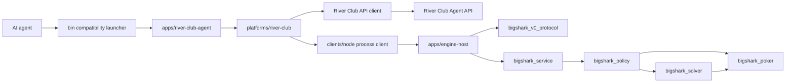

# System Architecture

Status: Current

## Purpose

BigShark is an agent-driven no-limit Texas Hold'em system. The current product
integrates with River Club, while the C++ decision process consumes a compact
normalized context over a local NDJSON protocol.

The repository separates three concerns:

1. Platform operation: authentication, table discovery, seating, polling,
   deadlines, legal-action submission, and journaling.
2. Engine process integration: process lifecycle, request framing, timeouts,
   and response correlation.
3. Poker decisions: hand evaluation, range construction, equity estimation,
   heuristic policy, and river equilibrium solving.

The TypeScript application and River adapter boundaries and the C++ target
split are implemented. The v0 engine protocol remains during the staged
Protobuf migration defined by RFC 0002. The v1 IDL, generated bindings, and
conformance tests are implemented but are not connected to the production
host.

## Runtime Components

## Component Boundaries

| Component | Owns | Must not own |
| --- | --- | --- |
| `engine/` | Poker, solver, policy, service, and v0 protocol libraries | Authentication, HTTP, room discovery, platform tokens |
| `apps/engine-host` | C++ process composition and v0 NDJSON host lifecycle | Platform mapping or strategy rules |
| `clients/node` | Generic engine process lifecycle, NDJSON framing, timeouts, and FIFO correlation | River fields or poker strategy |
| `platforms/river-club` | River API, state parsing, normalization, legality checks, action submission, and journaling | Independent poker strategy |
| `apps/river-club-agent` | River session composition, timing, stop-loss, and model override window | Reusable adapter or client logic |
| `bin/` | Stable launchers into compiled TypeScript and the published engine executable | Reusable implementation |
| `.codex/skills/` | Human-readable exploitative style guidance | Transport or platform API details |
| `strategy/` | Poker policy baseline and observed table notes | Protocol implementation |

## Decision Flow

1. The River Club runner obtains an authoritative state snapshot.
2. `platforms/river-club/src/v0-normalizer.ts` converts the River room into
   the context documented in [Engine Protocol](../reference/engine-protocol.md).
3. `clients/node/engine-process-client.ts` sends the request to the persistent
   C++ host.
4. The v0 protocol mapper parses JSON, the service invokes policy, and the
   host serializes one decision.
5. The River adapter verifies that the action and amount remain legal.
6. The runner refreshes the server snapshot immediately before submission.
7. River Club validates the hand ID, revision, action, and amount atomically.
8. Commands and responses are appended to `sessions/*.jsonl` for replay.

## Safety Invariants

- The server is authoritative for cards, turn ownership, legal actions, and
  stack movement.
- No component may infer hidden cards or use undocumented endpoints.
- The engine may choose only from the legal action set supplied in its input.
- A bet or raise amount is a target total for the current street.
- A stale state causes a fresh decision. An old action is never replayed.
- The Node layer owns operational fallback behavior when the engine is
  unavailable or returns an invalid action.
- Tokens remain outside the repository and session logs.

## Remaining Coupling

- The production engine protocol is unversioned v0 JSON. RFC 0002 defines its
  accepted Protobuf replacement, whose IDL and generated-code checks now
  exist under `proto/`.
- River action history is still reconstructed from localized event text and
  compressed into actor-tagged strings for v0 compatibility.
- The River runner invokes the River CLI as a local child process.
- A second platform has not yet validated the adapter boundary.

See [RFC 0001](../rfcs/0001-engineering-architecture.md) for the accepted
adapter boundary and
[RFC 0002](../rfcs/0002-protobuf-engine-protocol.md) for the accepted engine
protocol.

## Deployment Constraints

- The engine is built as C++23.
- The current exact LP path optionally uses HiGHS.
- BigShark has no direct CoreFoundation dependency; vendored dependencies
  select their own platform libraries.
- The `linux-release` preset is verified with GCC 12 on Debian bookworm,
  without HiGHS, through `tools/ci/Dockerfile.linux`.
- `release` is the only preset that publishes `bin/bigshark-engine`.
- `debug` and `asan` keep their binaries inside their preset build directories.

## Capability Boundary

The live engine is a hybrid poker decision engine:

- Preflop: approximate 6-max, 100 BB charts.
- Flop and turn: deterministic Monte Carlo equity plus heuristics.
- River: exact sequence-form LP when available and within budget, otherwise
  bounded DCFR.
- Experimental multi-street CFR: offline and test-only.

The current implementation must not be represented as a complete equilibrium
solver for every street, stack depth, table size, betting structure, or poker
variant.
