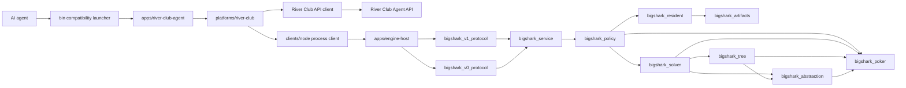

# System Architecture

Status: Current

## Purpose

BigShark is an agent-driven no-limit Texas Hold'em system. The current product
integrates with River Club, while the C++ decision process consumes a compact
normalized context over a local NDJSON protocol.

The repository separates three concerns:

1. Platform operation: authentication, table discovery, seating, polling,
   deadlines, legal-action submission, and journaling.
2. Engine process integration: process lifecycle, request framing, timeouts,
   and response correlation.
3. Poker decisions: hand evaluation, range construction, equity estimation,
   heuristic policy, and river equilibrium solving.

The TypeScript application and River adapter boundaries and the C++ target
split are implemented. The v1 framed Protobuf engine protocol is the default
for the River Club runner (with roots; v0 NDJSON remains as the fallback).
The resident layer serves blueprint decisions on the v1 path, with
terminal-only resolving on a minor-2 AUTOMATIC blueprint miss and a labeled
operational fallback (check/call/fold) when the resolver also misses.

## Runtime Components

## Component Boundaries

| Component | Owns | Must not own |
| --- | --- | --- |
| `engine/` | Poker, solver, abstraction, policy, service, v0 and v1 protocol libraries, resident lookup, artifacts, resolver, and solver-owned benchmarks | Authentication, HTTP, room discovery, platform tokens |
| `bigshark_abstraction` (RFC 0008 stage 3) | Card bucketing, declared ordered action menus, abstraction identity (`AbstractionId`), and the typed mismatch refusal; depends only on the rules layer | Knowledge of solvers, storage, or IO, and any modification of the rules. The solver's live menu is a thin adapter over the lifted builder (bit-for-bit identical decisions, replay 156/0/0); card buckets and `AbstractionId` are consumed by the flop class library and class-based `resolve_root` (W4a/W4c) |
| `bigshark_tree` (RFC 0008 stage 4 L3) | The seat-count-agnostic abstract public betting tree (`AbstractTree`): abstracted action nodes, probability-free public-card chance nodes, and fold/showdown terminal ledgers built from an L1 `GameDef` and an L2 menu; links only `bigshark_poker` and `bigshark_abstraction` | Regrets, ranges, hole cards, policy, probabilities on chance edges, per-deal conditioning, and any solver, transitional rules adapter (heads-up or multiway), storage/transport, or private-holding evaluator (enforced unconditionally at build time by allowlisting the compiler-resolved include closure — which macro-paste, line-splice, digraph, no-space, and `#import` spellings cannot evade — and at link time by the link-negative test). A build that crosses a deterministic node/depth/byte bound throws the typed `tree_resource_exhausted`, never a truncated tree; the byte bound covers requested retained capacity |
| `bigshark_solver::solve` (RFC 0008 stage 4 L4) | The single unified solver seam: routes a two-seat identity tree to heads-up CFR with the numeric core unchanged (bit-for-bit under both drivers and every runout variant), and explicitly refuses unsupported shapes with the typed `unsupported_tree_shape` | Silent approximation of a model it does not solve, conflating a shape refusal with a malformed request (the exception is not `invalid_argument`), and a self-assigned guarantee level on the result (the source-to-guarantee map is L6). The river LP/DCFR and experimental multistreet solvers are reachable but refuse-only this stage |
| `apps/engine-host` | C++ process composition, v0 NDJSON host lifecycle, and framed Protobuf host modes (`--proto` / `--serve-proto`, the default serving mode) | Platform mapping or strategy rules |
| `clients/node` | Generic engine process lifecycle, NDJSON framing, timeouts, and FIFO correlation | River fields or poker strategy |
| `platforms/river-club` | River API, state parsing, normalization, legality checks, action submission, and journaling | Independent poker strategy |
| `apps/river-club-agent` | River session composition, timing, stop-loss, and model override window | Reusable adapter or client logic |
| `bin/` | Stable launchers into compiled TypeScript and the published engine executable | Reusable implementation |
| `.codex/skills/` | Human-readable exploitative style guidance | Transport or platform API details |
| `strategy/` | Poker policy baseline and observed table notes | Protocol implementation |

## Decision Flow

1. The River Club runner obtains an authoritative state snapshot.
2. `platforms/river-club/src/v1-mapper.ts` converts the River room into the
   structured v1 context (chip units, enum cards, ordered seats, structured
   action history, side pots, absolute targets). The v0 normalizer remains
   as the fallback path.
3. `clients/node/proto-engine-process-client.ts` sends the framed v1 request
   to the persistent C++ host.
4. The v1 protocol mapper parses the message, the service invokes policy,
   and the host serializes one decision. On the resident path, the policy
   layer first looks up a blueprint in `bigshark_resident`; on a minor-2
   AUTOMATIC blueprint miss the bounded terminal-only resolver runs; if the
   resolver also misses, a labeled operational fallback (check/call/fold)
   is served. On the v0 fallback path, the v0 protocol mapper parses JSON,
   the service invokes policy, and the host serializes one decision.
5. The River adapter verifies that the action and amount remain legal.
6. The runner refreshes the server snapshot immediately before submission.
7. River Club validates the hand ID, revision, action, and amount atomically.
8. Commands and responses are appended to `sessions/*.jsonl` for replay.

## Safety Invariants

- The server is authoritative for cards, turn ownership, legal actions, and
  stack movement.
- No component may infer hidden cards or use undocumented endpoints.
- The engine may choose only from the legal action set supplied in its input.
- A bet or raise amount is a target total for the current street.
- A stale state causes a fresh decision. An old action is never replayed.
- The Node layer owns operational fallback behavior when the engine is
  unavailable or returns an invalid action.
- Tokens remain outside the repository and session logs.

## Remaining Coupling

- The v1 framed Protobuf protocol is the default for the River Club runner;
  v0 NDJSON remains as the fallback. RFC 0002 defines the accepted v1
  contract, whose IDL and generated-code checks exist under `proto/`.
- River action history is replayed as structured history on the v1 path;
  only past-street rounded display text remains text-only. The v0 path
  still compresses events into actor-tagged strings.
- The River runner invokes the River CLI as a local child process.
- A second platform has not yet validated the adapter boundary.

See [RFC 0001](../rfcs/0001-engineering-architecture.md) for the accepted
adapter boundary and
[RFC 0002](../rfcs/0002-protobuf-engine-protocol.md) for the accepted engine
protocol.

## Deployment Constraints

- The engine is built as C++23.
- The current exact LP path optionally uses HiGHS.
- BigShark has no direct CoreFoundation dependency; vendored dependencies
  select their own platform libraries.
- The `linux-release` preset is verified with GCC 12 on Debian bookworm,
  without HiGHS, through `tools/ci/Dockerfile.linux`.
- `release` is the only preset that publishes `bin/bigshark-engine`.
- `debug` and `asan` keep their binaries inside their preset build directories.

## Capability Boundary

The live engine is a hybrid poker decision engine:

- Preflop: approximate 6-max, 100 BB charts; a trained heads-up preflop
  profile (flop-terminal, declared small profile at 3 BB) is available as
  an offline artifact with policy-derived continuation ranges.
- Flop and turn: deterministic Monte Carlo equity plus heuristics;
  resident blueprint libraries serve flop-rooted decisions at the
  `approximate` guarantee level when a configured root matches.
- River: exact sequence-form LP when available and within budget, otherwise
  bounded DCFR; resident blueprints serve river-rooted decisions at the
  `certified_bound` guarantee level.
- Terminal-only resolving: on a minor-2 AUTOMATIC blueprint miss, the
  bounded terminal-only resolver runs; if it also misses, a labeled
  operational fallback (check/call/fold) is served.
- Engine-served practice tier: the practice simulator forwards bot
  decisions to the engine via v1 framed Protobuf.
- Experimental multi-street CFR: offline and test-only.

The current implementation must not be represented as a complete equilibrium
solver for every street, stack depth, table size, betting structure, or poker
variant. The preflop profile is a declared-profile coverage result, not a
full-game GTO solution.
