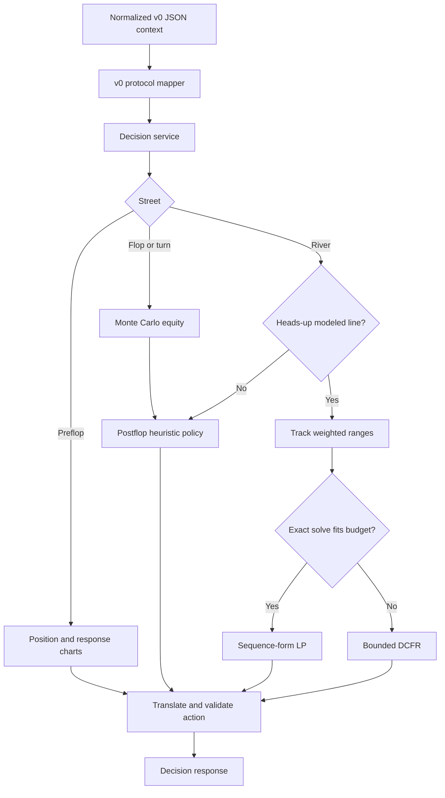
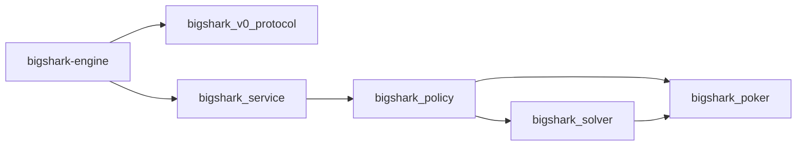

# GTO Engine Design

Status: Current

## Scope

The decision core is a C++23 process published as `bin/bigshark-engine`. It
accepts one normalized poker context and returns one legal-action proposal.
The generic TypeScript client in `clients/node/engine-process-client.ts` keeps
the process warm and communicates with it through newline-delimited JSON
(NDJSON).

The live policy is hybrid:

- preflop uses approximate charts;
- flop and turn use deterministic Monte Carlo equity and policy heuristics;
- supported heads-up river spots use an exact sequence-form linear program
  when HiGHS is available and the solve fits the time budget;
- other supported river spots use bounded Discounted Counterfactual Regret
  Minimization (DCFR);
- unsupported or failed solver paths return to the heuristic policy.

The term GTO in this repository applies to the implemented equilibrium
subsystems. It does not imply full-game equilibrium coverage.

## Decision Pipeline

## Module Map

| Module | Responsibility |
| --- | --- |
| `include/bs/eval.hpp` | Five-to-seven-card hand evaluation and comparable scores |
| `include/bs/charts.hpp`, `src/poker/charts.cpp` | 169-hand keys, Chen ordering, and preflop ranges |
| `include/bs/equity.hpp` | Deterministic Monte Carlo equity against filtered opponent ranges |
| `include/bs/range.hpp` | Concrete two-card combinations and range utilities |
| `include/bs/policy.hpp`, `src/policy/decision.cpp` | Street routing, heuristic policy, and solver action translation |
| `include/bs/service.hpp`, `src/service/decision_service.cpp` | Protocol-neutral decision service entry point |
| `include/bs/v0_protocol.hpp`, `src/protocol/v0_json.cpp` | Legacy JSON request and response mapping |
| `src/gto/range_tracker.*` | Action-line-based weighted range narrowing |
| `src/gto/range_equity.*` | Combo equity against a weighted opposing range |
| `src/gto/river_game.*` | OpenSpiel-compatible heads-up river game |
| `src/gto/sf_lp.*` | Solver-neutral sequence-form LP construction |
| `src/gto/highs_backend.*` | Optional in-process HiGHS backend |
| `src/gto/cfr_solver.*` | Bounded full-tree DCFR fallback |
| `include/bs/river_gto.hpp`, `src/gto/river_gto.cpp` | Public river solver facade and scheduling |
| `src/gto/multistreet_cfr.*` | Experimental offline flop-to-river DCFR |
| `apps/engine-host/main.cpp` | One-shot and persistent NDJSON process composition |

The corresponding CMake dependency graph is:

`bigshark_v0_protocol` is the only first-party C++ target that compiles
against yyjson. OpenSpiel and HiGHS remain private dependencies of
`bigshark_solver`.

## Card and Hand Representation

A card ID is `rank * 4 + suit`:

- ranks `0..12` represent `2..A`;
- suits `0..3` represent spades, hearts, diamonds, and clubs.

The evaluator packs category and tie-break ranks into one unsigned score. A
higher score always represents a stronger hand. Categories range from high
card (`1`) through straight flush (`9`).

Rank masks drive straight and straight-flush detection. Regular straight
windows start at a six-high straight. The wheel (`A2345`) is handled by a
separate mask so no negative bit shift can occur.

## Preflop Policy

The preflop policy is an approximation for 6-max cash play near 100 BB:

- raise-first-in ranges are keyed by `UTG`, `HJ`, `CO`, `BTN`, and `SB`;
- response ranges are keyed by the opener bucket;
- value 3-bets, bluff 3-bets, calls, 4-bet values, 4-bet bluffs, and
  continuation ranges are explicit 169-hand sets;
- short stacks at or below 12 BB use a simplified jam-or-fold branch;
- sizing is rounded to big-blind units and clamped to the legal interval.

`MP` and short-handed positions are mapped into the available chart buckets.
This policy is deterministic and range-based, but it is not a solved preflop
equilibrium.

## Flop and Turn Policy

The postflop evaluator combines:

- made-hand category;
- board texture, pairing, suit density, and rank connectivity;
- deterministic Monte Carlo equity against per-opponent strength gates;
- pot odds and minimum defense frequency;
- draw classification;
- player count;
- effective style.

The random stream is seeded from the request seed or from a stable hash of the
hand identifier and revision. Re-evaluating the same decision therefore keeps
mixed actions stable.

The heuristic policy:

- raises strong made hands for value;
- permits selected nut and combination-draw semi-bluffs;
- calls when estimated equity clears pot odds plus a safety margin;
- uses a limited minimum-defense-frequency branch for dry-board made hands;
- reduces bluffing in multiway pots;
- adjusts thin value and bluff frequency through the selected style.

## River Game

The production river game models heads-up play with one bet and one raise.
The in-position player acts first in this abstract tree.

| Node | Actor | Actions |
| --- | --- | --- |
| `kRoot` | In position | check, bet |
| `kAfterC` | Out of position | check, lead |
| `kFaceBet` | Out of position | fold, call, raise |
| `kFaceLead` | In position | fold, call, raise |
| `kFaceRaiseI` | In position | fold, call |
| `kFaceRaiseO` | Out of position | fold, call |

The game is zero-sum. Terminal utility is net chip profit for the in-position
side. Private deals are weighted by the product of the two input range
weights, excluding board and cross-player card conflicts.

## Range Construction and Tracking

The range pipeline starts from preflop continuation sets and applies public
flop and turn actions:

1. Build concrete 1,326-combination ranges, excluding board cards.
2. Gate the starting range by preflop raise count and aggressor role.
3. Estimate every surviving combo's equity against the opposing range.
4. Apply action-specific continuation weights:
   - bets and raises preserve value hands, credible draws, and a capped bluff
     tail;
   - calls preserve made hands and draws while removing most air;
   - checks retain broad weak ranges and reduce the weight of hands expected
     to bet.
5. Apply a strength-stratified weighted cap.
6. Force the hero's actual combination into the retained range.

The final cap defaults to 36 combinations per side for live river solving.
Strength bands preserve value, bluff-catcher, and air structure instead of
flattening the range into evenly spaced combinations.

Range tracking is a deterministic equity-based approximation. It is not an
equilibrium solution.

## Exact Sequence-Form LP

When HiGHS is available, the engine constructs a sparse sequence-form linear
program derived from the Koller-Megiddo-von Stengel formulation:

- realization-plan variables represent one player's sequence reach;
- treeplex equalities preserve realization flow;
- counterfactual-value variables constrain the opponent's decision nodes;
- terminal constraints combine payoff, chance probability, and realization
  probability;
- solving once for each side produces behavior policies and a value check.

OpenSpiel supplies the information-state tree. Its types remain private to the
GTO implementation and do not cross the public `bs::gto` facade.

## Bounded DCFR

DCFR is always available and has no external solver dependency:

- regret updates run across the full supported river tree;
- average policies are retained for every combination and public node;
- iteration count is reduced when the estimated deal count approaches the
  wall-clock budget;
- periodic time checks stop the solve without discarding the accumulated
  strategy.

The regression fixture targets exploitability below 0.05 pot. Typical
100,000-iteration fixtures are substantially lower.

## Solver Scheduling and Caching

The facade estimates valid private-deal count as approximately
`0.92 * ip_combos * oop_combos`.

The exact backend is selected only when its estimated two-sided LP cost fits
the configured budget. Otherwise the bounded DCFR backend is used.

Two process-local caches reduce live latency:

- river deal tables are cached by board;
- completed solutions are cached by board, sizing, and both range
  fingerprints.

Measured values are hardware-specific. The current development machine
observed roughly 0.13-0.24 seconds for uncached exact solves at a 36-combo cap
and roughly 0.3 milliseconds for cache hits.

## Action Translation

The solver produces abstract action indices. `src/policy/decision.cpp` maps
them to the legal action vocabulary supplied by the caller.

- An open bet target is
  `call + round_to_bb(fraction * (pot + call))`.
- A re-raise target is
  `round_to_bb(raise_fraction * (pot + 2 * call))`.
- Every amount is clamped to the caller's inclusive legal range.
- An unavailable action or invalid amount rejects the solver result and
  returns control to the heuristic policy.

The Node client performs a second legality check before any platform action is
submitted.

## Experimental Multi-Street CFR

`multistreet_cfr.*` models flop, turn, and river play with public chance nodes.
It is self-contained and does not depend on OpenSpiel.

Implemented capabilities:

- chance-sampled CFR across card-compatible, weighted private ranges;
- optional fixed turn and river cards for exact reference fixtures;
- perfect-recall public betting-history keys across streets;
- OCHS-style equity buckets shared across runouts;
- information-set-correct exact best-response evaluation;
- deterministic bucket and policy queries.

Verified behavior:

- fixed-run single-combination games converge to the expected value;
- fixed-run multi-combination games converge below `0.2%` pot exploitability;
- nonuniform ranges with overlapping-card combinations preserve normalized
  legal reach and converge against the independent oracle;
- sampled public chance converges below `2%` pot exploitability in the
  deterministic regression fixture;
- the independent best-response oracle agrees with per-hand BR and equilibrium
  values without conditioning actions on hidden opponent cards;
- chance handling preserves one opponent combination for the entire hand.

Current boundary:

- the solver remains offline and test-only;
- the validation tree has one bet per street and no raises;
- exact exploitability enumeration and the current bucket model are intended
  for small validation ranges, not production-scale blueprints.

The reproducible fixture matrix, metric definitions, and quality thresholds
are documented in [Benchmarking](../development/benchmarking.md).

## Failure Behavior

- Missing hole cards produce a fold decision with reason `no hole cards`.
- Unsupported river lines fall back to the postflop heuristic.
- Exact LP failure falls back to bounded DCFR.
- Solver output that cannot be translated to a legal action falls back to the
  heuristic.
- Process-level parse failures currently return a fold-shaped response.

The current wire contract is documented in
[Engine Protocol](../reference/engine-protocol.md). Its error model is a known
limitation addressed by
[RFC 0002](../rfcs/0002-protobuf-engine-protocol.md).

## Verification

The native suite covers:

- hand categories and ordering;
- straight and draw-mask boundaries;
- v0 request mapping and repeated response serialization;
- deterministic equity behavior;
- multiway equity sanity;
- DCFR exploitability and policy normalization;
- exact LP and DCFR value agreement when HiGHS is available;
- weighted range construction and action-line tracking;
- multi-street fixed-run and sampled-chance values;
- multi-combination convergence, card-conflict reach, and independent best
  responses.

Use the commands in [Build and Test](../development/build-and-test.md).

## Known Limitations

- Only the supported heads-up river tree has a production equilibrium solver.
- Preflop, flop, turn, and multiway decisions remain approximate.
- The live betting tree supports one bet and one raise.
- Ante, rake, side-pot utility, tournament ICM, and non-Hold'em variants are
  outside the current engine context.
- HiGHS is discovered from the host rather than vendored.
- Linux build verification remains pending.
