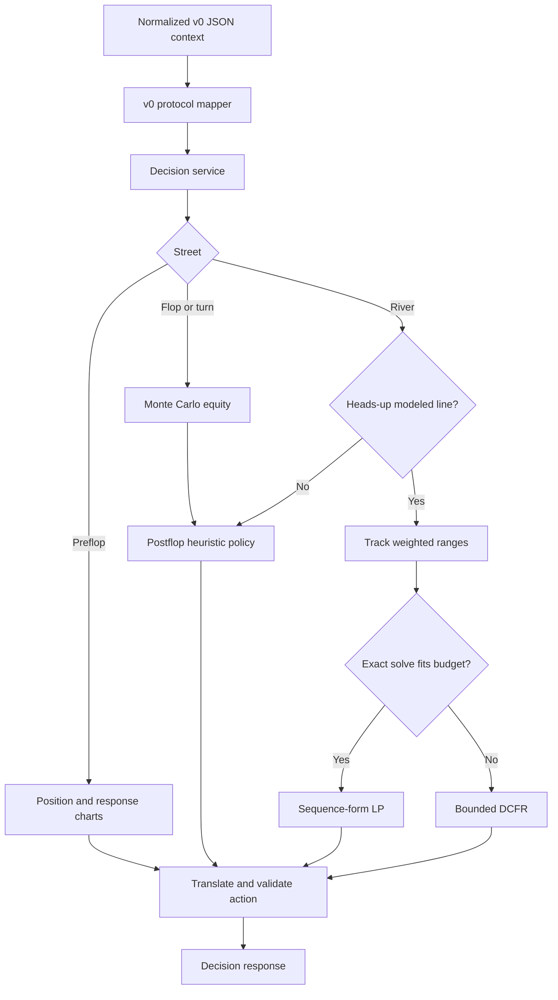
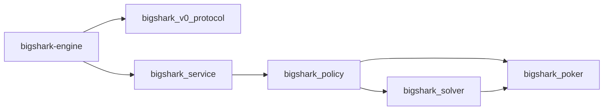
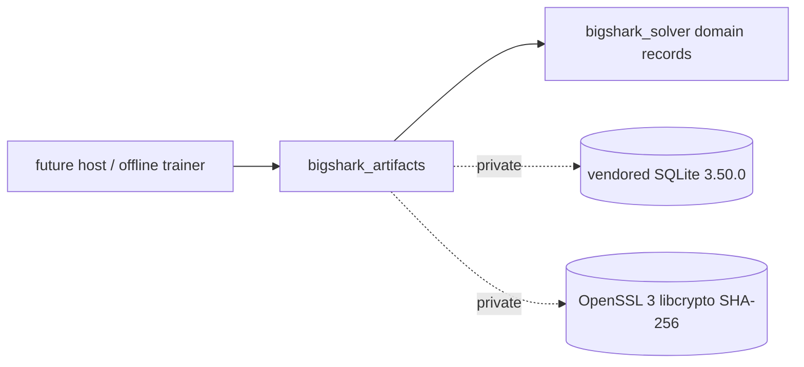

# GTO Engine Design

Status: Current

## Scope

The decision core is a C++23 process published as `bin/bigshark-engine`. It
accepts one normalized poker context and returns one legal-action proposal.
The generic TypeScript client in `clients/node/engine-process-client.ts` keeps
the process warm and communicates with it through newline-delimited JSON
(NDJSON).

The live policy is hybrid:

- preflop uses approximate charts;
- flop and turn use deterministic Monte Carlo equity and policy heuristics;
- supported heads-up river spots use an exact sequence-form linear program
  when HiGHS is available and the solve fits the time budget;
- other supported river spots use bounded Discounted Counterfactual Regret
  Minimization (DCFR);
- unsupported or failed solver paths return to the heuristic policy.

The term GTO in this repository applies to the implemented equilibrium
subsystems. It does not imply full-game equilibrium coverage.

## Decision Pipeline

## Module Map

| Module | Responsibility |
| --- | --- |
| `include/bs/eval.hpp` | Five-to-seven-card hand evaluation and comparable scores |
| `include/bs/heads_up.hpp`, `src/poker/heads_up.cpp` | Offline flop-rooted heads-up betting transitions and exact chip settlement |
| `include/bs/heads_up_solver.hpp`, `src/gto/heads_up_solver.cpp` | Multi-size full-traversal and external-sampling heads-up CFR (pinned SplitMix64 PRNG, two-player kSimple averages), immutable policies, and exact modeled best response |
| `include/bs/strategy_artifact.hpp`, `src/artifacts/` | RFC 0005 offline checkpoint and immutable-policy SQLite artifacts, transactional writes, SHA-256 publication, and a bounded untrusted reader; SQLite and OpenSSL are private to this target |
| `include/bs/icm.hpp`, `src/poker/icm.cpp` | Bounded offline prize-equity arithmetic and declared simultaneous-bust handling |
| `include/bs/settlement.hpp`, `src/poker/settlement.cpp` | Contribution-layer pots, refunds, declared capped rake, odd-chip awards, and exact 2..6-player ledger |
| `include/bs/charts.hpp`, `src/poker/charts.cpp` | 169-hand keys, Chen ordering, and preflop ranges |
| `include/bs/equity.hpp` | Deterministic Monte Carlo equity against filtered opponent ranges |
| `include/bs/range.hpp` | Concrete two-card combinations and range utilities |
| `include/bs/policy.hpp`, `src/policy/decision.cpp` | Street routing, heuristic policy, and solver action translation |
| `include/bs/service.hpp`, `src/service/decision_service.cpp` | Protocol-neutral decision service entry point |
| `include/bs/v0_protocol.hpp`, `src/protocol/v0_json.cpp` | Legacy JSON request and response mapping |
| `src/gto/range_tracker.*` | Action-line-based weighted range narrowing |
| `src/gto/range_equity.*` | Combo equity against a weighted opposing range |
| `src/gto/river_game.*` | OpenSpiel-compatible heads-up river game |
| `src/gto/sf_lp.*` | Solver-neutral sequence-form LP construction |
| `src/gto/highs_backend.*` | Optional in-process HiGHS backend |
| `src/gto/cfr_solver.*` | Bounded full-tree DCFR fallback |
| `include/bs/river_gto.hpp`, `src/gto/river_gto.cpp` | Public river solver facade and scheduling |
| `src/gto/multistreet_cfr.*` | Experimental offline flop-to-river DCFR |
| `apps/engine-host/main.cpp` | One-shot and persistent NDJSON process composition |

The corresponding CMake dependency graph is:

`bigshark_v0_protocol` is the only first-party C++ target that compiles
against yyjson. OpenSpiel and HiGHS remain private dependencies of
`bigshark_solver`.

## Card and Hand Representation

A card ID is `rank * 4 + suit`:

- ranks `0..12` represent `2..A`;
- suits `0..3` represent spades, hearts, diamonds, and clubs.

The evaluator packs category and tie-break ranks into one unsigned score. A
higher score always represents a stronger hand. Categories range from high
card (`1`) through straight flush (`9`).

Rank masks drive straight and straight-flush detection. Regular straight
windows start at a six-high straight. The wheel (`A2345`) is handled by a
separate mask so no negative bit shift can occur.

## Offline Heads-Up Rules

`bs::poker::HeadsUpState` is the first RFC 0004 implementation stage in
`bigshark_poker`. It does not change production decision routing or the legacy
validation game. The supported root is a closed-street flop with two players,
no ante/rake, equal matched root contributions, and explicit stacks, pot,
button, and big blind. Unequal root contributions require a broader pot model
and are rejected. Total chips cannot exceed `2^53 - 1`; intermediate sums are
checked unsigned 64-bit arithmetic.

The state exposes `Action`, `Deal`, `Showdown`, and `Folded` phases. OOP
(`1 - button` in the two-seat domain) acts first on each street. `legal()`
returns check/fold/call availability, the actual capped call cost, and a
bet/raise target-total interval. Below-minimum aggression is permitted only
when it consumes the actor's entire stack. No raising is possible against an
all-in opponent. The rules permit unmatched overbets up to the actor's stack;
future solver size abstraction is responsible for selecting effective targets.

`after_action()` and `after_card()` return a new state; invalid input leaves
the original unchanged. Actions include the caller's seat for turn checking.
Non-aggressive actions must carry zero target total. Invalid input throws
`std::invalid_argument`; integer overflow throws `std::overflow_error`.

Public cards retain their street order. The state never stores either
player's hole cards, so chance enumeration must separately filter the sampled
private deal. `after_card()` checks the deck range and public duplicates;
`settle_showdown()` additionally validates both private hands before using
the existing evaluator. Fold settlement requires no private cards.

Gross contributions and refunds are retained separately. An unmatched wager
is refunded at fold or street closure, including a short all-in call.
Stacks already include refunds; final settlement credits awards only.
`Settlement` reports awards, refunds, final stacks, and signed integer net
utility relative to hand-start chips. Zero-sum chip conservation applies
throughout this supported profile. After an all-in call the remaining public
cards are dealt without further betting.

Persistence, resolving, multiway rules, and preflop-root rules are separate
implementation stages.

## Full-Traversal Heads-Up Trainer

`bs::solver::HeadsUpTrainer` accepts a flop-rooted game, weighted exact-card
ranges, and reduced rational per-street sizing. It enumerates compatible
joint private deals, reserves fixed future validation cards before any deal,
and uses the native poker transitions. A fixed runout is a conditional test
game, not production coverage of unseen cards.

Each CFR iteration runs player 0 then player 1. Regrets are frozen during
each full sweep; opponent/chance-weighted updates accumulate until that sweep
finishes and are committed together with the frozen sweep policy. Average
weights accumulate exactly once per exact information set per traverser sweep
(a per-sweep dedup over the hidden opponent histories and chance branches that
share the key), weighted by own reach and policy alone, with no joint-deal or
public-chance factor. Own reach to a fixed perfect-recall key is identical
across those hidden histories, so adding it more than once would double count.
Information keys retain ordered boards, own cards, actor, and full public
target-total history. The immutable policy owns the full game identity and
exposes explicit misses.

The full-policy evaluator aggregates hidden opponent reach before choosing
the responder's action. It reports chip-unit values and normalized NashConv
(`sum of both best-response gains / root pot`), using the policy's own declared
game. A separate native test enumerates every pure response strategy on small
games, without using the evaluator's response recursion or information keys.

Limits bound total visited nodes per call, information-set count, conservatively
accounted allocation bytes, deadline, and recursion depth (at most 256).
Exceeding them rejects an incomplete iteration; it never prunes actions or
inserts heuristic leaf values. Policy publication is transactional and returns
the last completely committed iteration on allocation failure. Exact
evaluation reports resource failure explicitly. Extremely small probabilities
that would underflow are unsupported rather than silently removed.

Sampled traversal is implemented and is the documented release-scale trainer
(see the next section); serialized training resume, release-scale coverage,
and preflop training remain pending. A small weighted fixed-run fixture reaches
normalized NashConv `0.000821201` at 8,192 iterations; this is not a
general-game equilibrium claim.

## Sampled Heads-Up Trainer (External Sampling)

`HeadsUpTrainer::train_sampled(iterations, seed, limits)` implements the pinned
RFC 0004 revision-1 external-sampling MCCFR. One iteration runs traverser 0,
then traverser 1; each traversal samples exactly one weighted joint private
deal for the episode. At a traverser information set the local regret-matching
policy is frozen before recursion and every action is enumerated; at chance and
opponent nodes one outcome is sampled from the actual chance/current-policy
distribution. Regrets update by raw sampled `v(a) - v` at traverser nodes, and
the two-player `AverageType::kSimple` sum adds the frozen policy on each
opponent-node visit. Sampled updates carry no extra private-deal or reach
factor because the visit sampling already supplies them.

The two average conventions are a pinned pair, not competing implementations.
The full traversal accumulates its average exactly once per information set
per traverser sweep (deduping the hidden deals and chance branches that share
the perfect-recall key) as `own reach * policy`, with no deal or chance
factor. The sampled kSimple sum is a raw per-visit `sigma(a)` add at opponent
nodes; the episode sampling already supplies the private-deal and reach mass.
Consequently the raw sampled row equals the full-traversal row at the
corresponding opponent information set only up to a constant chance factor:
the expected one-iteration sampled behavior matches the full behavior exactly
after both rows are normalized to sum one (RFC 0004 lines 191-195). The regret
identity is stricter: full regret deltas already carry the chance and opponent
reach weight, so the enumerated expected raw sampled regret equals the full
raw regret with no normalization. Both identities are verified by exact
enumeration of one-sweep outcomes under non-uniform range weights, a non-fixed
public card, and repeated hidden histories, not only by convergence.

Entropy comes exclusively from a SplitMix64 stream initialized to the seed:
each draw increments the state by `0x9e3779b97f4a7c15` and applies the pinned
xor-shift/multiply mix. Unit doubles use the top 53 bits times `2^-53`;
bounded card sampling rejects below `(2^64 - bound) mod bound` before modulo;
weighted deals scan in fixed ascending order. Traversal order, deal order, and
player/action order are fixed; no unordered map consumes randomness.

Sampled publication uses the same transactional iteration boundary as the full
trainer. An interrupted iteration discards the prospective table and restores
the PRNG to its iteration-start mark, so the published policy, completed
iteration count, and PRNG state always describe committed iterations. The
per-iteration prospective table deep copy carries an explicit transient budget
charge released after the committed swap, so accounted peak bytes bound the
brief two-table coexistence.

The pinned quality gates run in the version-2 heads-up blueprint benchmarks:
normalized NashConv at most `0.002` for the fixed small game and `0.02` for a
sampled free-river small game, for seeds 1, 17, and 43, with same-build
repeats matching every published policy row within `1e-12`. The default CTest
runner spends the free-river case at a bounded 100,000-iteration checkpoint
that passes the gate inside the one-million compute budget; the manual
capacity runner (`benchmark-heads-up-capacity`, not a CTest) spends both
sampled cases at the pinned 1,000,000-iteration checkpoint. A separately
written backward-induction oracle counter-checks the modeled best response on
a game with a non-fixed chance card. These are bounded small-game fixtures,
not release blueprint coverage.

## Frozen Heads-Up Matrix

The RFC 0004 Stage 4 runner `benchmark-heads-up-matrix` (schema version 3,
manual target, not a CTest) freezes twelve flop-root fixtures: a genuinely
rainbow disconnected dry board `Ks7h2c`, two-tone connected, paired, and
monotone boards; equal and asymmetric postflop stacks; and effective SPR 1,
4, and 10 over one shared pair of three-combo weighted ranges and the
standard multi-size schedule. Eleven fixtures fix the turn `3s` and river
`5h`; one SPR-1 monotone fixture fixes only the turn. External sampling was
measured to miss rare information sets at feasible budgets on these trees
(the runner's `--sampled-coverage` mode reproduces 251/252 fixed sets after
3,000,000 iterations and 4,028/6,192 free-river sets after 100,000), so every
fixture trains with full traversal and is certified by the exact modeled
best response; schema 3 derives `metric_class = EXACT` only for finite full
rows and makes no sampled-deviation estimate. Each row also carries the
pinned `algorithm_revision`, a stable `range_digest`, and a
`missing_information_sets` count (zero on every complete row). SPR-1 rows
use the pinned `0.002`/`0.02` gates; SPR 4/10 rows report measured NashConv
behind frozen, margin-rounded reference-machine fixture gates rather than
claiming the small-game threshold, with a documented `--freeze` rebase
procedure for other platforms. The catalog, CSV fields, and reference-
machine numbers are in [Benchmarking](../development/benchmarking.md). This
is a bounded frozen matrix, not full-game equilibrium coverage.

## Strategy Artifacts (RFC 0005 Stage 5)

The offline `bigshark_artifacts` static library serializes RFC 0004 training
checkpoints and immutable, validated policy exports. Its public surface is
`include/bs/strategy_artifact.hpp`, implemented under `src/artifacts/`, and
exchanges only solver domain records (`HeadsUpGame`, `HeadsUpPolicy`,
`TrainingResult`, `InformationKey`, `PolicyRow`, and the checkpoint-only raw
regret/average rows). SQLite and OpenSSL headers never appear in the public
header; SQL handles never cross the boundary. The library links
`bigshark_solver` publicly for the domain types and keeps the vendored SQLite
amalgamation and OpenSSL Crypto PRIVATE. No host, service, client, platform, or
live-decision path links it in this stage; wiring is deferred.

The artifact is a SQLite database with `application_id = 0x42534754` ("BSGT"),
`user_version = 1`, STRICT tables, foreign keys enforced, prepared statements
throughout, and a compile/runtime requirement of SQLite 3.37 or newer. Tables:

| Table | Content |
| --- | --- |
| `manifest` | Singleton: artifact kind (`checkpoint`/`policy`), algorithm revision, information-key revision, numeric profile, validation state, engine revision, completed iterations, PRNG identifier, seed and PRNG state (16 lowercase hex digits), run status, node/set/byte counters |
| `game` | Singleton: rules and utility identifiers, button, big blind, flop, optional fixed turn/river, both stacks and contributions, pot |
| `sizes` | Ordered `(street, kind, ordinal)` rational bet/raise numerator and denominator |
| `ranges` | `(player, combo)` primary key, canonical zero-based unordered combo id 0..1325, nonnegative finite REAL weight |
| `information_states` | Integer id, player, own combo columns, and the canonical ASCII public key; full identity unique |
| `actions` | `(info_id, ordinal)` primary key with FK, kind, optional target total, finite probability; per-row probabilities sum to one within `1e-12` |
| `training` | Checkpoint-only FK to `(info_id, ordinal)`: cumulative regret and nonnegative unnormalized average weight |
| `bounds` | RFC 0005 certification columns; present and validated, empty in this stage |
| `measurements` | Fixture, seed, iterations, metric, exact/estimated class, finite value; empty in this stage |

The information-state public key is the RFC 0005 canonical ASCII sequence
`street|board_ids|events`, chosen over a binary BLOB key because it is
self-describing, directly inspectable with SQLite tooling, and keeps the
versioned grammar explicit. It is stored alongside the acting player and own
combo in typed columns; the key itself contains no private cards. Events are
comma-separated `actor:kind:target` triples with kinds `f/x/c/b/r`; public
deals are represented entirely by the ordered `board_ids` sequence, so
revision-1 event text never contains `d` triples. Board counts pin the street,
and the reader reparses the round-end grammar, decimal rules (no leading
zeros), targets (`-` for non-aggressive actions), and board/hole separation.

Chip and rational values follow the RFC 0004 `2^53 - 1` profile: every stored
INTEGER is range-checked on read, doubles are stored as REAL with NaN and
infinity rejected, and probabilities are validated per row. Rational sizes,
card ids, combo identity, action kinds, and aggressive targets round-trip
exactly; REAL probabilities and training values round-trip as IEEE doubles.

Checkpoints are mutable. `create_checkpoint` writes one complete iteration in
a single transaction with rollback journaling and `synchronous=FULL`;
`commit_checkpoint` replaces the policy and training state in one transaction
and only after a read-only identity probe proves the full canonical identity
(root board and street, button, blinds, stacks, contributions, pot, utility,
every range weight, ordered rational sizing schedule, algorithm/key/numeric
revisions, PRNG identifier, and seed). A mismatch fails with a typed
`IdentityMismatch` before any write. A published policy cannot be resumed as
training state.

Publication writes a fresh SQLite file to a unique temporary name in the
destination directory, fills and validates it in one transaction, closes it,
fsyncs the file, marks it `0444`, places it with an exclusive same-filesystem
hard link (never overwriting), and fsyncs the parent directory before and
after removing the temporary name. The generation is identified by SHA-256
(OpenSSL 3 EVP, streamed within the file bound) of its bytes; the digest is
never stored inside the hashed file. Publication independently reopens the
linked file read-only with the computed digest before returning.

Readers treat the file as untrusted: reject above an 8 GiB default bound
(overridable), validate the physical header and committed in-header database
size before opening, and require legacy (non-WAL) file-format version bytes;
they reject any `<path>-wal`, `-shm`, or `-journal` sibling (the digest covers
only the main file) and open through a percent-encoded
`file:...?immutable=1` URI so SQLite performs no journal recovery or sidecar
I/O and reads exactly the hashed bytes. They open `SQLITE_OPEN_READONLY` with
foreign keys, `query_only`, `trusted_schema=OFF`, a 64 MiB page-cache cap, and
extension loading compiled out; then verify application id and schema
version, require byte-identical canonical CREATE definitions (not merely a
STRICT suffix) with an exact table set and no views, triggers, user indexes,
or other schema objects, run `integrity_check` and `foreign_key_check`, and
validate every REAL, probability sum, integer range, canonical key (including
public-card pairwise distinctness), referential link, and fixed-array
domain. A process-once 512 MiB SQLite hard heap limit bounds schema-parse
amplification. Every column value used as an array/enum index is range
checked in C++ before indexing, independent of write-time SQL CHECKs.
Optional digest pinning rejects a tampered file before parsing. Failures are
typed `ArtifactError` values (including a dedicated capacity-exceeded kind).
This stage eagerly loads all rows into immutable domain records; bounded
resident subset selection and any decision-path access belong to Stage 6.
Checkpoint writers fail closed: after setting the writer pragmas they read
`synchronous` (`2`/FULL) and `journal_mode` (`delete`) back on the same
connection and abort on mismatch; the per-connection synchronous setting is
not observable through a second connection.

The new fault evidence (`artifacts` CTest) covers lossless round trips
including an independent forked-process reader, split-run resume equality
within `1e-12`, full canonical identity mismatch rejection, transactional
ENOSPC injected through a test-only VFS shim, real killed-writer rounds with
and without the rollback journal, page/header/truncation corruption, unknown
versions, foreign-key and STRICT rejection, NaN/Inf REALs, bad probability
sums, oversized integers, and immutable-publication guarantees.

## Offline ICM Arithmetic

`bs::poker::icm_equities()` requires an explicitly complete field of 2..10
players, unique stable IDs, positive stacks, one non-increasing payout per
remaining place, and a prize-unit identifier. It aggregates finish-order
probabilities by subset (at most 1,024 subsets), with chip/prize totals bounded
by `2^53 - 1`. Expected payouts are finite doubles with no prize rounding.

`icm_terminal_utility()` consumes fully settled, chip-conserving terminal
stacks for the same field. Newly busted players rank by pre-hand stacks;
ties require explicit stable-ID byte-order rules, splitting their occupied
prizes with exact integer remainder allocation. Surviving prize equity and
bust prizes minus pre-hand equity produce prize-unit utility. No chip-EV
conversion, rake, inferred remote stacks, or implicit provider rules apply.

The arithmetic is isolated from strategy routing. Production tournament
support remains disabled pending settlement integration, v2 protocol and
provider gates. Tests independently enumerate finish permutations, including
1,089 grid fixtures and 120 seeded fixtures, plus analytic and bust cases.

## Preflop Policy

The preflop policy is an approximation for 6-max cash play near 100 BB:

- raise-first-in ranges are keyed by `UTG`, `HJ`, `CO`, `BTN`, and `SB`;
- response ranges are keyed by the opener bucket;
- value 3-bets, bluff 3-bets, calls, 4-bet values, 4-bet bluffs, and
  continuation ranges are explicit 169-hand sets;
- short stacks at or below 12 BB use a simplified jam-or-fold branch;
- sizing is rounded to big-blind units and clamped to the legal interval.

`MP` and short-handed positions are mapped into the available chart buckets.
This policy is deterministic and range-based, but it is not a solved preflop
equilibrium.

## Flop and Turn Policy

The postflop evaluator combines:

- made-hand category;
- board texture, pairing, suit density, and rank connectivity;
- deterministic Monte Carlo equity against per-opponent strength gates;
- pot odds and minimum defense frequency;
- draw classification;
- player count;
- effective style.

The random stream is seeded from the request seed or from a stable hash of the
hand identifier and revision. Re-evaluating the same decision therefore keeps
mixed actions stable.

The heuristic policy:

- raises strong made hands for value;
- permits selected nut and combination-draw semi-bluffs;
- calls when estimated equity clears pot odds plus a safety margin;
- uses a limited minimum-defense-frequency branch for dry-board made hands;
- reduces bluffing in multiway pots;
- adjusts thin value and bluff frequency through the selected style.

## River Game

The production river game models heads-up play with one bet and one raise.
The in-position player acts first in this abstract tree.

| Node | Actor | Actions |
| --- | --- | --- |
| `kRoot` | In position | check, bet |
| `kAfterC` | Out of position | check, lead |
| `kFaceBet` | Out of position | fold, call, raise |
| `kFaceLead` | In position | fold, call, raise |
| `kFaceRaiseI` | In position | fold, call |
| `kFaceRaiseO` | Out of position | fold, call |

The game is zero-sum. Terminal utility is net chip profit for the in-position
side. Private deals are weighted by the product of the two input range
weights, excluding board and cross-player card conflicts.

## Range Construction and Tracking

The range pipeline starts from preflop continuation sets and applies public
flop and turn actions:

1. Build concrete 1,326-combination ranges, excluding board cards.
2. Gate the starting range by preflop raise count and aggressor role.
3. Estimate every surviving combo's equity against the opposing range.
4. Apply action-specific continuation weights:
   - bets and raises preserve value hands, credible draws, and a capped bluff
     tail;
   - calls preserve made hands and draws while removing most air;
   - checks retain broad weak ranges and reduce the weight of hands expected
     to bet.
5. Apply a strength-stratified weighted cap.
6. Force the hero's actual combination into the retained range.

The final cap defaults to 36 combinations per side for live river solving.
Strength bands preserve value, bluff-catcher, and air structure instead of
flattening the range into evenly spaced combinations.

Range tracking is a deterministic equity-based approximation. It is not an
equilibrium solution.

## Exact Sequence-Form LP

When HiGHS is available, the engine constructs a sparse sequence-form linear
program derived from the Koller-Megiddo-von Stengel formulation:

- realization-plan variables represent one player's sequence reach;
- treeplex equalities preserve realization flow;
- counterfactual-value variables constrain the opponent's decision nodes;
- terminal constraints combine payoff, chance probability, and realization
  probability;
- solving once for each side produces behavior policies and a value check.

OpenSpiel supplies the information-state tree. Its types remain private to the
GTO implementation and do not cross the public `bs::gto` facade.

## Bounded DCFR

DCFR is always available and has no external solver dependency:

- regret updates run across the full supported river tree;
- average policies are retained for every combination and public node;
- iteration count is reduced when the estimated deal count approaches the
  wall-clock budget;
- periodic time checks stop the solve without discarding the accumulated
  strategy.

The regression fixture targets exploitability below 0.05 pot. Typical
100,000-iteration fixtures are substantially lower.

## Solver Scheduling and Caching

The facade estimates valid private-deal count as approximately
`0.92 * ip_combos * oop_combos`.

The exact backend is selected only when its estimated two-sided LP cost fits
the configured budget. Otherwise the bounded DCFR backend is used.

Two process-local caches reduce live latency:

- river deal tables are cached by board;
- completed solutions are cached by board, sizing, and both range
  fingerprints.

Measured values are hardware-specific. The current development machine
observed roughly 0.13-0.24 seconds for uncached exact solves at a 36-combo cap
and roughly 0.3 milliseconds for cache hits.

## Action Translation

The solver produces abstract action indices. `src/policy/decision.cpp` maps
them to the legal action vocabulary supplied by the caller.

- An open bet target is
  `call + round_to_bb(fraction * (pot + call))`.
- A re-raise target is
  `round_to_bb(raise_fraction * (pot + 2 * call))`.
- Every amount is clamped to the caller's inclusive legal range.
- An unavailable action or invalid amount rejects the solver result and
  returns control to the heuristic policy.

The Node client performs a second legality check before any platform action is
submitted.

## Experimental Multi-Street CFR

`multistreet_cfr.*` models flop, turn, and river play with public chance nodes.
It is self-contained and does not depend on OpenSpiel.

Implemented capabilities:

- chance-sampled CFR across card-compatible, weighted private ranges;
- optional fixed turn and river cards for exact reference fixtures;
- perfect-recall public betting-history keys across streets;
- OCHS-style equity buckets shared across runouts;
- information-set-correct exact best-response evaluation;
- deterministic bucket and policy queries.

Verified behavior:

- fixed-run single-combination games converge to the expected value;
- fixed-run multi-combination games converge below `0.2%` pot exploitability;
- nonuniform ranges with overlapping-card combinations preserve normalized
  legal reach and converge against the independent oracle;
- sampled public chance converges below `2%` pot exploitability in the
  deterministic regression fixture;
- the independent best-response oracle agrees with per-hand BR and equilibrium
  values without conditioning actions on hidden opponent cards;
- chance handling preserves one opponent combination for the entire hand.

Current boundary:

- the solver remains offline and test-only;
- the validation tree has one bet per street and no raises;
- exact exploitability enumeration and the current bucket model are intended
  for small validation ranges, not production-scale blueprints.

The reproducible fixture matrix, metric definitions, and quality thresholds
are documented in [Benchmarking](../development/benchmarking.md).

## Failure Behavior

- Missing hole cards produce a fold decision with reason `no hole cards`.
- Unsupported river lines fall back to the postflop heuristic.
- Exact LP failure falls back to bounded DCFR.
- Solver output that cannot be translated to a legal action falls back to the
  heuristic.
- Process-level parse failures currently return a fold-shaped response.

The current wire contract is documented in
[Engine Protocol](../reference/engine-protocol.md). Its error model is a known
limitation addressed by
[RFC 0002](../rfcs/0002-protobuf-engine-protocol.md).

## Verification

The native suite covers:

- hand categories and ordering;
- straight and draw-mask boundaries;
- v0 request mapping and repeated response serialization;
- deterministic equity behavior;
- multiway equity sanity;
- DCFR exploitability and policy normalization;
- exact LP and DCFR value agreement when HiGHS is available;
- weighted range construction and action-line tracking;
- multi-street fixed-run and sampled-chance values;
- multi-combination convergence, card-conflict reach, and independent best
  responses.
- Pinned SplitMix64 vectors, enumerated external-sampling update expectations
  under non-uniform range weights and free public cards, sampled
  repeatability/rollback, and fixed/sampled-chance blueprint quality gates.

Use the commands in [Build and Test](../development/build-and-test.md).

Linux GCC 12 verification passes in the no-HiGHS CI lane, including the
multi-street benchmark and bounded river DCFR tests. This verifies the
portable fallback build; it does not validate the HiGHS backend on Linux.

## Known Limitations

- Only the supported heads-up river tree has a production equilibrium solver.
- Preflop, flop, turn, and multiway decisions remain approximate.
- The live betting tree supports one bet and one raise.
- Ante, rake, side-pot utility, tournament ICM, and non-Hold'em variants are
  outside the current engine context.
- HiGHS is discovered from the host rather than vendored.
- Linux HiGHS-enabled build verification remains outside the current CI lane.
