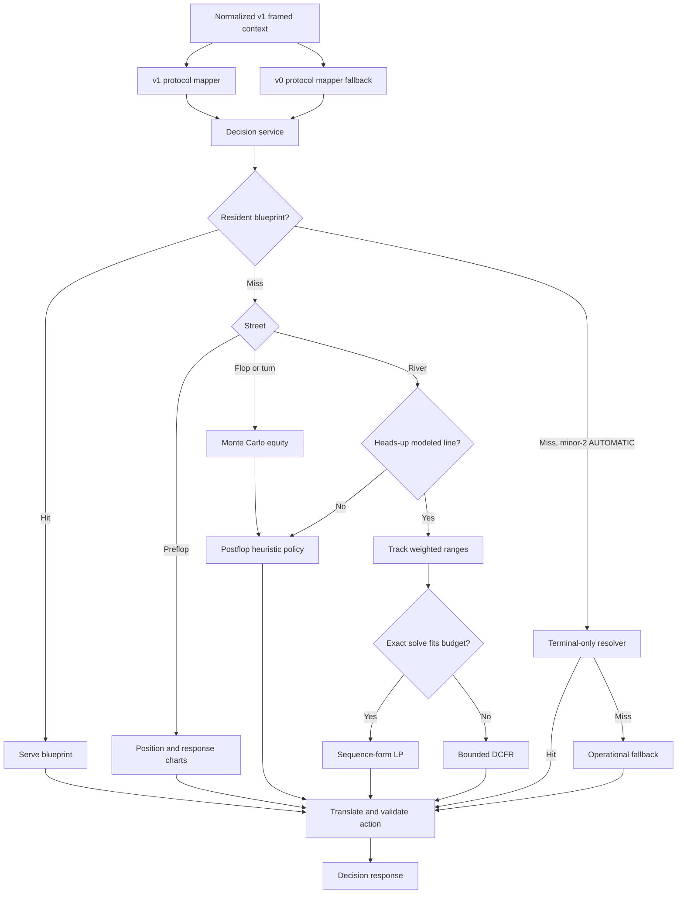
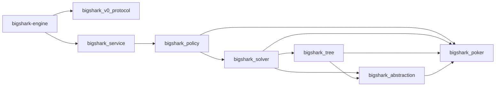
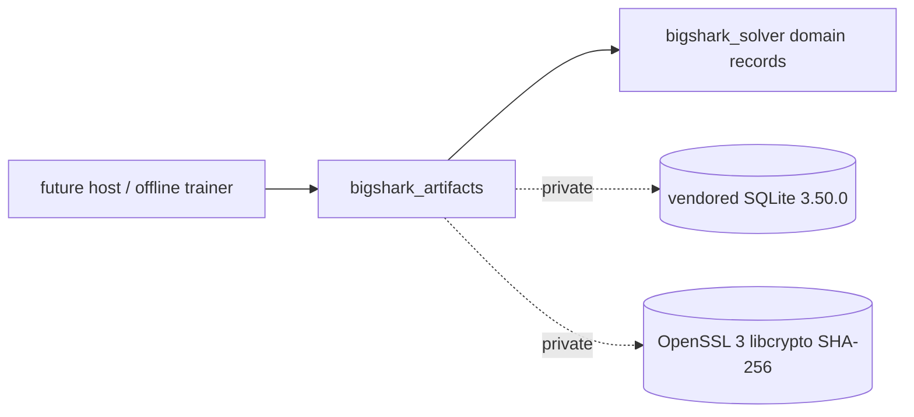
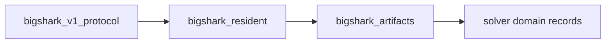
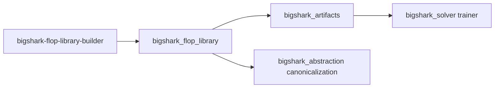

# GTO Engine Design

Status: Current

## Scope

The decision core is a C++23 process published as `bin/bigshark-engine`. It
accepts one normalized poker context and returns one legal-action proposal.
The generic TypeScript client in `clients/node/engine-process-client.ts` keeps
the process warm and communicates with it through newline-delimited JSON
(NDJSON).

The live policy is hybrid:

- preflop uses approximate charts; a trained heads-up preflop profile
  (flop-terminal, declared small profile at 25 BB) is available as an offline
  artifact with policy-derived continuation ranges (RFC 0007 / W4b);
- flop and turn use deterministic Monte Carlo equity and policy heuristics;
  resident blueprint libraries serve flop-rooted decisions at the
  `approximate` guarantee level when a configured root matches;
- supported heads-up river spots use an exact sequence-form linear program
  when HiGHS is available and the solve fits the time budget;
- other supported river spots use bounded Discounted Counterfactual Regret
  Minimization (DCFR);
- on a minor-2 AUTOMATIC blueprint miss, the bounded terminal-only resolver
  runs; if it also misses, a labeled operational fallback (check/call/fold)
  is served;
- unsupported or failed solver paths return to the heuristic policy.

The term GTO in this repository applies to the implemented equilibrium
subsystems. It does not imply full-game equilibrium coverage.

## Decision Pipeline



## Module Map

| Module | Responsibility |
| --- | --- |
| `include/bs/eval.hpp` | Five-to-seven-card hand evaluation and comparable scores |
| `include/bs/heads_up.hpp`, `src/poker/heads_up.cpp` | Offline flop-rooted heads-up betting transitions and exact chip settlement |
| `include/bs/game_definition.hpp`, `src/poker/game_definition.cpp`, `src/poker/game_definition_settlement.cpp` | RFC 0008 unified game definition: one `GameDef` / `GameState` for 2..10 seats with a single legal-transition implementation. Stages 1-2 construct every seat count 2..10; the machine selects the heads-up rules at two seats and the `MultiwayState` rules at 3..10 by seat-count branch. `HeadsUpState`/`MultiwayState` remain the shipping rules types and nothing routes through this yet. Guarded by two independent oracles (`test_game_definition` for the two-seat profile, `test_game_definition_multiway` driving the real `MultiwayState` in lockstep at 3..6 and an independent ledger at 7..10) and by machine-run mutation batteries that require every semantic mutation to turn an oracle red or be recorded as equivalent with a reachability measurement that proves it |
| `include/bs/abstraction.hpp`, `src/abstraction/abstraction.cpp` | RFC 0008 stage 3 L2 abstraction (a separate `bigshark_abstraction` target linking ONLY `bigshark_poker`): the declared ordered action menu (the RFC 0007 per-street pot-fraction schedule with its `AbstractionId`), identity and lossy card bucketing, deterministic abstraction identity, and a typed `abstraction_mismatch` refusal. Card bucketing offers three kinds: `Identity` (evaluator score, 91 preflop buckets), `CategoryTiersV1` (hand category 1–9, only 2 preflop buckets), and `Preflop169` (13 pairs + 78 suited + 78 offsuit = 169 preflop buckets, the standard lossless preflop rank-suit abstraction, falling back to `CategoryTiersV1` at postflop). The n-seat trainer seals rows under `Preflop169` (`kNSeatCardKind`). The rules never depend on it and it never knows a solver; the solver menu is a thin adapter over it. The identity menu reproduces the shipped menu element-for-element, pinned by `test_abstraction_equivalence`; decision behavior is unchanged (replay 156/0/0). Stage 3 also added the profile-neutral `build_multiway_action_menu` with a caller-supplied deepest-cover cap; the two-seat `build_action_menu` path is byte-identical (shared core). Persistence of the id landed in schema v3 (W4c-i); the card-abstraction declaration is stored in the artifact manifest and consumed by the class-based `resolve_root` and flop class library |
| `include/bs/abstract_tree.hpp`, `src/tree/abstract_tree.cpp` | RFC 0008 stage 4 L3 abstract public betting tree (a separate `bigshark_tree` target linking ONLY `bigshark_poker` and `bigshark_abstraction`): one seat-count-agnostic builder materializes the full unconditioned public tree (abstracted action nodes, probability-free public-card chance nodes, and fold/showdown terminal ledgers) from an L1 `GameDef` plus an L2 `ActionAbstraction`, owned by value. It carries no regrets, ranges, hole cards, or policy; chance edges carry no probability (per-deal conditioning is L4), and a fold leaf records the exact `settle_fold()` utility vector while a showdown leaf records the ledger L4 needs for `settle_showdown`. Deterministic `TreeLimits` throw a typed, non-`invalid_argument` `tree_resource_exhausted`, and the byte cap is a true upper bound on retained capacity (every retained slab is budgeted before allocation). An unconditional build-time boundary-guard target (scanning the header and source with comments/strings stripped) and a link-negative target forbid any L3 dependency on the solver, the transitional rules adapters, storage/transport, or a private-holding evaluator. Fidelity is pinned by an independent enumerator (`test_abstract_tree_fidelity`) that never calls the builder or L2 menu |
| `include/bs/solve.hpp`, `src/gto/solve.cpp`, `include/bs/detail/solve_projection.hpp`, `src/gto/solve_projection.cpp` | RFC 0008 stage 4 L4 unified solver seam: `SolveResult solve(const SolveRequest&)`. Every RFC-named solver is reachable through it; a solver that does not model the tree's shape throws a typed, non-`invalid_argument` `unsupported_tree_shape` rather than approximating. Stage 4 routes the heads-up multistreet CFR behind solve() by a pure field-copy projection of the two-seat `GameDef` onto a `HeadsUpRoot` (the projection is a separately unit-tested detail translation unit so the unmaterializable preflop arm is still verified), with the numeric `HeadsUpTrainer` core unchanged and bit-for-bit conformance over both drivers and all fixed-runout variants (`test_solve_conformance`); it pre-validates fixed conditioning with the typed refusal. The river LP/DCFR and experimental multistreet solvers are registered as explicit refuse-only adapters because their bespoke models are not L1 identity trees. No `Guarantee` enum lives here (the source-to-guarantee map is L6) |
| `include/bs/heads_up_solver.hpp`, `src/gto/heads_up_solver.cpp` | Multi-size full-traversal and external-sampling heads-up CFR (pinned SplitMix64 PRNG, two-player kSimple averages), immutable policies, and exact modeled best response. The fractional size schedule types and the ordered action menu now live in `bigshark_abstraction`; this target re-exports the types unchanged and delegates `abstract_actions` to the lifted builder. As of stage 4 its only unified entry point is `solve()`; the direct trainer remains the bit-for-bit reference that conformance pins against, not a second strategy |
| `include/bs/strategy_artifact.hpp`, `src/artifacts/` | RFC 0005 offline checkpoint and immutable-policy SQLite artifacts, transactional writes, SHA-256 publication, and a bounded untrusted reader; SQLite and OpenSSL are private to this target |
| `include/bs/resident_policy.hpp`, `src/resident/` | RFC 0005 Stage 6 resident policy lookup: explicit digest-pinned supported roots, an immutable compact flat index with contiguous probability storage, hero-card-independent public belief propagation, and a separate hero-private blocker filter; no SQL, locks, or heap allocation on a lookup. Wired into the v1 decision path: linked by `bigshark_v1_protocol` (PRIVATE) and serves blueprint decisions on the resident path |
| `include/bs/flop_library.hpp`, `src/flop_library/` | RFC 0009 W4c-iii offline flop class library builder: enumerates the 1,755 suit-isomorphic canonical classes, trains and publishes a per-class schema-v3 artifact with a declared premium range, and writes an honest coverage/storage manifest. Links `bigshark_artifacts` PUBLIC; offline only, linked by nothing on a decision path |
| `include/bs/icm.hpp`, `src/poker/icm.cpp` | Bounded offline prize-equity arithmetic and declared simultaneous-bust handling |
| `include/bs/settlement.hpp`, `src/poker/settlement.cpp` | Contribution-layer pots, refunds, declared capped rake, odd-chip awards, and exact 2..10-player ledger (widened from 2..6 in RFC 0008 stage 2) |
| `include/bs/charts.hpp`, `src/poker/charts.cpp` | 169-hand keys, Chen ordering, and preflop ranges |
| `include/bs/equity.hpp` | Deterministic Monte Carlo equity against filtered opponent ranges |
| `include/bs/range.hpp` | Concrete two-card combinations and range utilities |
| `include/bs/policy.hpp`, `include/bs/guarantee.hpp`, `src/policy/decision.cpp`, `src/policy/guarantee.cpp` | Street routing, heuristic policy, solver action translation, and (RFC 0008 stage 5) the declared `DecisionSource` ladder. `evaluatePolicySourced(Ctx, RiverBackendHint)` names the source that selected each decision at the routing branch; `guaranteeFor` is the single normative source-to-level table (policy-producible sources span `approximate`, `certified_bound`, and `operational_fallback` after W3/W4d), owned here under a narrow `-Werror=switch` |
| `include/bs/service.hpp`, `src/service/decision_service.cpp` | Protocol-neutral decision service entry point; stage 5 adds `decideSourced(Ctx)` returning the decision plus its declared source |
| `include/bs/v0_protocol.hpp`, `src/protocol/v0_json.cpp` | Legacy JSON request and response mapping (frozen; no guarantee surface) |
| `src/protocol/v1_*.{hpp,cpp}` | RFC 0002/0005 framed Protobuf host: minor 0 (frozen), minor 1 (`ExpandedStrategy`, resident blueprint/resolve, field 10 vocabulary), and (RFC 0008 stage 5) minor 2 with the typed five-level ladder — `SolverMetadata.guarantee_level` (field 11) on every successful response, the `minimum_guarantee` request floor (field 8), and non-retryable error code 9 for a complete below-floor answer. RFC 0009 W3 demotes the minor-2 `AUTOMATIC` heuristic fallthrough to an explicit `HEURISTIC` request; W4d wires terminal-only resolving into the minor-2 `AUTOMATIC` branch on a blueprint miss (certified → `certified_bound`/RESOLVING, deadline baseline → `approximate`/BLUEPRINT, resolver miss → operational fallback) |
| `src/gto/range_tracker.*` | Action-line-based weighted range narrowing |
| `src/gto/range_equity.*` | Combo equity against a weighted opposing range |
| `src/gto/river_game.*` | OpenSpiel-compatible heads-up river game |
| `src/gto/sf_lp.*` | Solver-neutral sequence-form LP construction |
| `src/gto/highs_backend.*` | Optional in-process HiGHS backend |
| `src/gto/cfr_solver.*` | Bounded full-tree DCFR fallback |
| `include/bs/river_gto.hpp`, `src/gto/river_gto.cpp` | Public river solver facade and scheduling |
| `src/gto/multistreet_cfr.*` | Experimental offline flop-to-river DCFR |
| `apps/engine-host/main.cpp` | One-shot and persistent NDJSON process composition, plus framed Protobuf host modes (`--proto` / `--serve-proto`, the default serving mode) |

The corresponding CMake dependency graph is:



`bigshark_tree` (RFC 0008 L3) sits between the solver and the L1/L2 components:
it links only `bigshark_poker` and `bigshark_abstraction`, and the solver links
it `PUBLIC`. The L3→L4 direction is enforced both at build time and at link
time. The build-time guard (`bigshark_l3_boundary_guard`,
`engine/cmake/l3_boundary_guard.sh`) does not regex-scan include text — that is
beatable by preprocessing (macro-`##`-pasted includes and identifiers,
backslash-newline splices, digraph `%:include`, no-space `#include<…>`,
`#import`, shadow headers). Instead it runs the real compiler in dependency
mode (`-MMD -MF`) on each L3 source and allowlists the RESOLVED, post-
preprocessor set of engine headers, so every spelling that actually compiles is
caught. The permitted closure is exactly L1 (`game_definition.hpp` and its
transitive `heads_up.hpp` / `settlement.hpp`) plus L2 (`abstraction.hpp`) and
L3's own header; the header-only inline evaluators `eval.hpp` / `equity.hpp`
(which emit a weak symbol and so cannot be caught at link time) are therefore
unreachable. The guard is unconditional (not gated on `BUILD_TESTING`) and
re-runs whenever either L3 file changes; `test_tree_link_negative` links the
tree without the solver, confirming the solver LIBRARY is not reachable from L3
by construction. (A new repo-local file can only enter the target via the
explicit, reviewed source list in `CMakeLists.txt`; `bigshark_tree` is not
globbed.)

`bigshark_v0_protocol` is the only first-party C++ target that compiles
against yyjson. OpenSpiel and HiGHS remain private dependencies of
`bigshark_solver`.

## Card and Hand Representation

A card ID is `rank * 4 + suit`:

- ranks `0..12` represent `2..A`;
- suits `0..3` represent spades, hearts, diamonds, and clubs.

The evaluator packs category and tie-break ranks into one unsigned score. A
higher score always represents a stronger hand. Categories range from high
card (`1`) through straight flush (`9`).

Rank masks drive straight and straight-flush detection. Regular straight
windows start at a six-high straight. The wheel (`A2345`) is handled by a
separate mask so no negative bit shift can occur.

## Offline Heads-Up Rules

`bs::poker::HeadsUpState` is the first RFC 0004 implementation stage in
`bigshark_poker`. It does not change production decision routing or the legacy
validation game. The supported root is a closed-street flop with two players,
no ante/rake, equal matched root contributions, and explicit stacks, pot,
button, and big blind. Unequal root contributions require a broader pot model
and are rejected. Total chips cannot exceed `2^53 - 1`; intermediate sums are
checked unsigned 64-bit arithmetic.

The state exposes `Action`, `Deal`, `Showdown`, and `Folded` phases. OOP
(`1 - button` in the two-seat domain) acts first on each street. `legal()`
returns check/fold/call availability, the actual capped call cost, and a
bet/raise target-total interval. Below-minimum aggression is permitted only
when it consumes the actor's entire stack. No raising is possible against an
all-in opponent. The rules permit unmatched overbets up to the actor's stack;
future solver size abstraction is responsible for selecting effective targets.

`after_action()` and `after_card()` return a new state; invalid input leaves
the original unchanged. Actions include the caller's seat for turn checking.
Non-aggressive actions must carry zero target total. Invalid input throws
`std::invalid_argument`; integer overflow throws `std::overflow_error`.

Public cards retain their street order. The state never stores either
player's hole cards, so chance enumeration must separately filter the sampled
private deal. `after_card()` checks the deck range and public duplicates;
`settle_showdown()` additionally validates both private hands before using
the existing evaluator. Fold settlement requires no private cards.

Gross contributions and refunds are retained separately. An unmatched wager
is refunded at fold or street closure, including a short all-in call.
Stacks already include refunds; final settlement credits awards only.
`Settlement` reports awards, refunds, final stacks, and signed integer net
utility relative to hand-start chips. Zero-sum chip conservation applies
throughout this supported profile. After an all-in call the remaining public
cards are dealt without further betting.

Persistence (Stage 5) and resolving (Stage 9, plus W4d wiring) have landed.
Multiway rules remain a separate implementation stage.

### Preflop size schedule and the accounting decoupling (RFC 0007 step 1)

RFC 0007 rollout step 1 landed: the game-copy byte charge no longer derives from
struct layout, and the size schedule gained the preflop entry the profile needs.

- `kGameCopyAccountingBytes` (`engine/include/bs/heads_up_solver.hpp`) is the
  declared accounting constant every byte-charge site now reads - the trainer's
  `game_byte_charge`, the resident footprint estimate, and the resident index
  estimate. A static assertion keeps it at least the real struct size, so it
  stays a conservative budget rather than a measurement, and it moves only by a
  deliberate edit. Measured on the current shape the struct is 352 bytes and the
  declared budget is 368.
- `SizeSchedule` is now `std::array<StreetSizes, 4>` indexed by the Street enum,
  with `default_size_schedule()` supplying the postflop pot fractions and a
  preflop menu. Because the preflop "pot" at the root is only the posted blinds,
  the same pot-fraction form yields the larger blind-relative opens a preflop
  game needs: at 1/2 blinds the menu produces a minimum raise plus roughly 2x,
  2.5x, and 3.5x opens and the all-in target. A flop-rooted game never reads the
  preflop entry, so its behavior is unchanged.

Two bounds are deliberately wider than they look, and both are recorded because
getting them wrong broke the artifact byte identity by exactly one entry:

- `game_byte_charge` charges only the POSTFLOP schedule entries. Charging the
  preflop entry too made `accounted_bytes` depend on whether a game was built
  from defaults or restored from an artifact - the same stored game but not the
  same in-memory preflop entry - and the split-run identity broke by 192 bytes.
  The charge describes the game the artifact represents, not every field the
  struct carries.
- `same_size_schedule` compares the same three stored entries. Comparing the
  fourth before the artifact stores it makes every resume fail as an identity
  mismatch: a correct comparison applied one step early.

Both widen together with the store in RFC 0007 rollout step 3, which is where
the artifact learns the preflop entry (schema-major bump, `root_street`, and
`rules_id`).

### Preflop root profile (RFC 0004 Stage 10)

`HeadsUpRoot::preflop` selects a second, additive profile: no board, blinds
posted for real, the button (small blind) acting first, and the big blind
holding its option after a limp. The flop-rooted profile is untouched — the
same roots, transitions, and results — and `Street` keeps its historical
values (`Flop = 0`, `Turn = 1`, `River = 2`) with `Preflop` appended, so no
existing encoding or comparison changes. An undealt flop is expressed with the
same unset sentinel the fixed runout uses (`-1`), never with card `0`, which is
a real card.

The profile follows real heads-up rules: the button posts the small blind and
the other seat the big blind, both drawn from the declared stacks; the button
acts first; a call by the button is a limp, and the street stays open for the
big blind to raise or check (its option). Any wager by either seat cancels the
option. The first completed postflop street reverses the order, so the big
blind acts first from the flop onward. A street advances with the FIRST public
card of that street, so a partially dealt flop is already `Street::Flop` with
fewer than three cards while the `Deal` phase continues; information keys
distinguish those states by board size. Posted blinds are live wagers, not
uncalled overbets: a street closes with equal commitments, and only a genuinely
unmatched excess (a blind or an all-in that nobody could match) is returned to
its owner. A seat that commits every chip it can still wager is recorded as
all-in rather than inferred from `stack == 0`, because a returned excess
restores the stack without restoring the ability to act; the board then runs
out to showdown with no further betting. Preflop roots carrying a flop,
mismatched blind posts, and blinds exceeding a stack are rejected.

#### Stage 10 scope boundary

This change delivers the preflop RULES and their independent native tests
(`engine/tests/test_heads_up_preflop.cpp`), which is rollout step 1 of RFC 0004
("rules and independent terminal tests, with no live policy change").

RFC 0007 (W4b) subsequently delivered the bounded preflop profile:
`TerminalDepth::Flop` game termination, `Phase::Frontier` frontier leaves,
the frontier evaluator contract (option A: declared table, plus the
`EquityFrontierEvaluator` exact-equity alternative), n-seat trainer
flop-terminal support, preflop artifact persistence (rules_id
`rfc0009-unified-preflop-v1`), resident-layer preflop support, and
continuation-range export. The declared small profile (6 combos/seat,
flop-terminal) trains to completion.

The virtual flop deal (`NodeKind::FlopDeal`) replaces the 3-level chance
subtree (52×51×50 = 132,600 frontier leaves per preflop line) with a single
leaf node. The trainer's walk samples 3 cards inline at the leaf and
constructs the frontier payload from the GameState it carries. This drops
the flop-terminal tree from millions of nodes (>8 GiB at 25 BB) to hundreds
of nodes (<1 MB at any stack depth), enabling realistic-depth preflop
training. The declared small profile (6 combos/seat, 25 BB, flop-terminal)
trains to completion: 670 nodes, 319 information sets, 285 KB, 0.02 s.
The RFC 0007 measured 606 info sets at 3 BB is the abstracted count
(conditioned on hole-card buckets), not the raw tree node count.

The live six-max preflop charts remain in force and are not replaced by
the heads-up model.

## Abstract Public Betting Tree and Unified Solve (RFC 0008 Stage 4)

Stage 4 adds the two middle layers of the RFC 0008 architecture. L3
(`bs::tree`) is the abstract public betting tree; L4 (`bs::solver::solve`) is
the one seam through which every solver is reached. The strict dependency
order L3 → L1+L2 and L4 → L3 is enforced both structurally (separate static
libraries) and mechanically (a build-time boundary-guard target over the L3
header and source, plus a link-negative test); neither layer depends upward,
and the rules never learn how they are abstracted.

### The L3 tree

`AbstractTree(GameDef, ActionAbstraction, TreeLimits = {})` materializes the
full UNCONDITIONED public tree by iteratively expanding a `GameState`:

- an `Action` node carries the acting seat and the ordered L2 menu for the
  profile-neutral rule. At two seats the cover is the single opponent's
  reachable street total; at 3+ seats it is the maximum over every other live,
  non-folded seat (`build_multiway_action_menu`). Both profiles share one L2
  menu core, so the heads-up rule is unchanged;
- a `Chance` node appears for a board deal and has one child per public card id
  in `0..51` not already on the board (49 turn children, 48 river children).
  The edges carry NO probability and are NOT conditioned on any deal's hole
  cards or reserved runout: the tree is a public description, and per-deal
  conditioning together with the uniform measure belongs to L4;
- a `TerminalFold` leaf stores the exact chip-utility vector from the L1
  `settle_fold()`; a `TerminalShowdown` leaf stores the settlement ledger
  (every seat's gross contribution, refund, stack, folded flag, the live-seat
  order, and the board) that L4 later pairs with concrete holdings to call
  `settle_showdown`. Folded seats are retained because N-way side pots need
  their gross commitment.

Nodes are addressed by stable index; the edge label lives on the child
(`incoming_action` aligned to the menu, or `incoming_card`). Internal nodes
carry no terminal payload. The builder holds `GameState` by value on an
explicit stack (no native recursion), assigns indices in deterministic order,
and owns its `GameDef` and `ActionAbstraction` by value.

`TreeLimits` are deterministic (node, depth, and byte caps; no wall clock) and
are checked BEFORE the allocation that would exceed them, throwing
`tree_resource_exhausted`, which deliberately is not an `invalid_argument`:
exhaustion is an expected, recoverable condition, not a malformed request, and
a failed build yields no tree. The byte cap bounds REQUESTED retained capacity:
every heap block the tree keeps — the node array, the terminal array,
each node's `children` and `actions` slabs, and each fold leaf's payout vector
— is grown only through a budgeted `reserve` that charges the whole grown slab
(the builder uses an explicit doubling policy rather than the allocator's
unspecified growth factor) before allocating it, so `accounted_bytes()` equals
the sum of requested retained capacities with zero unaccounted reallocation
slack (pinned exactly on the three-seat fixture). Allocator size-class rounding
adds a small physical overshoot (~1–2%, measured) outside the portable
accounting. Only bounded transient working memory (the DFS frame stack, one
menu, one public-card list) is uncharged; on the unmaterializable preflop root
the build aborts at ~0.92 GiB peak RSS under the 1 GiB cap rather than
exceeding it. A full unconditioned preflop tree is
not materializable even at one-chip stacks because the ordered five-card runout
alone is 52·51·50·49·48 = 311,875,200 river leaves, so such a root honestly
exhausts the cap; every exact golden fixture is therefore rooted on a
three-card flop, and preflop is reached through the trainer's conditioning path
rather than a materialized public tree.

The independent oracle `test_abstract_tree_fidelity` consumes the built tree but
derives the expected node kind, actor, menu, chance set, and terminal payload
from a raw `GameState` expansion coded in the test itself — it never calls the
builder or the L2 menu — and walks both in lockstep. Exact, independently
measured counts are pinned:

| Fixture (rooted flop) | Nodes | Action | Chance | Fold | Showdown |
| --- | --- | --- | --- | --- | --- |
| 2 seats, stacks {1,1} | 31124 | 9608 | 248 | 4804 | 16464 |
| 3 seats, stacks {1,1,1} | 102827 | 28824 | 941 | 7206 | 65856 |
| 3 seats, stacks {1,1,2} | 162316 | — | — | 7206 | 79968 |
| 3 seats, stacks {2,3,3} | 547535 | 216752 | 3309 | 35826 | 291648 |

The `{2,3,3}` fixture is the non-vacuous cover for deepest-cover aggregation:
only when two non-actor covers differ AND both clear the minimum bet does
`max(minimum, min(maximum, cover))` distinguish the rules (at the root the
first other seat covers 2 and the deepest covers 3, yielding menus that differ
by a bet-3 edge). Shallower asymmetric shapes were measured and shown not to
reach the distinction, so they are not relied on for that gate. The three-seat
fixtures also pin mid-hand folds (showdown leaves that contain a folded seat,
which a fold terminal itself can never have).

### The L4 solve seam

`solve(const SolveRequest&)` selects a solver by the tree's shape and either
returns a move-only `SolveResult` wrapping the concrete `TrainingResult`, or
throws `unsupported_tree_shape` — also deliberately not an `invalid_argument`
so a host's malformed-request handler cannot misclassify an honest model
refusal. The contract this stage enforces:

- the heads-up multistreet CFR is routed for a two-seat identity tree. The
  two-seat `GameDef` is projected onto the 1:1 `HeadsUpRoot` by a pure field
  copy (`bs::solver::detail::project_heads_up_root`,
  `include/bs/detail/solve_projection.hpp`; `PlayerChips` is a strict prefix of
  the unified `GamePlayer`): a preflop root carries the three `-1` flop
  sentinels and posted blinds, a rooted flop carries its three board cards with
  zero blinds. `HeadsUpRoot` is structurally flop-rooted (its board slot is
  exactly three cards), so a two-seat turn- or river-rooted tree
  (`board_size` 4/5) is refused with `unsupported_tree_shape` before the
  projection rather than silently dropping `board[3..4]`; the n-seat route
  solves such roots directly. The numeric `HeadsUpTrainer` core is otherwise
  untouched — the tree is not traversed for numerics — so full-traversal and
  external-sampling results, including the SplitMix64 PRNG stream, reproduce
  the direct trainer bit-for-bit over every fixed-runout variant. Because a
  preflop public tree is unmaterializable, the preflop projection arm is
  verified directly against the legacy `HeadsUpState` in `test_solve_conformance`
  rather than end-to-end;
- fixed turn/river conditioning arrives on the REQUEST
  (`RunoutConditioning`), never as `GameDef` root identity, matching the
  ownership split of the shipped `HeadsUpGame.fixed_runout`. Conditioning is a
  postflop feature, so L4 validates it before the trainer runs and throws
  `unsupported_tree_shape` (never the trainer's `invalid_argument`) for a card
  out of range, on the rooted board, duplicated turn/river, or colliding with a
  dealt hole card, and for any conditioning on a preflop root;
- an identity `AbstractionId` implies a fully valid identity schedule: an
  unreduced fraction is normalized to reduced form at L2 declaration (reduced
  form is part of declared identity), so it cannot pass the id check and later
  throw inside the trainer;
- the river LP, river DCFR, and experimental multistreet CFR are explicitly
  selectable and REACHABLE, but refuse every L3 request with the typed
  exception because their models (a six-node float-geometry river toy and an
  OCHS-bucketed experimental DCFR) are not L1 `GameDef` identity trees. They
  are never silently approximated, and their numerics stay gated on their
  unchanged direct entry points until a later stage declares a dedicated
  abstraction;
- a multi-seat (3+) tree, a non-identity action abstraction, and a wrong range
  count are likewise refused with `unsupported_tree_shape`; a null tree or a
  zero iteration count is `invalid_argument` (a malformed request, not a
  shape). `SolverKind::Auto` routes only the two-seat identity tree to heads-up
  CFR and refuses everything else.

`SolveResult` carries the `AbstractionId` for later L5 keying but intentionally
no guarantee level: the normative source-to-guarantee mapping is L6 (stage 5),
and a result must never grade itself.

### Stage 4 verification

Beyond the two oracles, `test_solve_conformance` builds its expected
`HeadsUpGame` from an independent root literal (asserted `same_game_def`-equal
to the tree's def, never pointer-identical) and compares every reported result
field — including `information_sets`, `accounted_bytes`, and the SplitMix64
`prng_state` — with raw floating-point `==`, over both drivers and all three
fixed-runout variants, plus a second identical solve per variant to pin
determinism. It also unit-tests the preflop projection arm directly against the
legacy `HeadsUpState`, asserts every typed refusal (3-seat explicit and Auto,
wrong range count, non-identity schedule, null tree, zero iterations, each
non-L1 solver, and the illegal fixed-conditioning shapes), and
`test_tree_link_negative` links `bigshark_tree` without the solver. The
fidelity oracle additionally gates all three resource caps (node, byte, depth)
and the preflop honest-exhaustion, and checks every showdown ledger field
including `refunded`. A 19-mutant battery
(`tools/mutation/abstract-tree-stage4.json`) across three targets requires
every node-kind, chance-set, terminal-payload, live-count, resource-cap,
deepest-cover, schedule-reduction, projection (button and both preflop
fields), runout-validation/conditioning, mode, and identity-refusal mutation to
turn a suite red: 19 caught / 0 equivalent / 0 gap. ASan/UBSan is clean on all
new and touched targets, and the full release suite and the 156-hand replay are
unchanged.

## Full-Traversal Heads-Up Trainer

`bs::solver::HeadsUpTrainer` accepts a flop-rooted game, weighted exact-card
ranges, and reduced rational per-street sizing. It enumerates compatible
joint private deals, reserves fixed future validation cards before any deal,
and uses the native poker transitions. A fixed runout is a conditional test
game, not production coverage of unseen cards.

Each CFR iteration runs player 0 then player 1. Regrets are frozen during
each full sweep; opponent/chance-weighted updates accumulate until that sweep
finishes and are committed together with the frozen sweep policy. Average
weights accumulate exactly once per exact information set per traverser sweep
(a per-sweep dedup over the hidden opponent histories and chance branches that
share the key), weighted by own reach and policy alone, with no joint-deal or
public-chance factor. Own reach to a fixed perfect-recall key is identical
across those hidden histories, so adding it more than once would double count.
Information keys retain ordered boards, own cards, actor, and full public
target-total history. The immutable policy owns the full game identity and
exposes explicit misses.

The full-policy evaluator aggregates hidden opponent reach before choosing
the responder's action. It reports chip-unit values and normalized NashConv
(`sum of both best-response gains / root pot`), using the policy's own declared
game. A separate native test enumerates every pure response strategy on small
games, without using the evaluator's response recursion or information keys.

Limits bound total visited nodes per call, information-set count, conservatively
accounted allocation bytes, deadline, and recursion depth (at most 256).
Exceeding them rejects an incomplete iteration; it never prunes actions or
inserts heuristic leaf values. Policy publication is transactional and returns
the last completely committed iteration on allocation failure. Exact
evaluation reports resource failure explicitly. Extremely small probabilities
that would underflow are unsupported rather than silently removed.

Sampled traversal is implemented and is the documented release-scale trainer
(see the next section); serialized training resume and release-scale coverage
remain pending. Preflop training landed in W4b (flop-terminal, declared small
profile at 25 BB via the virtual flop deal). A small weighted fixed-run fixture
reaches normalized NashConv `0.000821201` at 8,192 iterations; this is not a
general-game equilibrium claim.

## Sampled Heads-Up Trainer (External Sampling)

`HeadsUpTrainer::train_sampled(iterations, seed, limits)` implements the pinned
RFC 0004 revision-1 external-sampling MCCFR. One iteration runs traverser 0,
then traverser 1; each traversal samples exactly one weighted joint private
deal for the episode. At a traverser information set the local regret-matching
policy is frozen before recursion and every action is enumerated; at chance and
opponent nodes one outcome is sampled from the actual chance/current-policy
distribution. Regrets update by raw sampled `v(a) - v` at traverser nodes, and
the two-player `AverageType::kSimple` sum adds the frozen policy on each
opponent-node visit. Sampled updates carry no extra private-deal or reach
factor because the visit sampling already supplies them.

The two average conventions are a pinned pair, not competing implementations.
The full traversal accumulates its average exactly once per information set
per traverser sweep (deduping the hidden deals and chance branches that share
the perfect-recall key) as `own reach * policy`, with no deal or chance
factor. The sampled kSimple sum is a raw per-visit `sigma(a)` add at opponent
nodes; the episode sampling already supplies the private-deal and reach mass.
Consequently the raw sampled row equals the full-traversal row at the
corresponding opponent information set only up to a constant chance factor:
the expected one-iteration sampled behavior matches the full behavior exactly
after both rows are normalized to sum one (RFC 0004 lines 191-195). The regret
identity is stricter: full regret deltas already carry the chance and opponent
reach weight, so the enumerated expected raw sampled regret equals the full
raw regret with no normalization. Both identities are verified by exact
enumeration of one-sweep outcomes under non-uniform range weights, a non-fixed
public card, and repeated hidden histories, not only by convergence.

Entropy comes exclusively from a SplitMix64 stream initialized to the seed:
each draw increments the state by `0x9e3779b97f4a7c15` and applies the pinned
xor-shift/multiply mix. Unit doubles use the top 53 bits times `2^-53`;
bounded card sampling rejects below `(2^64 - bound) mod bound` before modulo;
weighted deals scan in fixed ascending order. Traversal order, deal order, and
player/action order are fixed; no unordered map consumes randomness.

Sampled publication uses the same transactional iteration boundary as the full
trainer. An interrupted iteration discards the prospective table and restores
the PRNG to its iteration-start mark, so the published policy, completed
iteration count, and PRNG state always describe committed iterations. The
per-iteration prospective table deep copy carries an explicit transient budget
charge released after the committed swap, so accounted peak bytes bound the
brief two-table coexistence.

The pinned quality gates run in the version-2 heads-up blueprint benchmarks:
normalized NashConv at most `0.002` for the fixed small game and `0.02` for a
sampled free-river small game, for seeds 1, 17, and 43, with same-build
repeats matching every published policy row within `1e-12`. The default CTest
runner spends the free-river case at a bounded 100,000-iteration checkpoint
that passes the gate inside the one-million compute budget; the manual
capacity runner (`benchmark-heads-up-capacity`, not a CTest) spends both
sampled cases at the pinned 1,000,000-iteration checkpoint. A separately
written backward-induction oracle counter-checks the modeled best response on
a game with a non-fixed chance card. These are bounded small-game fixtures,
not release blueprint coverage.

## Frozen Heads-Up Matrix

The RFC 0004 Stage 4 runner `benchmark-heads-up-matrix` (schema version 3,
manual target, not a CTest) freezes twelve flop-root fixtures: a genuinely
rainbow disconnected dry board `Ks7h2c`, two-tone connected, paired, and
monotone boards; equal and asymmetric postflop stacks; and effective SPR 1,
4, and 10 over one shared pair of three-combo weighted ranges and the
standard multi-size schedule. Eleven fixtures fix the turn `3s` and river
`5h`; one SPR-1 monotone fixture fixes only the turn. External sampling was
measured to miss rare information sets at feasible budgets on these trees
(the runner's `--sampled-coverage` mode reproduces 251/252 fixed sets after
3,000,000 iterations and 4,028/6,192 free-river sets after 100,000), so every
fixture trains with full traversal and is certified by the exact modeled
best response; schema 3 derives `metric_class = EXACT` only for finite full
rows and makes no sampled-deviation estimate. Each row also carries the
pinned `algorithm_revision`, a stable `range_digest`, and a
`missing_information_sets` count (zero on every complete row). SPR-1 rows
use the pinned `0.002`/`0.02` gates; SPR 4/10 rows report measured NashConv
behind frozen, margin-rounded reference-machine fixture gates rather than
claiming the small-game threshold, with a documented `--freeze` rebase
procedure for other platforms. The catalog, CSV fields, and reference-
machine numbers are in [Benchmarking](../development/benchmarking.md). This
is a bounded frozen matrix, not full-game equilibrium coverage.

## Strategy Artifacts (RFC 0005 Stage 5)

The offline `bigshark_artifacts` static library serializes RFC 0004 training
checkpoints and immutable, validated policy exports. Its public surface is
`include/bs/strategy_artifact.hpp`, implemented under `src/artifacts/`, and
exchanges only solver domain records (`HeadsUpGame`, `HeadsUpPolicy`,
`TrainingResult`, `InformationKey`, `PolicyRow`, and the checkpoint-only raw
regret/average rows). SQLite and OpenSSL headers never appear in the public
header; SQL handles never cross the boundary. The library links
`bigshark_solver` publicly for the domain types and keeps the vendored SQLite
amalgamation and OpenSSL Crypto PRIVATE. The library is linked by
`bigshark_resident`, which is wired into the v1 decision path.



The artifact is a SQLite database with `application_id = 0x42534754` ("BSGT"),
STRICT tables, foreign keys enforced, prepared statements throughout, and a
compile/runtime requirement of SQLite 3.37 or newer. Three schema versions
coexist; `open_validated` selects the DDL by `user_version`:

- **v1** (`user_version = 1`, frozen): the original two-seat schema. The
  `game` table carries both stacks/contributions inline; `info_key_revision`
  is the v1 key grammar.
- **v2** (`user_version = 2`, RFC 0009 D3): the seat-generic schema. A new
  `game_seats` table holds per-seat stack/contribution for 2..10 seats, the
  `game` table gains `player_count`, `root_street`, `ante`, and
  `terminal_depth`, and the manifest gains `terminal_depth`. The key grammar
  is `info_key_revision = 2`. A v2 artifact serves one exact board.
- **v3** (`user_version = 3`, RFC 0009 W4c-i): the seat-generic schema plus a
  declared card abstraction on the manifest. Only the manifest differs from
  v2; the nine other table definitions are reused byte-for-byte. A v3
  artifact serves a board *class*, and its stored flop is the canonical
  representative under the declared abstraction.

The v2/v3 tables:

| Table | Content |
| --- | --- |
| `manifest` | Singleton: artifact kind (`checkpoint`/`policy`), algorithm revision, information-key revision (2), numeric profile, validation state, engine revision, completed iterations, PRNG identifier, seed and PRNG state (16 lowercase hex digits), run status, node/set/byte counters, action/terminal abstraction declaration, `terminal_depth`, and (v3 only) the card-abstraction declaration: `card_abstraction_name`, `card_abstraction_version`, `card_abstraction_parameters`, `card_abstraction_digest` (16 lowercase hex digits, verified against name/version/parameters) |
| `game` | Singleton: rules and utility identifiers, player count (2..10), button, big blind, ante, root street, terminal depth, flop (canonical representative for v3), optional fixed turn/river, pot |
| `game_seats` | `(seat)` primary key: per-seat stack and contribution for 2..10 seats |
| `sizes` | Ordered `(street, kind, ordinal)` rational bet/raise numerator and denominator |
| `ranges` | `(player, combo)` primary key, canonical zero-based unordered combo id 0..1325, nonnegative finite REAL weight |
| `information_states` | Integer id, player, own combo columns, and the canonical ASCII public key; full identity unique |
| `actions` | `(info_id, ordinal)` primary key with FK, kind, optional target total, finite probability; per-row probabilities sum to one within `1e-12` |
| `training` | Checkpoint-only FK to `(info_id, ordinal)`: cumulative regret and nonnegative unnormalized average weight |
| `bounds` | RFC 0005 certification columns; present and validated, empty in this stage |
| `measurements` | Fixture, seed, iterations, metric, exact/estimated class, finite value; empty in this stage |

The information-state public key is the RFC 0005 canonical ASCII sequence
`street|board_ids|events`, chosen over a binary BLOB key because it is
self-describing, directly inspectable with SQLite tooling, and keeps the
versioned grammar explicit. It is stored alongside the acting player and own
combo in typed columns; the key itself contains no private cards. Events are
comma-separated `actor:kind:target` triples with kinds `f/x/c/b/r`; public
deals are represented entirely by the ordered `board_ids` sequence, so
revision-1 event text never contains `d` triples. Board counts pin the street,
and the reader reparses the round-end grammar, decimal rules (no leading
zeros), targets (`-` for non-aggressive actions), and board/hole separation.

Chip and rational values follow the RFC 0004 `2^53 - 1` profile: every stored
INTEGER is range-checked on read, doubles are stored as REAL with NaN and
infinity rejected, and probabilities are validated per row. Rational sizes,
card ids, combo identity, action kinds, and aggressive targets round-trip
exactly; REAL probabilities and training values round-trip as IEEE doubles.

Checkpoints are mutable. `create_checkpoint` writes one complete iteration in
a single transaction with rollback journaling and `synchronous=FULL`;
`commit_checkpoint` replaces the policy and training state in one transaction
and only after a read-only identity probe proves the full canonical identity
(root board and street, button, blinds, stacks, contributions, pot, utility,
every range weight, ordered rational sizing schedule, algorithm/key/numeric
revisions, PRNG identifier, and seed). A mismatch fails with a typed
`IdentityMismatch` before any write. A published policy cannot be resumed as
training state.

Publication writes a fresh SQLite file to a unique temporary name in the
destination directory, fills and validates it in one transaction, closes it,
fsyncs the file, marks it `0444`, places it with an exclusive same-filesystem
hard link (never overwriting), and fsyncs the parent directory before and
after removing the temporary name. The generation is identified by SHA-256
(OpenSSL 3 EVP, streamed within the file bound) of its bytes; the digest is
never stored inside the hashed file. Publication independently reopens the
linked file read-only with the computed digest before returning.

Readers treat the file as untrusted: reject above an 8 GiB default bound
(overridable), validate the physical header and committed in-header database
size before opening, and require legacy (non-WAL) file-format version bytes;
they reject any `<path>-wal`, `-shm`, or `-journal` sibling (the digest covers
only the main file) and open through a percent-encoded
`file:...?immutable=1` URI so SQLite performs no journal recovery or sidecar
I/O and reads exactly the hashed bytes. They open `SQLITE_OPEN_READONLY` with
foreign keys, `query_only`, `trusted_schema=OFF`, a 64 MiB page-cache cap, and
extension loading compiled out; then verify application id and schema
version, require byte-identical canonical CREATE definitions (not merely a
STRICT suffix) with an exact table set and no views, triggers, user indexes,
or other schema objects, run `integrity_check` and `foreign_key_check`, and
validate every REAL, probability sum, integer range, canonical key (including
public-card pairwise distinctness), referential link, and fixed-array
domain. A process-once 512 MiB SQLite hard heap limit bounds schema-parse
amplification. Every column value used as an array/enum index is range
checked in C++ before indexing, independent of write-time SQL CHECKs.
Optional digest pinning rejects a tampered file before parsing. Failures are
typed `ArtifactError` values (including a dedicated capacity-exceeded kind).
This stage eagerly loads all rows into immutable domain records; bounded
resident subset selection and decision-path access landed in Stage 6 (the
resident layer, wired into the v1 path).
Checkpoint writers fail closed: after setting the writer pragmas they read
`synchronous` (`2`/FULL) and `journal_mode` (`delete`) back on the same
connection and abort on mismatch; the per-connection synchronous setting is
not observable through a second connection.

The new fault evidence (`artifacts` CTest) covers lossless round trips
including an independent forked-process reader, split-run resume equality
within `1e-12`, full canonical identity mismatch rejection, transactional
ENOSPC injected through a test-only VFS shim, real killed-writer rounds with
and without the rollback journal, page/header/truncation corruption, unknown
versions, foreign-key and STRICT rejection, NaN/Inf REALs, bad probability
sums, oversized integers, and immutable-publication guarantees.

## Resident Policy Lookup (RFC 0005 Stage 6)

The `bigshark_resident` static library adds the resident layer over
validated artifacts. Its public surface is
`include/bs/resident_policy.hpp`, implemented under `src/resident/`
(`resident_policy.cpp`, `public_reach.{hpp,cpp}`,
`resident_index.{hpp,cpp}`). It links `bigshark_artifacts` PUBLIC (which
brings the solver and poker domain records) and is linked by
`bigshark_v1_protocol` (PRIVATE), serving blueprint decisions on the v1
decision path.



Startup takes an explicit list of supported roots: a filesystem path and a
pinned SHA-256 digest per root (the pin is mandatory). Each artifact is
first inspected with an additive lightweight probe
(`artifacts::probe_artifact`): the probe performs every physical check
(size, digest, sidecar rejection, immutable open, application/schema
version, canonical schema objects, integrity check) and materializes only
the manifest, the game identity (root, ordered rational sizes, bit-exact
ranges), and SQL aggregates over information states, actions, and canonical
key lengths — it never reconstructs policy rows. A conservative tight upper
bound on the compact resident footprint,
`ResidentIndex::estimate_bytes`, gates the full eager load, so an oversized
root is refused (`OverBudget`) before the map-plus-index construction
transient; the bound is proven in tests to be at least the exact footprint
and tight (slack is a fixed per-vector term plus bounded vector growth).
Accepted roots are still fully loaded and their exact post-build
`resident_bytes` is the final advertising truth, so the pre-gate can never
advertise a root the exact measurement would refuse. Roots whose declared
ranges leave no positive card-compatible joint deal (zero or fully
cross-blocked ranges, which the loader itself accepts) are refused with
`InvalidRange`; the same canonical root listed twice is `DuplicateRoot`; a
bad artifact is `LoadFailed` and never disables the other roots. A capacity
failure in one root is isolated to that root; other roots and the non-resident
decision path are unaffected.

Root identity at a query is the full canonical notion shared with the
solver's `same_root` and the artifact reader's `same_game`: ordered flop,
stacks, matched contributions, pot, big blind, and button. The range weights
and ordered rational sizing schedule cannot be spoilt by a query because
they come from the advertised artifact itself; two artifacts with the same
root but different range/size identity are both refused as duplicates. A
fixed turn or river card that differs from the artifact's reserved runout
misses exactly as `HeadsUpPolicy::lookup` diverges.

For a v3 (class-based) artifact the stored flop is the canonical
representative of its board class, so the root match is against the query
flop's canonical form, not the query flop itself. The resident boundary
computes the suit relabel `canonicalize(query_flop)` once per query and
applies it at every point a concrete card enters the artifact's coordinate
system: the root match, the runout comparison, the public-path replay, the
information-key prefix board, and the hero combo lookup. The blocking check
and the returned `hero_cards` stay in concrete coordinates. A v2 artifact
has no card abstraction; its relabel is the identity and the path is
unchanged. The relabel, the canonical flop, and a canonical prefix-board
scratch buffer live in `ResidentScratch` alongside the reach and key
buffers, so the warm query path still allocates no heap memory.

The compact index flattens each artifact `std::map` into four contiguous
buffers: a key blob (8-byte header plus the canonical key words), an action
blob, a probability blob, fixed row records, and an open-addressing slot
table at a 50 percent load factor. Lookup hashes the caller's fixed key
span, linear-probes, and verifies every candidate with a full length and
word comparison before resolving offsets; hash collisions can never return a
wrong row. Action identity is action kind plus the exact street target
total, never kind alone. Warm lookups perform no SQLite call, no lock, and
no heap allocation: every buffer a query touches lives in a caller-owned
`ResidentScratch` (per-player per-combo raw reach, marginals, per-card mass,
partner mass, an action-probability scratch, a fixed 256-word key, and the
v3 canonical-translation buffers: a 4-entry suit relabel, the 3-card
canonical flop, and a 5-card canonical prefix-board scratch).

Public belief is computed once per public node with no hero hole-card
input. Starting from the artifact's declared pair of weighted ranges, the
model replays the observed public path:

- an observed action by actor `a` multiplies each live `a`-combination reach
  by that node's policy probability for the action (kind plus exact target);
  a missing row is `MissingHistory`, an action absent from the row's action
  set is `OffTreeAmount`, and an action whose probability is zero for every
  live actor combination is `ZeroProbabilityObservedAction`;
- an observed public card zeroes every combination of either player holding
  it, which simultaneously removes the incompatible joint deals, and the
  card-compatible joint distribution is renormalized. At a free chance slot
  the replay also enforces the solver's chance support
  (`public_cards`): the dealt card must not be one reserved for a LATER
  fixed slot (fixed slots themselves must equal their reserved card, as
  `runout_matches` already requires); an out-of-support card is an `OffTree`
  miss because that branch was never trained.

An actor combination with positive raw reach but no positive
card-compatible opponent combination after a free card is an orphan: the
full traversal never visited that branch for the combination, so a complete
artifact has no row for it. The replay requires a row only when the
combination still has positive compatible joint mass; the orphan's action
factor is left at zero (its joint mass and marginal are already zero), so
the node stays covered for the combinations that do have rows. If the joint
mass is ever non-finite or non-positive (zero declared range, fully
cross-blocked ranges, or a zero-probability observation for every live
deal), the lookup fails closed with `EmptyJointRange` or
`ZeroProbabilityObservedAction` and never returns non-finite belief. After a successful public replay, the hero step also fails safe
when the actual hero combination's conditioned raw reach is exactly zero
along the observed path (`ZeroProbabilityHeroCombination`): a blueprint row
is never returned for a combination the observer knows the hero cannot hold,
even though the hero-independent belief update itself remains valid.

The joint mass is the exact sum over player-0 combinations of raw reach
times the player-1 mass not sharing either card, evaluated with
inclusion-exclusion over per-card masses. The normalization constant is
folded into one player's raw vector only; the joint distribution and both
marginals always divide by the same current joint mass, so positive
constant factors (including the solver's `1/legal-cards` chance factor)
cancel, matching the solver convention verified through
`response_value_with_reach`. By construction the answer is identical for
every hero combination.

The hero-private step is separate and runs only when an actual hero hand
selects an action: it rejects hero combinations sharing a board card
(`ComboBlockedByBoard`), fetches the hero combination's own policy row at
the node (`UntrainedCombo` if absent), and copies the opponent marginal
with combinations sharing either hero card removed. That private view is
never renormalized into a relabeled equilibrium range; if every opponent
combination is blocked the result is `OpponentRangeFullyBlocked`. The
component never emits a fallback policy, never invents a uniform policy,
never scales stacks, and exposes no bound or certification symbol on the
resident lookup itself: every schema version leaves the `bounds` and
`measurements` tables validated and empty, so a resident continuation is
advertised for blueprint lookup only.

## Flop Class Library Builder (RFC 0009 W4c-iii)

The offline `bigshark_flop_library` static library builds the first trained
class library: per-class flop-rooted schema-v3 artifacts that the resident
layer (above) loads as ordinary roots. Its public surface is
`include/bs/flop_library.hpp`, implemented under `src/flop_library/`. It links
`bigshark_artifacts` PUBLIC (which brings the solver and trainer) and is linked
by nothing on a decision path: only the `bigshark-flop-library-builder`
offline executable and its test link it.



The builder enumerates all C(52,3) = 22,100 concrete flops, canonicalizes each
through `abstraction::canonicalize`, and deduplicates to the 1,755 canonical
classes (W4a). For each of the first N classes (by canonical board-id order) it
constructs a two-seat flop-rooted `GameDef` (stack and contribution are
declared parameters), filters the declared range to off-board combos, builds
the `AbstractTree`, trains with the n-seat MCCFR trainer, and exports a
schema-v3 artifact with the suit-canonicalization `AbstractionId` as its card
abstraction. Each artifact is checkpointed, published (SHA-256), and probed;
the checkpoint is removed so the directory holds only immutable policies.

The declared first-library range is a fixed premium set: AA, KK, QQ, JJ (24
combos) plus AKs (4) and AKo (12) — 40 combos total, weight 1.0, used for every
seat. Board-overlapping combos are filtered per class at build time.

The manifest (`manifest.json`) records the honest measurements: the class
count, the covered-flop count (of 22,100), the per-class stored-row count and
SHA-256, and the total storage in bytes. Coverage is measured, never estimated:
`count_covered_flops` enumerates all 22,100 concrete flops and counts those
whose canonical class is in the library.

**First library measurements (2026-10-02).** Four classes, 1,000 iterations
each, stack 4 / contribution 2 (SPR 1), seed 20261002:

| Class | Canonical board | Stored rows | Artifact bytes |
| --- | --- | --- | --- |
| 0 | {0, 1, 2} | 2,557,771 | 565,047,296 |
| 1 | {0, 1, 4} | 2,765,197 | 613,621,760 |
| 2 | {0, 1, 6} | 2,792,667 | 617,242,624 |
| 3 | {0, 1, 8} | 2,687,010 | 593,313,792 |

Coverage: 40 of 22,100 flops (0.181%). Total storage: 2,389,225,472 bytes
(~2.23 GiB).

The per-class storage is dominated by the full chance tree: a River-terminal
game materializes every turn card (45) and every river card (44) — 1,980
runout paths per action path — and the export emits a concrete policy row for
every (seat, combo, action-node) triple across all of them. The trainer itself
visits only 4,966–5,680 information sets per class; the ~2.6M stored rows are
the concrete expansion. A flop-terminal profile would eliminate the turn/river
chance branching and reduce this by orders of magnitude; `TerminalDepth::Flop`
has since landed in W4b (RFC 0007), though the flop class library itself
remains River-terminal. The measurements above are the honest cost of the
River-terminal shape; the class selection and storage budget for a larger
library are decided by these measured costs, not estimated.

## Bounded Resolving Gadget (RFC 0005 Stage 9)

The resolver (`bs::resolver::Resolver`, static `bigshark_resolver`) re-solves a
single **terminal-only** postflop hero decision rooted at a reconstructed
descendant of an immutable blueprint game. It does not modify the frozen RFC
0004 trainer: normal poker transitions and exact settlement are reused, while
the synthetic weighted root chance, the responder `-x` infosets, and the
constant-payoff `TERMINATE` action live only in a sibling augmented-game
traversal under `engine/src/resolver/`.

Terminal-only is a graph property, not a list of spots: from the current node
the resolver walks every ordered abstract action for every declared compatible
combination and confirms each branch reaches `Folded`/`Showdown` through public
cards alone, with no later decision for either player. The canonical live case
is facing an all-in (fold or call, then the runout). A node with any remaining
decision is reported ineligible (`UNSUPPORTED_FEATURE` on the wire), and the
ordinary BLUEPRINT reconstruction gate still rejects every all-in shape.

### Counterfactual mass and centered margins

For joint deal `d = (hero h, responder r)` at the node the unnormalized
counterfactual weight is `w(h,r) = rangeW_hero(h) * rangeW_resp(r) *
pi^prefix_hero(h)`, zero when the hands share a card or block the board.
`pi^prefix_hero` is the product of the locked blueprint probabilities of every
prior hero action on the observed path; the responder's own action reach is
excluded (its `-x` infoset starts fresh) and every hero action at/after the
node is excluded. Per responder infoset `I`,

```
m(I) = sum_h w(h, r)                                   (zero recorded, never divided)
b(I) = sum_h w(h,r) * C_base(h,r) / m(I)
```

where `C_base` locks the hero's current node to its blueprint row and averages
the exact responder settlement through the remaining uniform/fixed public
chance. (In the terminal-only profile the responder has no in-subtree
decision, so this locked-continuation expectation is its baseline best
response.) Already-dealt public cards condition the support; their uniform
chance probability is a common constant across deals at the fixed board and is
omitted without changing any ratio.

The augmented root chance selects deals with `w / sum w`; each responder `-x`
infoset then chooses `TERMINATE` (constant payoff `b(I)`, zero-sum to the
hero) or `CONTINUE` (the real terminal subtree). The responder trunk and the
hero's current decision are solved by full-traversal CFR using the RFC 0004
regret-matching action selection and the two-player `kSimple` own-reach
average ownership; Stage 9 adds **linear** iteration weighting (iteration `t`
weights instantaneous regret and average contribution by `t`), which keeps
`kSimple` ownership and improves the average-strategy rate from `O(1/T)` to
`O(1/T^2)` so a bounded deadline reaches the `1e-8` root-pot equilibrium gate
on the tiny terminal game. The terminal-only continuation payoff matrix is
constant, so it is computed once per resolve and read by CFR; the independent
certifier does not read that cache.

### Independent certification and whole-range selection

The candidate is constructed and certified for the whole hero range before
the actual hero combination is consulted. A separately written enumeration
(`certifier.cpp`, with its own runout and reach factors, and a third,
independent test oracle in `engine/tests/resolver_oracle.*`) recomputes the
responder best response against the whole candidate:

```
BR_cand(I) = max( b(I), sum_h w(h,r) C_cand(h,r) / m(I) )
accept  <=>  BR_cand(I) <= b(I) + 1e-9 * root_pot   for every positive m(I)
```

Zero-mass infosets receive no gadget chance (the candidate is keyed by hero
holdings and cannot route probability through them), are recorded with
`m = 0` and no division, and are required to carry no positive-weight deal.
Any resource/time limit while solving or certifying discards the candidate.
Selection is private-independent: the only seed is a deterministic hash of
the public context (digest, root, board, history, sizes), and complete
certified policies are cached in-process under that exact key.

Range completeness is enforced over the combos that actually participate in
a positive-weight deal, not over every board-unblocked hero holding: a holding
that blocks every declared opponent combo carries zero counterfactual mass,
enters no responder infoset, and can never appear in any opponent best
response, so requiring a row for it would discard an otherwise certifiable
whole-range candidate. Such holdings stay recorded in `live_hero` and are
never fabricated into the candidate.

The request's `solve_time_budget_ms` bounds the training work, not only the
wall-clock guard. `Resolver::resolve` derives a deterministic iteration cap
after building the model, because the per-iteration cost driver is the joint
deal count times the ordered-action count and those are only known there:
`iteration_cap_for_budget` divides the solve share of the budget (70 percent
after the return reserve, the same split used between solve and certification)
by a conservative per-unit cost (`kGadgetIterationUnitCost`, about fifteen
times the measured release-build cost per deal x traverser walk step) times
two traverser sweeps over every deal and action, then applies the configured
iteration count as an upper bound. A zero cap means the budget cannot pay for
one bounded iteration and the candidate is discarded, never published
untrained. Every input is public — budget, deal count, action count — so every
counterfactual hero combination derives the identical cap and cache identity,
and a wider range or larger action menu strictly lowers the cap, which is what
makes it binding on the profiles the wall clock would otherwise govern. The
cache identity includes that derived cap (not the caller's configured count),
so two requests at the same public state with different solve budgets cannot
collide on one key and serve each other's candidate. The baseline row used for
deadline fallback is taken first, inside the same receipt-anchored window,
rather than untimed after the solver consumed the budget.

The offline practice simulator's `engine` difficulty tier (RFC 0009 W4e) is a
process-boundary consumer of this pipeline: it spawns `bigshark-engine
--serve-proto` and forwards bot decisions over the v1 framed protocol, so a
practice bot plays the resident blueprint → terminal-only resolver → labeled
operational fallback chain. See [the practice-table
doc](../development/practice-table.md) and [the protobuf protocol
reference](../reference/protobuf-engine-protocol.md#c-process-client-rfc-0009-w4e).

## Multiway Rules (RFC 0006 Stage 13)

`bs::poker::MultiwayState` is the 3..6-player no-limit rules sibling of
`HeadsUpState`. It is deliberately a separate type rather than a generalization:
the heads-up state keeps its exact contract and both of its profiles are
untouched, and the multiway profile is the RFC 0006 experimental one.

RFC 0008 stages 1-2 landed `bs::poker::GameState` as the eventual single
replacement for both old types: it now constructs every seat count 2..10,
picking the heads-up rules by seat-count branch at two seats and the
`MultiwayState` rules at 3..10. It is still additive: `HeadsUpState` and this
section's type remain the shipping rules types, and nothing routes through the
new machine. Stage 2 also widened the contribution ledger to ten seats and
fixed two real defects in this shipped type where a zero-stack seat was not
marked all in (one on a rooted board, one for a non-blind seat preflop with no
ante); each regression lives in `test_multiway.cpp`. Stage 3
introduced the L2 abstraction component (the declared action menu lifted
out of the solver, card bucketing, and abstraction identity); stage 4 added the
L3 abstract tree (built for 2..10 seats by the same builder, with the 3+ cover
rule) and the unified L4 `solve()` seam, which routes the two-seat identity
tree to heads-up CFR and explicitly refuses a multi-seat tree until the
measured multiway stage. **Stage 7 is where
the duplicated implementations are actually deleted**, and until then this
section describes what runs.

Ownership and boundaries: `bigshark_poker` owns these rules; they depend on the
shared `Settlement` ledger and the shared evaluator and on nothing else. No
solver, artifact, transport, or provider type is involved, and no production
path selects this profile.

The contract the rules implement, all of it under test in
`engine/tests/test_multiway.cpp`:

- Blinds are posted from the seats clockwise of the button (small blind, then
  big blind), and an optional ante is dead money from every player.
- Preflop action starts LEFT OF THE BIG BLIND. Postflop action starts left of
  the button, skipping seats that cannot act (folded or all in).
- Raise rights follow the provider-independent reopening rule: only a full raise
  restores the right to re-raise for players who already acted. A short all-in
  never does, and cumulative short all-ins never do.
- A player facing a wager may re-raise only while someone else can still
  respond; a seat with no chips behind cannot raise.
- Folded chips stay in the pot as dead money. Only a genuinely unmatched excess
  returns to its owner, and folding does not create one.
- A hand ends as soon as one live player remains, or at showdown once the board
  is complete. Settlement uses the general contribution-layer ledger, which
  supports all 2..10 players as of RFC 0008 stage 2, so multiway pots, side
  pots, and odd-chip awards reuse the single settlement implementation.

The profile is experimental, matching RFC 0006: the two-player zero-sum
convergence theorem does not extend to it, and no equilibrium or coverage claim
is made. Training, joint-deal sampling, and unilateral-deviation evaluation are
separate later work.

## Multiway Joint-Deal Sampling (RFC 0006 Stage 13)

`bs::solver::enumerate_joint_deals` and `sample_joint_deal`
(`engine/include/bs/multiway_sampler.hpp`) own the joint private-deal
distribution for the experimental multiway profile.

RFC 0006 states the requirement as a prohibition: sample joint deals
proportional to the product of the supplied range weights conditioned on mutual
card compatibility, and never sample each seat independently and renormalize.
The two functions therefore come as a pair, and the enumerated table is the
reference the sampler is checked against rather than the other way around.

- `enumerate_joint_deals` walks the seats depth-first, skipping combinations
  blocked by the board or conflicting with an already-chosen seat, and records
  the unnormalized mass, the normalized per-deal probabilities, and how many
  seat combinations were rejected for conflicts. It is exhaustive, so it is for
  small validation games.
- `sample_joint_deal` proposes a combination proportional to the per-seat
  weights and rejects it when the seats conflict. That rejection-conditional
  draw IS the joint distribution the RFC requires; the sampler deliberately does
  not draw each seat independently and renormalize the last pool.

Both take the caller's `SplitMix64` stream, so a run is reproducible from its
seed, and both read only the declared ranges and the board: no solver state,
no storage type, and no production path. The distributional evidence lives in
`engine/tests/test_multiway_sampler.cpp`, which asserts the enumerated support
shape, then checks empirical draw frequencies against the enumerated
probabilities on a fixture whose joint weights are deliberately non-uniform (so
a uniform-over-support or independent-per-seat sampler would visibly deviate),
plus reproducibility, weight proportionality, and input validation.

## Offline ICM Arithmetic

`bs::poker::icm_equities()` requires an explicitly complete field of 2..10
players, unique stable IDs, positive stacks, one non-increasing payout per
remaining place, and a prize-unit identifier. It aggregates finish-order
probabilities by subset (at most 1,024 subsets), with chip/prize totals bounded
by `2^53 - 1`. Expected payouts are finite doubles with no prize rounding.

`icm_terminal_utility()` consumes fully settled, chip-conserving terminal
stacks for the same field. Newly busted players rank by pre-hand stacks;
ties require explicit stable-ID byte-order rules, splitting their occupied
prizes with exact integer remainder allocation. Surviving prize equity and
bust prizes minus pre-hand equity produce prize-unit utility. No chip-EV
conversion, rake, inferred remote stacks, or implicit provider rules apply.

The arithmetic is isolated from strategy routing. Production tournament
support remains disabled pending settlement integration, v2 protocol and
provider gates. Tests independently enumerate finish permutations, including
1,089 grid fixtures and 120 seeded fixtures, plus analytic and bust cases.

## Preflop Policy

The live preflop policy is an approximation for 6-max cash play near 100 BB:

- raise-first-in ranges are keyed by `UTG`, `HJ`, `CO`, `BTN`, and `SB`;
- response ranges are keyed by the opener bucket;
- value 3-bets, bluff 3-bets, calls, 4-bet values, 4-bet bluffs, and
  continuation ranges are explicit 169-hand sets;
- short stacks at or below 12 BB use a simplified jam-or-fold branch;
- sizing is rounded to big-blind units and clamped to the legal interval.

`MP` and short-handed positions are mapped into the available chart buckets.
This policy is deterministic and range-based, but it is not a solved preflop
equilibrium.

### Trained heads-up preflop profile (RFC 0007 / W4b)

A trained heads-up preflop profile is available as an offline artifact. It
uses `TerminalDepth::Flop` game termination with frontier leaves valued by
the `EquityFrontierEvaluator` (exact all-in-at-flop equity: enumerates all
C(45,2) = 990 turn/river combos, returns equity × pot − contributed as the
expected net chip delta). The profile trains the n-seat MCCFR trainer on a
flop-terminal game and exports policy-derived continuation ranges
(`PolicyReachRangePair`) for every flop reached with positive probability.

The virtual flop deal (`NodeKind::FlopDeal` leaf) replaces the 3-level chance
subtree (52×51×50 = 132,600 frontier leaves per preflop line) with a single
leaf, so the tree has only hundreds of nodes at any stack depth. The trainer
samples 3 cards inline at the leaf. The card abstraction is `Preflop169`
(13 pairs + 78 suited + 78 offsuit = 169 buckets at preflop, falling back to
`CategoryTiersV1` at postflop), which replaced `CategoryTiersV1` (only 2
preflop buckets: pair vs. high card) as `kNSeatCardKind`.

The declared small profile (6 combos/seat, flop-terminal) trains to
completion at 25 BB: 670 tree nodes, 922 information sets (abstracted by
`Preflop169` buckets), 827,136 accounted bytes, 0.02s wall, 22,100 flops
exported. The full-range profile (all 1,326 combos/seat) trains to completion
at 100 BB: 5,326 tree nodes (1,776 action), 85,605 information sets,
78,614,144 accounted bytes (~75 MB), 0.53s wall. Both fit well within the
default 1 GiB byte cap.

A full-range 100 BB profile trained with 100,000 iterations and the
`EquityFrontierEvaluator` is published at `artifacts/preflop-profile/`
(schema v2, `rules_id = "rfc0009-unified-preflop-v1"`): 126,317 information
sets, 1,025,584 stored rows, 266 MB file, 111.6s wall. The offline builder
is `bigshark-preflop-profile-builder` (usage: `<output-dir> [iterations]
[stack-bb]`). The profile is a declared-profile coverage result, not a
full-game GTO solution; the all-in-at-flop frontier approximation ignores
postflop betting.

## Flop and Turn Policy

The postflop evaluator combines:

- made-hand category;
- board texture, pairing, suit density, and rank connectivity;
- deterministic Monte Carlo equity against per-opponent strength gates;
- pot odds and minimum defense frequency;
- draw classification;
- player count;
- effective style.

The random stream is seeded from the request seed or from a stable hash of the
hand identifier and revision. Re-evaluating the same decision therefore keeps
mixed actions stable.

The heuristic policy:

- raises strong made hands for value;
- permits selected nut and combination-draw semi-bluffs;
- calls when estimated equity clears pot odds plus a safety margin;
- uses a limited minimum-defense-frequency branch for dry-board made hands;
- reduces bluffing in multiway pots;
- adjusts thin value and bluff frequency through the selected style.

## River Game

The production river game models heads-up play with one bet and one raise.
The in-position player acts first in this abstract tree.

| Node | Actor | Actions |
| --- | --- | --- |
| `kRoot` | In position | check, bet |
| `kAfterC` | Out of position | check, lead |
| `kFaceBet` | Out of position | fold, call, raise |
| `kFaceLead` | In position | fold, call, raise |
| `kFaceRaiseI` | In position | fold, call |
| `kFaceRaiseO` | Out of position | fold, call |

The game is zero-sum. Terminal utility is net chip profit for the in-position
side. Private deals are weighted by the product of the two input range
weights, excluding board and cross-player card conflicts.

## Range Construction and Tracking

The range pipeline starts from preflop continuation sets and applies public
flop and turn actions:

1. Build concrete 1,326-combination ranges, excluding board cards.
2. Gate the starting range by preflop raise count and aggressor role.
3. Estimate every surviving combo's equity against the opposing range.
4. Apply action-specific continuation weights:
   - bets and raises preserve value hands, credible draws, and a capped bluff
     tail;
   - calls preserve made hands and draws while removing most air;
   - checks retain broad weak ranges and reduce the weight of hands expected
     to bet.
5. Apply a strength-stratified weighted cap.
6. Force the hero's actual combination into the retained range.

The final cap defaults to 36 combinations per side for live river solving.
Strength bands preserve value, bluff-catcher, and air structure instead of
flattening the range into evenly spaced combinations.

Range tracking is a deterministic equity-based approximation. It is not an
equilibrium solution.

## Exact Sequence-Form LP

When HiGHS is available, the engine constructs a sparse sequence-form linear
program derived from the Koller-Megiddo-von Stengel formulation:

- realization-plan variables represent one player's sequence reach;
- treeplex equalities preserve realization flow;
- counterfactual-value variables constrain the opponent's decision nodes;
- terminal constraints combine payoff, chance probability, and realization
  probability;
- solving once for each side produces behavior policies and a value check.

OpenSpiel supplies the information-state tree. Its types remain private to the
GTO implementation and do not cross the public `bs::gto` facade.

## Bounded DCFR

DCFR is always available and has no external solver dependency:

- regret updates run across the full supported river tree;
- average policies are retained for every combination and public node;
- iteration count is reduced when the estimated deal count approaches the
  wall-clock budget;
- periodic time checks stop the solve without discarding the accumulated
  strategy.

The regression fixture targets exploitability below 0.05 pot. Typical
100,000-iteration fixtures are substantially lower.

## Solver Scheduling and Caching

The facade estimates valid private-deal count as approximately
`0.92 * ip_combos * oop_combos`.

The exact backend is selected only when its estimated two-sided LP cost fits
the configured budget. Otherwise the bounded DCFR backend is used.

Two process-local caches reduce live latency:

- river deal tables are cached by board;
- completed solutions are cached by board, sizing, and both range
  fingerprints.

Measured values are hardware-specific. The current development machine
observed roughly 0.13-0.24 seconds for uncached exact solves at a 36-combo cap
and roughly 0.3 milliseconds for cache hits.

## Action Translation

The solver produces abstract action indices. `src/policy/decision.cpp` maps
them to the legal action vocabulary supplied by the caller.

- An open bet target is
  `call + round_to_bb(fraction * (pot + call))`.
- A re-raise target is
  `round_to_bb(raise_fraction * (pot + 2 * call))`.
- Every amount is clamped to the caller's inclusive legal range.
- An unavailable action or invalid amount rejects the solver result and
  returns control to the heuristic policy.

The Node client performs a second legality check before any platform action is
submitted.

## Experimental Multi-Street CFR

`multistreet_cfr.*` models flop, turn, and river play with public chance nodes.
It is self-contained and does not depend on OpenSpiel.

Implemented capabilities:

- chance-sampled CFR across card-compatible, weighted private ranges;
- optional fixed turn and river cards for exact reference fixtures;
- perfect-recall public betting-history keys across streets;
- OCHS-style equity buckets shared across runouts;
- information-set-correct exact best-response evaluation;
- deterministic bucket and policy queries.

Verified behavior:

- fixed-run single-combination games converge to the expected value;
- fixed-run multi-combination games converge below `0.2%` pot exploitability;
- nonuniform ranges with overlapping-card combinations preserve normalized
  legal reach and converge against the independent oracle;
- sampled public chance converges below `2%` pot exploitability in the
  deterministic regression fixture;
- the independent best-response oracle agrees with per-hand BR and equilibrium
  values without conditioning actions on hidden opponent cards;
- chance handling preserves one opponent combination for the entire hand.

Current boundary:

- the solver remains offline and test-only;
- the validation tree has one bet per street and no raises;
- exact exploitability enumeration and the current bucket model are intended
  for small validation ranges, not production-scale blueprints.

The reproducible fixture matrix, metric definitions, and quality thresholds
are documented in [Benchmarking](../development/benchmarking.md).

## Failure Behavior

- Missing hole cards produce a fold decision with reason `no hole cards`.
- Unsupported river lines fall back to the postflop heuristic.
- Exact LP failure falls back to bounded DCFR.
- Solver output that cannot be translated to a legal action falls back to the
  heuristic.
- Process-level parse failures currently return a fold-shaped response.

The current wire contract is documented in
[Engine Protocol](../reference/engine-protocol.md). Its error model is a known
limitation addressed by
[RFC 0002](../rfcs/0002-protobuf-engine-protocol.md).

## Verification

The native suite covers:

- hand categories and ordering;
- straight and draw-mask boundaries;
- v0 request mapping and repeated response serialization;
- deterministic equity behavior;
- multiway equity sanity;
- DCFR exploitability and policy normalization;
- exact LP and DCFR value agreement when HiGHS is available;
- weighted range construction and action-line tracking;
- multi-street fixed-run and sampled-chance values;
- multi-combination convergence, card-conflict reach, and independent best
  responses.
- Pinned SplitMix64 vectors, enumerated external-sampling update expectations
  under non-uniform range weights and free public cards, sampled
  repeatability/rollback, and fixed/sampled-chance blueprint quality gates.

Use the commands in [Build and Test](../development/build-and-test.md).

Linux GCC 12 verification passes in the no-HiGHS CI lane, including the
multi-street benchmark and bounded river DCFR tests. This verifies the
portable fallback build; it does not validate the HiGHS backend on Linux.

## Known Limitations

- Resident blueprints serve flop-rooted and preflop decisions at the
  `approximate` guarantee level and river-rooted decisions at
  `certified_bound`; only the supported heads-up river tree has a production
  equilibrium solver.
- Preflop (6-max charts), turn, and multiway decisions remain approximate.
  The trained heads-up preflop profile is a declared-profile coverage result
  at 3 BB, not a full-game solution.
- The live betting tree supports one bet and one raise.
- Ante, rake, side-pot utility, tournament ICM, and non-Hold'em variants are
  outside the current engine context.
- HiGHS is discovered from the host rather than vendored.
- Linux HiGHS-enabled build verification remains outside the current CI lane.
