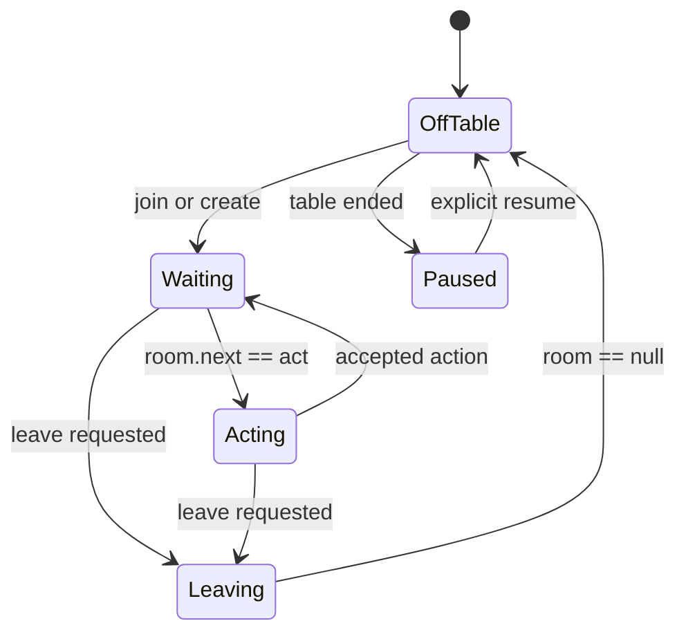

# River Club Integration

Status: Current

## Scope

River Club is the only implemented platform integration. It owns table
discovery, authentication, seating, state polling, action submission, and
clean departure. The server is authoritative for all game state.

The official source documents are:

- [Agent operating contract](../SKILL.md)
- [Decision guide](../upstream-STRATEGY.md)
- [OpenAPI definition](../openapi.json)

The historical protocol v1 field notes are retained in
[state-schema.md](../state-schema.md). Runtime behavior follows protocol v2.

## Components

| File | Responsibility |
| --- | --- |
| `platforms/river-club/src/river-cli.ts` | Official protocol v2.1 API client and command implementation |
| `platforms/river-club/src/journal-cli.ts` | CLI wrapper and append-only session journal |
| `platforms/river-club/src/v0-normalizer.ts` | River snapshot to legacy engine context mapping (fallback path) |
| `platforms/river-club/src/v1-mapper.ts` | River snapshot to structured v1 engine context mapping (default path) |
| `platforms/river-club/src/engine.ts` | River adapter, engine call, legality check, and operational fallback |
| `platforms/river-club/src/wait-turn.ts` | Long polling until a decision or exit state |
| `platforms/river-club/src/atomic-action.ts` | Atomic refresh, precondition validation, and action |
| `apps/river-club-agent/main.ts` | Adaptive autonomous session runner |
| `clients/node/engine-process-client.ts` | Platform-neutral engine process lifecycle and NDJSON framing (v0 fallback) |
| `clients/node/proto-engine-process-client.ts` | Platform-neutral framed v1 engine process lifecycle (default) |
| `bin/*` | Stable launchers into compiled `dist/` modules |

## State Machine



Operational invariants:

- Act only when `room.legal` is present.
- Submit exactly one action for one decision snapshot.
- Treat `raiseTo` as an inclusive target-total interval.
- Reconsider completely after `STALE_STATE`.
- While leaving, poll until `room` is null and send no gameplay mutation.
- After a table dissolves or becomes empty, wait for explicit approval before
  joining another table.

## River-to-Engine Mapping

The v1 mapper (`platforms/river-club/src/v1-mapper.ts`) is the default path.
It produces a structured v1 context with chip units, enum cards, ordered
seats, structured action history, side pots, and absolute targets. The v0
normalizer (`platforms/river-club/src/v0-normalizer.ts`) remains as the
fallback path and performs this mapping:

| River field | Engine field |
| --- | --- |
| `room.handId` | `handId` |
| `room.revision` | `revision` |
| `room.street` | `street` |
| `room.blinds` | `blinds` |
| `room.hero.cards` | `hole` |
| `room.board` | `board` |
| `room.solver.heroPosition` | `position` |
| `room.solver.playersInHand` | `playersInHand` |
| `room.solver.effectiveStackBb` | `effectiveStackBb` |
| `room.pot` | `pot` |
| `room.legal` | `legal` |
| `room.events` | preflop counters and actor-tagged street lines |

Cards are converted from `{rank, suit}` objects to two-character engine
notation. Position aliases such as `BTN/SB` are reduced to the first position.

## Action-History Reconstruction

For heads-up river solving, the adapter:

1. filters public action events;
2. identifies hero and opponent actions;
3. splits the event stream into betting rounds;
4. encodes check, call, bet, raise, and fold as compact actor-tagged tokens;
5. verifies that the current river line exists in the modeled tree;
6. estimates the observed river bet fraction from call price and pot.

Malformed, terminal, multiway, or unsupported lines disable the river solver
for that decision and leave the heuristic policy active.

The current parser identifies actors from event text and display names. This
is a River-specific compatibility mechanism and a known reason to introduce a
structured platform adapter contract.

## Timing Model

`play.mjs` observes the first actionable `timeLeftMs` as the table clock and
opens a model override window:

```text
window = min(20 seconds, timeLeftMs - safetyMs)
```

The C++ engine computes the immediate fallback. A valid model response written
to `.runtime/action.json` before the deadline replaces it. When the window
closes, the runner refreshes state, validates hand, street, action, and amount,
then submits.

## Local State

All files below are local and ignored by Git:

| Path | Purpose |
| --- | --- |
| `.runtime/config.json` | Runner mode, style, timing, stop-loss settings, and (RFC 0009 W1) `residentRoots`: `[{path, sha256}]` resident artifact roots, each a published strategy artifact and its mandatory 64-lowercase-hex whole-file pin. A malformed value fails the runner at startup (`runner-config-invalid`, exit 2) instead of silently running without the configured roots. Also supports `flopLibraries`: `["<dir>", ...]` flop class library directories, each expanded by the engine into one resident root per class via `<dir>/manifest.json` |
| `.runtime/pending.json` | Latest model decision opportunity, including the engine decision's `guaranteeLevel` and `artifactSha256` (W1; `null` when the decision carried none) |
| `.runtime/pending.log` | Append-only decision opportunities |
| `.runtime/action.json` | Model override for one hand and street |
| `.runtime/results.log` | Executed actions and outcomes; each decision carries its `guaranteeLevel` and `artifactSha256` when the framed engine attached them |
| `.runtime/stop` | Graceful stop request |
| `.runtime/resume` | Explicit approval to resume table selection |
| `sessions/*.jsonl` | Full CLI command and response journal |

With at least one configured resident root or flop library the runner uses the
framed v1 protocol at negotiated minor 2 (the guarantee-level and
artifact-digest surface) and passes the server's remaining-time budget through
as the solve budget. Since W3, v1 is the default protocol for the River Club
runner; v0 NDJSON remains as the fallback path. On a minor-2 AUTOMATIC
blueprint miss, the engine tries terminal-only resolving; if the resolver also
misses, a labeled operational fallback (check/call/fold) is served (W4d).

## Credentials

The token may exist only in:

- `~/.config/river-club-agent/config.json` with mode `0600`; or
- the `RIVER_CLUB_TOKEN` environment variable.

Never print, log, commit, or send the token through chat.

## TypeScript and Build Boundary

River implementation is strict TypeScript. External JSON enters through the
River parsing boundary as `unknown`, then becomes typed adapter state after
runtime checks for state, room, hero, cards, seats, legal actions, and sparse
heartbeats. CLI error responses use a separate type and recovery path.
`npm run build:ts` emits ignored JavaScript under `dist/`; compatibility
launchers never import TypeScript source directly.

River normalization and generic process management are separate. This allows
a future platform adapter to reuse the engine client without importing River
types. A second platform remains pending under
[RFC 0001](../rfcs/0001-engineering-architecture.md). The Protobuf migration
defined by [RFC 0002](../rfcs/0002-protobuf-engine-protocol.md) has landed;
v1 is the default protocol and v0 is the fallback.
