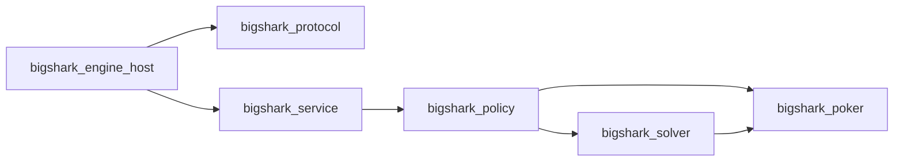

# RFC 0001: BigShark Engineering Architecture

## Summary

Restructure BigShark into a platform-neutral poker strategy engine with
explicit C++ domain, solver, policy, and host boundaries; reusable engine
clients; isolated platform adapters; application composition roots; and thin
`bin/` launchers.

River Club remains fully operational throughout the migration. The refactor
must preserve current decisions and command behavior before adding new
platforms or expanding solver capability.

## Motivation

The current repository proved the live decision loop and river solver, but its
layout reflects one rapidly developed integration:

- `bin/cpp-engine.mjs` combines River Club normalization, action-history
  reconstruction, process supervision, timeout handling, legality checks, and
  fallback behavior.
- `bin/play.mjs` combines room selection, bankroll policy, runner state,
  model override coordination, and River CLI invocation.
- `engine/src/decision.cpp` combines JSON parsing, strategy routing, solver
  translation, and policy implementation.
- `bin/` contains implementation code and a generated C++ binary rather than
  only stable entry points.
- The C++ build exposes broad static targets but does not enforce domain,
  solver, policy, protocol, and application dependency boundaries.

This shape makes a second platform likely to copy River-specific logic or add
provider branches to shared code. It also makes solver evolution harder
because transport, policy, and execution contracts are not independently
testable.

## Goals

- Make the C++ strategy engine independent of any poker platform API.
- Establish enforceable ownership and dependency direction.
- Keep platform authentication, polling, freshness, and action submission in
  platform adapters.
- Make `bin/` contain thin stable launchers only.
- Separate pure poker domain types from serialization-generated types.
- Preserve River Club command behavior, session logs, and replay results
  during migration.
- Allow a second platform to integrate without changing strategy code.
- Provide separate online decision, offline solving, replay, and benchmark
  applications.
- Keep every migration stage independently verifiable and reversible.

## Non-Goals

- Completing full-game GTO coverage in this refactor.
- Adding a second platform in the first implementation stage.
- Replacing River Club's official CLI or undocumented server behavior.
- Introducing a generic plugin framework before a second adapter exists.
- Moving authentication or network transport into C++ strategy libraries.
- Redesigning the poker strategy while moving ownership boundaries.
- Choosing the engine wire protocol; RFC 0002 owns that decision.

## Current State and Evidence

### Repository ownership

Current first-party implementation is concentrated in:

- `engine/`: evaluator, charts, equity, policy, river solving, experimental
  multi-street solving, JSON host, and tests.
- `bin/`: River Club CLI, journaling, polling, atomic action, adaptive runner,
  C++ process client, replay, and the published engine executable.
- `strategy/` and `.codex/skills/`: operational poker policy and exploitative
  style guidance.

### C++ coupling

`engine/src/decision.cpp` parses yyjson directly into `bs::Ctx`, runs policy,
maps solver actions to caller action strings, and returns `bs::Decision`.
`bsengine` publicly links yyjson through CMake. A pure policy caller cannot use
the library without inheriting serialization concerns.

### JavaScript coupling

`bin/cpp-engine.mjs` reads River-specific cards, solver fields, seats, and
localized event text, then also owns:

- process startup and warmup;
- NDJSON framing;
- FIFO response correlation;
- request timeout handling;
- response legality validation;
- operational fallback.

`bin/play.mjs` directly invokes `bigshark.mjs` for River rooms, joins, state
polling, actions, stop-loss, and leave behavior.

### Build and packaging

CMake publishes the release executable directly into `bin/`. Debug and ASan
presets are isolated, but the source tree still mixes executable scripts and a
generated binary. The C++ target also links CoreFoundation directly, making
the current build macOS-oriented.

### Verification baseline

The existing release gate provides:

- evaluator, equity, GTO, and multi-street reference CTests;
- documentation and RFC checks;
- historical decision replay with legality validation;
- debug, release, and sanitizer presets.

These form the behavioral baseline for the refactor.

## Design Principles

1. **Dependency direction is architectural.** Platform and serialization code
   depend on domain and policy code; domain and policy never depend on a
   platform or serialization implementation.
2. **Adapters terminate platform differences.** Provider cards, identities,
   revisions, localized text, amount semantics, and error codes do not cross
   the adapter boundary.
3. **Applications are composition roots.** Applications wire modules together
   and contain no reusable domain logic.
4. **`bin/` is an interface, not an implementation directory.** It contains
   thin launchers or installed artifacts only.
5. **Generated code is not domain code.** Protocol-generated types are mapped
   at the engine host boundary.
6. **Behavior parity precedes feature growth.** The first stages move code
   without changing decisions.
7. **One strategy core remains authoritative.** Platform adapters and clients
   contain no independent poker policy.
8. **Generalization requires evidence.** Shared runner abstractions are
   extracted only after two real adapters demonstrate common behavior.

## Proposed Design

### Target repository layout

```text
apps/
  engine-host/
    main.cpp
    CMakeLists.txt
  river-club-agent/
    main.mjs

engine/
  include/bigshark/
    poker/
    solver/
    policy/
    service/
  src/
    poker/
    solver/
      river/
      multistreet/
    policy/
    service/
  tests/
    poker/
    solver/
    policy/

proto/
  bigshark/engine/v1/
    engine.proto
  buf.yaml
  buf.gen.yaml

clients/
  node/
    engine-process-client.mjs
    tests/

platforms/
  river-club/
    src/
      api-client.mjs
      adapter.mjs
      runner.mjs
      atomic-action.mjs
      journal.mjs
    tests/
    fixtures/

tools/
  replay/
  benchmark/
  solver-cli/

bin/
  bigshark
  river-club-agent
  bigshark-engine

docs/
strategy/
.codex/skills/
```

Directory names describe ownership. The implementation may introduce these
directories stage by stage; a flag-day move is prohibited.

### C++ libraries

The target dependency graph is:



#### `bigshark_poker`

Owns:

- cards, ranks, suits, boards, and combinations;
- player, stack, pot, and action domain types;
- hand evaluation;
- range primitives;
- equity calculation.

It has no dependency on protocol-generated code, yyjson, OpenSpiel, HiGHS,
Node.js, or a platform API.

#### `bigshark_solver`

Owns:

- river game trees;
- sequence-form LP construction;
- HiGHS integration;
- DCFR;
- range construction and tracking;
- experimental multi-street CFR;
- exploitability and solver metadata.

It depends on `bigshark_poker`. OpenSpiel and HiGHS remain private
implementation dependencies.

#### `bigshark_policy`

Owns:

- preflop policy;
- postflop heuristic policy;
- solver routing;
- bet-size abstraction selection;
- deterministic action sampling;
- strategy profile application.

It consumes domain requests and returns domain strategy results. It does not
parse serialized messages.

#### `bigshark_service`

Owns:

- request semantic validation;
- capability checks;
- orchestration of policy queries;
- structured domain errors;
- metrics and trace metadata.

It does not own transport framing.

#### `bigshark_protocol`

Owns generated Protocol Buffers code and explicit mapping between generated
messages and service domain types. RFC 0002 defines this contract.

#### `bigshark_engine_host`

Owns:

- process startup;
- framed standard-input and standard-output transport;
- request dispatch;
- protocol-level error serialization;
- logging to standard error;
- capability requests.

### Node engine client

`clients/node` owns:

- child-process lifecycle;
- framed message encoding and decoding;
- FIFO or request-ID correlation;
- warmup;
- timeouts;
- process failure reporting.

It accepts only generated protocol messages. It never reads River Club rooms
or chooses poker actions.

### River Club platform adapter

`platforms/river-club` owns:

- the official API client and credentials;
- River state polling and room lifecycle;
- conversion to canonical protocol messages;
- structured action-history reconstruction;
- provider snapshot freshness;
- legal-action revalidation;
- conversion from target-total actions to River commands;
- River-specific operational fallback;
- table selection, bankroll policy, and journaling.

The adapter must not contain preflop ranges, postflop thresholds, or solver
policy.

### Applications

`apps/engine-host` composes C++ protocol, service, policy, and solver modules.

`apps/river-club-agent` composes the River adapter and Node engine client.

Tools are separate applications:

- replay consumes recorded fixtures and the engine client;
- benchmark measures domain, solver, and end-to-end latency;
- solver CLI supports offline experiments without platform dependencies.

### `bin/` policy

Tracked files in `bin/` are stable launchers with no reusable implementation.
Generated binaries are produced under `build/<preset>` and installed to an
ignored `dist/bin` directory. During migration, compatibility launchers may
preserve existing commands:

- `bin/bigshark.mjs`;
- `bin/play.mjs`;
- `bin/shoot.mjs`;
- `bin/bigshark-engine`.

Every compatibility launcher must state its target and removal condition.

### Test organization

Tests follow ownership:

- domain unit and property tests under `engine/tests/poker`;
- solver convergence and differential tests under `engine/tests/solver`;
- policy decision fixtures under `engine/tests/policy`;
- protocol conformance under `proto/tests` or a generated protocol test
  target;
- River mapping and state-machine tests under `platforms/river-club/tests`;
- cross-module end-to-end tests under `apps/*/tests`;
- replay and benchmark fixtures under their tools.

## Dependency Rules

Permitted dependencies:

```text
platform adapter -> engine client -> protocol generated types
engine host -> protocol mapper -> service -> policy -> solver -> poker
policy -> poker
tools -> public client or public C++ libraries
```

Forbidden dependencies:

- `engine/poker`, `engine/solver`, or `engine/policy` importing platform code;
- domain libraries importing generated Protocol Buffers types;
- the engine client importing River Club state types;
- platform adapters importing solver-private headers;
- reusable logic implemented in `bin/`;
- JavaScript implementing a second poker strategy;
- applications importing another application's private implementation.

CMake target visibility and include directories must enforce these rules.

## Compatibility and Migration

The migration preserves:

- current River Club CLI command names;
- `AGENTS.md` operating behavior;
- `.runtime` coordination semantics until explicitly migrated;
- `sessions/*.jsonl` replay support;
- `bin/bigshark-engine` as the operational engine entry point;
- current engine decisions for frozen fixtures.

Migration stages:

1. Freeze River snapshots, v0 contexts, and decisions as golden fixtures.
2. Extract the process client without changing the v0 JSON transport.
3. Extract River normalization and execution into `platforms/river-club`.
4. Move runner and journaling implementation behind compatibility launchers.
5. Split C++ domain, solver, policy, service, and host targets without changing
   behavior.
6. Implement RFC 0002 and run v0/v1 differential fixtures.
7. Switch River Club to the new protocol.
8. Replace generated source-tree binaries with install and launcher behavior.
9. Add a second platform adapter.
10. Extract only proven shared runner behavior.

Each stage must pass before the next starts. Compatibility code is removed
only after its replacement passes replay and operational validation.

## Security and Operational Impact

- Credentials remain platform-private and never enter engine requests.
- Platform adapters pass only information visible to the acting player.
- Action submission remains bound to an authoritative platform snapshot.
- Engine hosts accept bounded frame sizes and bounded solve budgets.
- Standard output is reserved for protocol frames; diagnostics use standard
  error.
- Every request carries a correlation ID through adapter, client, host, and
  solver metrics.
- Platform error codes are normalized only at the adapter boundary.
- No refactor stage may weaken hidden-information or token protections.

## Alternatives Considered

### Keep all JavaScript under `bin/`

Rejected. It provides no ownership boundary and makes stable command paths
indistinguishable from reusable implementation.

### Create one generic platform base class immediately

Rejected. River Club is the only implemented provider. A second adapter must
demonstrate the minimal shared contract before a reusable runner abstraction
is introduced.

### Move platform networking into C++

Rejected. It would mix credentials, retries, and provider APIs with poker
strategy and increase the engine security surface.

### Combine domain, solver, policy, and protocol in one C++ library

Rejected. Serialization would remain coupled to strategy, solver-private
dependencies would leak, and isolated testing would remain difficult.

### Rewrite everything before preserving fixtures

Rejected. A flag-day rewrite would make strategy regressions impossible to
separate from structural changes.

## Risks

| Risk | Impact | Mitigation |
| --- | --- | --- |
| Behavior drift during file moves | Silent strategy changes | Golden v0 context and decision fixtures before extraction |
| Premature generic adapter API | Ongoing abstraction cost | Extract shared runner behavior only after a second adapter |
| Compatibility launchers become permanent | Duplicate paths and confusion | Record removal criteria and test canonical entry points |
| C++ target split leaks private dependencies | Fragile builds | Enforce target visibility and compile isolated library tests |
| Protocol migration and architecture migration overlap | Hard rollback | Implement RFC 0002 only after adapter and client boundaries exist |
| Generated artifacts pollute source ownership | Review and reproducibility issues | Generate under build directories and keep IDL authoritative |
| Cross-platform build assumptions remain | Linux integration failure | Remove CoreFoundation requirement and add a build matrix |

## Verification Plan

- Freeze representative River preflop, flop, turn, and river snapshots.
- Record their v0 normalized contexts and engine decisions.
- Add pure mapping tests for River snapshot to canonical request.
- Add engine-client framing, timeout, and process-restart tests.
- Compile C++ libraries independently with only declared dependencies.
- Run debug, release, and sanitizer CTest suites.
- Run historical replay with zero illegal actions and zero unexpected
  fallbacks.
- Add Linux and macOS release builds before claiming platform portability.
- Add second-adapter conformance fixtures before extracting shared runner code.

## Rollout Plan

1. Land tests and fixtures with no runtime change.
2. Extract Node process-client code behind the existing `cpp-engine.mjs`
   export surface.
3. Move River normalization behind the same export surface.
4. Move session orchestration behind existing `bin/` launchers.
5. Split C++ targets one boundary at a time.
6. Implement and migrate the protocol under RFC 0002.
7. Move generated binaries to install output while retaining a launcher.
8. Add the second adapter.

At every stage, stop if golden decisions, legal action validation, or replay
results diverge without an explicitly approved strategy change.

## Rollback Plan

Each migration stage remains a separate logical change. Compatibility
launchers retain the previous entry point until the new owner passes all
verification. Rollback restores the previous module wiring without reverting
fixture or test improvements. Protocol migration has its own rollback in RFC
0002.

## Open Questions

- Which external platform will validate the second adapter boundary?
- Should replay become a platform-independent tool immediately after River
  extraction, or only after the second adapter exists?
- Which Linux distribution and compiler define the first portability target?

## Acceptance Criteria

- The target directory and ownership model are explicitly approved.
- Every target module has permitted and forbidden dependency rules.
- River Club compatibility requirements are accepted.
- The staged migration and rollback plan are judged independently reversible.
- RFC 0002 owns protocol decisions and does not leak them back into this RFC.
- The second-adapter rule for shared runner extraction is accepted.
- No implementation starts before this RFC records explicit approval.

## Decision

Approved by: BigShark project maintainer

Decision date: 2026-09-13

Approved as written. This RFC governs the staged repository and module
architecture refactor. RFC 0002 independently governs the engine protocol.
Implementation must follow the rollout order, compatibility requirements, and
acceptance criteria in this document.
