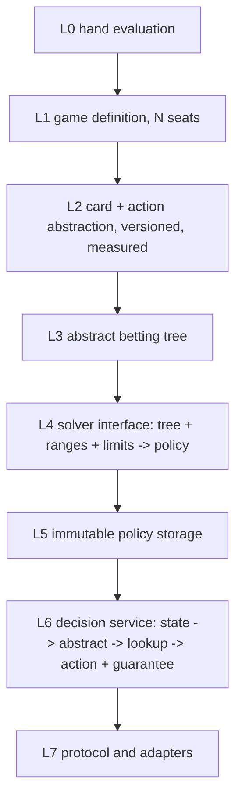

# RFC 0008: Unified N-Player Engine Architecture

## Summary

Restructure the engine around the one thing it is currently missing: an
**explicit, versioned abstraction layer**. Today the rules exist twice
(`HeadsUpState` and `MultiwayState`), the solver family is five mutually
incompatible entry points, the preflop charts are hard-coded C++ tables, and the
heuristic is indistinguishable from a solver in the decision path. The proposal
introduces one game definition parameterized by seat count, one abstraction
layer over it, one solver interface that sees a tree rather than a player count,
and one explicitly-labeled guarantee level on every decision the engine
returns. It then removes the duplicated and superseded paths in dependency
order, with each removal gated on the replacement being verified.

The target is a 2..10 seat engine whose strength degrades along a declared,
measurable gradient instead of a table-and-heuristic fallback.

## Motivation

The engine cannot grow toward larger tables because the layer that would make
larger tables tractable does not exist. Concretely, measured in this repository:

- **The rules are implemented twice.** `HeadsUpState`
  (`engine/src/poker/heads_up.cpp`, 12 member functions) and `MultiwayState`
  (`engine/src/poker/multiway.cpp`, 13 member functions) duplicate `actor`,
  `pot`, `can_raise`, `legal`, `pay`, `refund_unmatched`, `close_street`,
  `after_action`, `after_card`, `award`, `settle_fold`, and `settle_showdown`.
  RFC 0004's design principle 2 requires "all strategies use the same legal
  transition function"; the repository currently violates it.
- **There is no abstraction layer.** `grep` for a card or action abstraction
  finds only unrelated hits; bucket logic exists inside the experimental
  multistreet validation game, not as a shared component. RFC 0004 defers
  "lossy card buckets" to "a subsequent design and measured abstraction error"
  and that design is this RFC.
- **The solver family has five incompatible interfaces.** `river_gto`
  (`SolveRiver`, a river-specific `RiverNode` enumeration), `cfr_solver`
  (bounded full-tree DCFR), `multistreet_cfr` (experimental validation game),
  `heads_up_solver` (multi-size CFR with an `InformationKey` and a
  `HeadsUpPolicy`), and `multiway_sampler` (joint-deal enumeration). None share
  a policy or tree type.
- **The preflop charts are hard-coded.** `engine/src/poker/charts.cpp` is 98
  lines of `std::unordered_set<std::string>` literals produced from the
  playbook, consumed directly by `preflop()` in `engine/src/policy/decision.cpp`.
- **The heuristic is not distinguishable from a solver.** `decision.cpp` routes
  by street (preflop to charts, river to `river_gto`, everything else to
  heuristics) and returns a `Decision` with no statement of what, if anything,
  is guaranteed about it.
- **The settlement layer stops at six seats.**
  `engine/include/bs/settlement.hpp:67` states "Supports 2..6 players", while
  the platform's own room schema allows `maxPlayers` up to 10
  (`docs/openapi.json:93`). The engine therefore cannot represent the largest
  table it can be asked to play.

The cost of the current shape is not aesthetic. It means every new capability
must be implemented per seat count, every solver has its own correctness story,
and a reader of a decision cannot tell whether it came from an equilibrium
computation or a hand-written rule.

## Goals

- One game definition for 2..10 seats, with one legal-transition implementation
  and one settlement path, such that `HeadsUpState` and `MultiwayState` become
  configurations of it rather than separate types.
- An abstraction layer (card and action) that is explicit, versioned, bounded,
  and carries a **measured** error bound, and whose effect on decision quality
  is reported rather than assumed.
- One solver interface that takes an abstract tree and returns a policy, so a
  new solver is added without touching the rules, the abstraction, or the
  decision path.
- Every decision the engine returns carries an explicit **guarantee level**
  drawn from a closed set, so no approximate source can be mistaken for an
  equilibrium one.
- The superseded paths are removed in dependency order, each removal gated on a
  verified replacement.

## Non-Goals

- Claiming a 10-seat equilibrium. Multi-seat CFR has no convergence guarantee,
  and RFC 0006 states plainly that the two-player zero-sum theorem does not
  extend. This RFC builds the structure that lets measured quality be reported
  at larger seat counts; it does not assert a quality result it has not measured.
- Preserving v0 on the wire beyond the removal stage below.
- Replacing the heuristic with a solver where no solver is applicable. The
  heuristic remains, but becomes a labeled source rather than an unnamed default.
- Tournament ICM, rake, and utility-model changes; RFC 0006 owns those.
- Live promotion of any new profile. That remains a separate gate.

## Current State and Evidence

Verified at commit `70491a9`:

- Rules split: `engine/include/bs/heads_up.hpp` and
  `engine/include/bs/multiway.hpp`; implementations as cited above. The
  heads-up type additionally carries two root profiles (`preflop` and
  flop-rooted) and the multiway type carries 3..6 seats.
- Settlement: 2..6 seats, with earlier stages having added side pots, rake, and
  bounded ICM (§ Stage 11, Stage 12).
- Solver interfaces: as listed in Motivation, verified by reading each header.
- Decision routing: `engine/src/policy/decision.cpp` selects by street; the
  preflop branch consumes `charts()`, the river branch calls into `gto`, and the
  remainder falls through to heuristic helpers in the same file.
- Protocol: production traffic uses v0 NDJSON
  (`engine/src/protocol/v0_json.cpp`, 132 lines) with a v1 Protobuf contract
  implemented behind it (RFC 0002 Stages 7-8). The roadmap already records v0
  removal as `P8`, gated on "no remaining callers, rollback release artifact".
- Module dependencies (from `engine/CMakeLists.txt`): `solver -> poker`,
  `artifacts -> solver`, `resolver -> solver`, `resident -> artifacts +
  resolver`, `policy -> poker`. No abstraction component exists in this graph.

Assumptions, stated as such: that an action abstraction is sufficient to make
multi-seat trees tractable at some declared quality, and that a card abstraction
with a bounded error can be built over the existing range representation. Both
are to be measured in the stages below rather than assumed; the second is the
known-hard part and is called out as a risk.

## Design Principles

1. **One rules implementation.** Seat count is a parameter of a game definition,
   never a second copy of the transition function.
2. **Abstraction is explicit and versioned.** An abstracted game carries its
   abstraction identity and its measured error alongside it, so a policy can
   never be read as a statement about the unabstracted game.
3. **Solvers face trees, not player counts.** A solver's input is an abstract
   tree plus ranges plus limits; nothing in a solver signature mentions heads-up
   or multiway.
4. **Guarantee levels are a first-class output.** Every decision states what is
   guaranteed about it, from a closed set, and the set is ordered by strength.
5. **A heuristic is a strategy source, not a solver.** It is declared, labeled,
   and measured like any other source.
6. **Removal follows replacement.** A superseded path is deleted only after the
   replacement is verified against it, and the verification is recorded.

## Proposed Design

### Layering



| Layer | Owns | Must not own |
| --- | --- | --- |
| L0 `bigshark_poker` evaluation | Card ids, hand ranking | Anything about betting or strategy |
| L1 game definition | Legal transitions, chip state, settlement, for 2..10 seats | Abstraction choices, solvers, storage |
| L2 abstraction | Card bucketing, action menus, abstraction identity and error | Rules, solving, IO |
| L3 tree construction | Enumerating the abstract betting tree from L1 + L2 | Solving, storage |
| L4 solver | Producing a policy for a tree | Rules, abstraction, persistence, transport |
| L5 storage | Immutable policy artifacts, digests, bounded reading | Strategy semantics |
| L6 decision service | Routing a state to a policy source and reporting a guarantee | Rules, solver internals, transport |
| L7 protocol | Wire contracts | Strategy |

### L1: one game definition

`bs::poker::GameDef` describes a hand: seat count (2..10), button, blinds, antes,
stacks, and the rules variant. `bs::poker::GameState` is the transition machine
over it, with the union of the two current types' behavior expressed once.

The two existing profiles become configurations rather than types:

- the heads-up preflop root is `GameDef` with 2 seats and posted blinds;
- the heads-up flop root is `GameDef` with 2 seats and a rooted board;
- the current multiway root is `GameDef` with 3..6 seats.

Compatibility is preserved by keeping `HeadsUpState` and `MultiwayState` as thin
adapters over `GameState` during the transition, so every existing caller and
every existing test keeps working while the implementation is unified. The
adapters are deleted in the removal stage, not before.

Settlement extends from 6 to 10 seats. The contribution-layer algorithm is
already seat-count agnostic in structure; the change is a bound and its tests.

### L2: abstraction

Two components, both versioned and both carrying their own identity:

- **Action abstraction** maps a legal action set to a declared ordered menu. The
  existing per-street fractional size schedules (RFC 0007) are one
  implementation of it, made explicit.
- **Card abstraction** maps a concrete two-card holding plus board to a bucket.
  The first implementation is deliberately simple and measurable: a strength
  bucket over the existing range representation, with the bucketing function
  itself a declared, versioned parameter.

`AbstractionId` (name plus version plus parameters plus a digest) is part of a
game's identity, so a policy trained under one abstraction can never be looked
up under another. No abstraction is ever applied silently; a caller that
requests the unabstracted game gets the exact game or an explicit refusal.

**Measured error is part of the contract.** For a card abstraction the error is
the exploitability difference between the exact and abstracted solve on
enumerable validation games, reported as a number per validation fixture. RFC
0004's principle that lossy buckets "require measured abstraction error" is
satisfied by publishing that number, not by asserting smallness.

### L3: abstract tree

One builder produces an abstract tree from a `GameDef` and an `AbstractionId`.
The tree node type is shared by every solver. Terminal values come from L1
settlement, so multi-seat payout vectors (RFC 0006) flow through unchanged.

### L4: solver interface

```
struct SolveRequest { const AbstractTree& tree; ranges; SolveLimits limits; seed; };
struct SolveResult  { Policy policy; Guarantee guarantee; measured cost fields; };
SolveResult solve(const SolveRequest&);
```

Existing solvers become implementations: the river LP and DCFR, the heads-up
CFR, and any future multi-seat trainer. A solver declares which tree shapes it
supports and refuses the rest explicitly rather than approximating.

### L5: storage

The existing artifact and resident machinery (RFC 0005) is retained. Its game
identity gains the `AbstractionId`, and its schema-major coexistence rules (RFC
0007) are reused to carry the widened game definition.

### L6: decision service and guarantee levels

Every decision returns a `Guarantee` from a closed, ordered set:

| Level | Meaning |
| --- | --- |
| `certified_bound` | The decision came from a policy with an independently certified bound (as RFC 0005 Stage 9 does) |
| `exact_solved` | Solved exactly for the declared abstract game, no certified bound |
| `abstract_solved` | Solved for an abstract game; the abstraction carries a measured error |
| `approximate` | A declared heuristic or equity-based policy, with no solve |
| `operational_fallback` | A legality-preserving fallback when no strategy source was available |

The level is computed from the policy source, never from the caller's hopes, and
it is reported on the wire. A response whose level is weaker than the caller
requested is an explicit, typed outcome rather than a silent substitution. This
replaces the current street-based routing with source-based routing plus an
explicit preference order.

### L7: protocol

The v1 Protobuf contract gains the guarantee level as a structured field. v0 is
removed in the removal stage below, after the replacement is verified.

## Dependency Rules

- L1 depends only on L0. L2 depends only on L1 types. L3 depends on L1 + L2. L4
  depends on L3. L5 depends on L4's policy type. L6 depends on L5 + L4. L7
  depends on L6.
- No layer may depend on a later layer. In particular the abstraction must not
  know about solvers, and the decision service must not know about a specific
  solver's internals.
- `bigshark_solver` keeps its current dependency on `bigshark_poker` and gains no
  transport or storage dependency.
- The abstraction component is new and is placed in `bigshark_poker`'s dependents,
  not inside it: the rules must not know how they are abstracted.

## Compatibility and Migration

| Surface | Effect |
| --- | --- |
| `HeadsUpState` / `MultiwayState` | Keep working as adapters during the transition; deleted only in the removal stage |
| Existing policies and artifacts | Keep their identity and digests; the game identity gains an abstraction field under RFC 0007's schema-major rules |
| v0 NDJSON | Kept until the removal stage, where its removal is gated on no remaining callers and a rollback artifact |
| Preflop charts | Behavior preserved while they are re-expressed as an abstraction instance; the numeric tables do not change in that step |
| Live decision path | Unchanged in behavior until a source is explicitly promoted; every step is independently revertible |
| Settlement | Extended to 10 seats; 2..6 behavior is unchanged and re-verified against the Stage 11 oracle |

No flag day. Each stage lands behind the existing opt-in mechanisms and is
revertible on its own.

## Security and Operational Impact

Offline-only for every stage that touches training or abstraction. No
credentials, network access, or live play. The security-relevant boundary is
unchanged: the server remains authoritative, the engine still chooses only from
the supplied legal action set, and the hidden-information rule is unchanged -
an information key still contains only the acting seat's own cards, the board,
and public history.

The operational change is observability: every decision now reports a guarantee
level, which makes a quality regression visible in the session journal instead of
being indistinguishable from an equilibrium decision.

Resource limits are per-layer and declared: abstraction construction, tree size,
solve budget, and lookup budget each have their own bound, and an oversized tree
or an unavailable solver is a typed refusal rather than a degradation.

## Alternatives Considered

- **Extend `MultiwayState` from 6 to 10 seats and keep the current shape.**
  Rejected as the primary approach: it multiplies the duplication (a third
  transition implementation or a second branch in the existing two) and does not
  address why the engine cannot grow, which is the missing abstraction.
- **Adopt a full-game solver design with neural abstractions.** Rejected for this
  repository stage: it requires training compute and a validation story this
  project's bounded local limits do not support, and it would replace a working
  verified solver with an unverifiable one.
- **Keep the five solver interfaces and add a sixth for multi-seat.** Rejected:
  the interfaces are the reason a new capability touches every layer.
- **Delete the heuristic and serve only solved policies.** Rejected as a
  sequencing error: the heuristic is currently the only source that covers most
  live states, so deleting it before a replacement exists makes the engine
  unable to return a legal action, which violates a safety invariant.
- **Keep v0 indefinitely behind an adapter.** Rejected: v0 is transitional debt
  with a recorded removal item, and the adapter would have to carry the widened
  state anyway.

## Risks

| Risk | Mitigation |
| --- | --- |
| The unification changes heads-up or v0 behavior | Adapters first, deletion later; every step re-runs the Stage 1 exhaustive oracle (12,226 nodes), the replay suite (156 decisions / 0 illegal / 0 JS fallbacks), and the frozen matrix |
| The card abstraction's measured error is large enough to make the abstract policy worse than the current heuristic | Measured per validation fixture before it feeds any decision; a level weaker than `approximate` is never promoted |
| Multi-seat CFR does not converge, so a 10-seat solve is not trustworthy | No convergence claim is made; the guarantee level reports `abstract_solved` and the measured quality, and RFC 0006's nonconvergence statement stands |
| Widening settlement to 10 seats breaks the verified 2..6 path | The Stage 11 exhaustive contribution grid is re-run unchanged and extended; 2..6 results must be bit-identical |
| The abstraction becomes a place where quality silently degrades | `AbstractionId` is part of game identity, so no policy is ever looked up under a different abstraction, and the decision reports its level |
| The refactor stalls with two rule implementations alive | Each stage is independently revertible and the adapters keep both alive deliberately; the removal stage is gated on the replacement's verification, not on a calendar |

## Verification Plan

- **Unification equivalence.** For every root configuration the Stage 1 oracle
  enumerates, `GameState` and `HeadsUpState` produce identical transitions,
  chip states, and settlement. The oracle is the independent enumerator and is
  not modified by this work.
- **Settlement extension.** The Stage 11 contribution grid re-run unchanged for
  2..6 seats, bit-identical, plus a 7..10 seat extension with independent chip
  conservation and side-pot checks.
- **Abstraction identity.** A policy trained under `AbstractionId` A cannot be
  looked up under B; the refusal is typed. Round-trip through storage preserves
  the identity.
- **Measured abstraction error.** Exact versus abstracted exploitability on
  enumerable validation games, reported per fixture as a number, including the
  case where the abstraction is the identity (error must be zero).
- **Solver interface conformance.** Every existing solver is reachable through
  `solve`, refuses unsupported tree shapes explicitly, and reproduces its
  previous results bit-for-bit under the identity abstraction.
- **Guarantee-level correctness.** Every decision path reports the level its
  source warrants; a test asserts a weaker level is never reported as a stronger
  one, and that a request for a stronger level than available is typed.
- **Removal gates.** Each removed path has a recorded verification that its
  replacement covers every caller before deletion, and the full `AGENTS.md` gate
  passes at each removal commit.

## Rollout Plan

Each stage is independently verifiable and revertible. Stop on any legality,
conservation, oracle, or interface-conformance failure.

1. **Game definition.** Introduce `GameDef`/`GameState` for 2 seats behind
   adapters, preserving `HeadsUpState` behavior exactly. Gate: the Stage 1
   oracle and the replay suite, unchanged.
2. **Seat-count parameterization.** Extend `GameState` to 3..10 seats behind
   adapters, preserving `MultiwayState` behavior exactly. Gate: the multiway
   test suite plus the settlement grid.
3. **Abstraction layer.** Introduce action and card abstraction with
   `AbstractionId`, an identity implementation, and the measured-error harness.
   Gate: the error is zero for the identity abstraction, and the existing size
   schedules reproduce their current decisions.
4. **Tree and solver interface.** Introduce the shared tree and `solve`, and
   port the existing solvers behind it. Gate: bit-for-bit reproduction of each
   solver's previous results.
5. **Decision service and guarantee levels.** Source-based routing with the
   typed level on every response. Gate: the level-correctness tests and the
   replay suite with unchanged decisions.
6. **Measured larger-table policy.** Apply the abstraction to produce and
   measure a policy at larger seat counts, reporting measured quality and no
   convergence claim. Gate: published per-fixture numbers.
7. **Removal.** Delete the duplicated rule implementations (via the adapters),
   the hard-coded chart tables (re-expressed as an abstraction instance with
   unchanged values), the experimental solver paths subsumed by the interface,
   and v0. Gate: no remaining callers, a rollback release artifact, and the full
   gate green.

## Rollback Plan

Every stage up to 7 is additive behind adapters or opt-in selection, so
reverting the stage restores the previous behavior exactly. Stage 7 is
destructive and is therefore gated on a published rollback release artifact
containing the removed paths; the roadmap already requires this for v0 under
`P8`. No policy artifact is rewritten or reinterpreted at any stage, and no
existing digest moves.

## Open Questions

- Which card abstraction (strength buckets over the existing range, or something
  finer) gives an acceptable measured error at larger seat counts? Decided by
  stage 3's measured error, not by preference.
- At what seat count does the abstracted solve stop producing a policy that beats
  the declared heuristic, measured? Reported in stage 6; this is the honest
  answer to "how far up the table sizes can this engine actually go".
- Does the guarantee level belong on the wire as a new v1 field or as a v2
  package? RFC 0006 anticipates a `bigshark.engine.v2` for coherent full-state
  support; decided when stage 5 lands.
- Should the heuristic move into its own target with its own tests rather than
  staying in the decision service? Decided in stage 5.

## Acceptance Criteria

- One legal-transition implementation serves every seat count from 2 to 10, with
  the previous types available only as adapters, and the Stage 1 oracle passes
  unchanged.
- Settlement supports 2..10 seats with the 2..6 results bit-identical to the
  Stage 11 evidence and independent conservation checks at 7..10.
- An `AbstractionId` is part of game identity, no policy is looked up under a
  different abstraction, and the identity abstraction's measured error is zero.
- A card abstraction publishes a measured error per validation fixture, and no
  decision is served from an abstraction whose error is unreported.
- Every solver is reachable through one interface, refuses unsupported shapes
  explicitly, and reproduces its previous results bit-for-bit under the identity
  abstraction.
- Every decision reports a guarantee level from the closed set; a weaker source
  is never reported as a stronger level.
- The superseded paths are removed with recorded replacement evidence, and the
  full gate is green at each removal.

## Decision

Pending independent approval-agent review.
