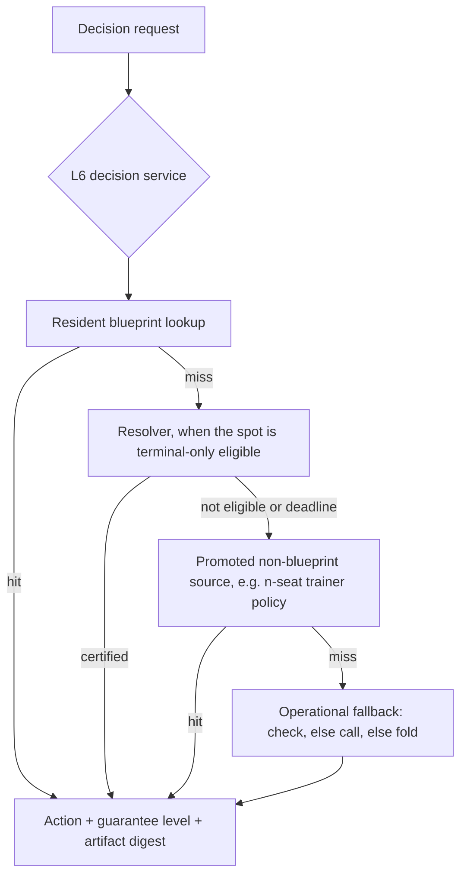

# RFC 0009: Unified Engine Delivery and Live Promotion

## Summary

RFC 0008 designed one engine for 2..10 seats and landed its first five stages,
but it deliberately stopped short of delivery: nothing routes through the
unified core on any live path, the persisted formats and the resolver are
two-seat-typed, and the heuristic still answers every live turn as an unnamed
strategy. This RFC is the delivery contract for that architecture. It (1) makes
the engine actually serve real tables and the offline practice simulator
through the already-built resident pipeline, (2) extends the L4 solve seam with
a seat-parameterized trainer that consumes the L3 tree so 3..10 seats are
solved by the same engine rather than refused, (3) widens the strategy artifact
to schema v2 carrying the seat dimension and the declared `AbstractionId` under
the coexistence mechanism RFC 0007 already approved, (4) generalizes the
resolver's certification to per-seat non-regression for n seats, (5) defines the
flop-coverage mechanism (preflop terminal-depth profiles, suit-isomorphic board
canonicalization, precomputed flop libraries, terminal-only resolving), and
(6) demotes the chart-plus-heuristic from an unnamed automatic strategy to a
declared, explicitly-requested policy source, with the demotion landing in the
same change as the promotion so no revision ever serves a live turn with
neither a promoted source nor a legal fallback.

## Motivation

The user's requirement, stated directly: one GTO engine that covers 2..10 seats
without the seat count being visible to the user, actually connected to the
table, with the heuristic removed as a strategy. The architecture for that
exists. The delivery does not.

Concretely, measured in this repository:

- **The engine has never served a live decision.** The runner calls
  `decide(room, { style, heroName, timeoutMs })`
  (`apps/river-club-agent/main.ts:319`) with no protocol or blueprint
  configuration, so production runs the v0 NDJSON path
  (`platforms/river-club/src/engine.ts:144`, `:161-171`) into `bs::decide`,
  which is the chart-plus-heuristic policy
  (`engine/src/policy/decision.cpp`). The resident blueprint pipeline
  (`--resident-root`, `apps/engine-host/main.cpp:277-316`; minor-1 BLUEPRINT and
  RESOLVING serving, `engine/src/protocol/v1_envelope.cpp:202-357`) is
  implemented, tested, and launched by nothing outside tests: the TypeScript
  client hardcodes `args: ['--serve-proto']` (`engine.ts:76-85`), and no
  production path selects `proto` or `protoBlueprint`.
- **The heuristic is indistinguishable from a strategy on the live path.** On
  v0 it carries no guarantee level at all (`ExecutableDecision` has none on the
  frozen path); even on minor 2 the AUTOMATIC mode falls through to
  `bs::decideSourced` (`v1_envelope.cpp:333-356`), so the engine's own
  heuristic answers any state no blueprint covers. RFC 0008's goal - "every
  decision carries an explicit guarantee level ... so no approximate source can
  be mistaken for an equilibrium one" - is met only where a client negotiates
  minor 2, and production negotiates minor 0.
- **The unified core serves 2..10 everywhere except the solver and everything
  downstream of it.** `GameDef`/`GameState` construct 2..10 seats
  (`engine/include/bs/game_definition.hpp:51-53`), the L2 abstraction and its
  `AbstractionId` exist (`engine/include/bs/abstraction.hpp`), the L3 abstract
  tree is built for 2..10 (`engine/include/bs/abstract_tree.hpp`), and
  `SolveRequest::ranges` is already per-seat
  (`engine/include/bs/solve.hpp:76,97`). But `solve()` routes only the two-seat
  identity tree and refuses every other shape with a typed
  `unsupported_tree_shape` (`engine/src/gto/solve.cpp:109-123`), the artifact
  DDL fixes two seats in four separate constraint sites (the `game` columns
  `:521-539`, `ranges.player` `:552-557`, `information_states.player` `:559-566`,
  and `bounds.responder_combo` `:590-601`), with the `sizes` street bound
  `:541-542` as the fifth and RFC 0007's already-named constraint, the
  canonical public key grammar admits only actors 0 and 1
  (`artifact_codec.cpp:95`, `:111-112`, `:165`), the resolver's model is a
  hero/responder pair (`counterfactual_reach.hpp:15-19`,
  `resolver.hpp:112,230`), its certification is a one-sided two-player bound
  (`certifier.cpp:58-161`), and the resident mapper refuses any request whose
  `players_size() != 2` (`v1_resident_mapper.cpp:70-71`). The wire protocol
  itself already accepts 2..10 (`v1_semantic_validator.cpp:458-479`), so the
  protocol is ready and the domain types are not.
- **The multiplayer trainer exists but has no storage and no bridge.** The
  stage-6 MCCFR trainer is gated for 2..10 live seats, and its measured
  candidate is an honest null that has not been promoted; its frozen artifact
  format (`engine/include/bs/stage6/frozen_manifest.hpp`) is non-SQLite, has no
  production reader (load is exercised only by tests), and is fenced from the
  service closure by the offline guard
  (`engine/cmake/stage6_offline_guard.cmake:15-26`).
- **The preflop profile approved in RFC 0007 is not implemented.**
  `TerminalDepth::Flop` is declared but only `River` is accepted
  (`engine/include/bs/game_definition.hpp:65,124`;
  `engine/src/poker/game_definition.cpp:63`), so no preflop-rooted
  training exists at any seat count, and the live preflop is the six-max chart.
- **Flop coverage has no mechanism.** A live board is an arbitrary one of
  C(52,3) = 22,100 flops, and no suit-isomorphism utility exists anywhere in
  the repository (verified by search: zero hits for isomorphism, canonical
  suit, or relabeling), so even a library of trained flops would have to be
  enumerated 22,100-fold instead of 1,755-fold.

The expected value is the one RFC 0008's Summary states and never delivered:
a 2..10 seat engine whose strength is a declared, measured gradient, actually
serving decisions, with every decision's provenance on the record.

## Goals

- A live turn is served through v1 with a promoted source whenever one covers
  it, and with an explicit `operational_fallback` otherwise; no live turn is
  ever answered by an unnamed strategy.
- One engine for 2..10 seats: the same game definition, abstraction, tree,
  solve seam, artifact format, resident lookup, and guarantee ladder serve
  every seat count; the only per-seat differences are declared abstraction
  parameters and the honest guarantee level.
- A seat-parameterized solver reachable through `solve()` for 3..10 seat
  identity trees, with the two-seat route bit-for-bit unchanged.
- Strategy artifact schema v2 carrying the seat dimension, the declared
  `AbstractionId`, and the terminal depth, with every existing artifact still
  loading byte-identically under its frozen v1 definition.
- Resolver certification generalized to per-seat non-regression for n seats,
  with its semantics documented as NOT an equilibrium claim.
- A defined flop-coverage mechanism: suit-isomorphic board canonicalization,
  preflop terminal-depth profiles per RFC 0007 generalized to n seats,
  precomputed flop libraries, and terminal-only on-demand resolving.
- The chart-plus-heuristic demoted to a declared policy source that no
  automatic routing selects; the demotion lands in the same change as the
  first promotion.
- The practice simulator serves at least one bot tier from the same engine
  host, through a process boundary that preserves the offline guard.

## Non-Goals

- Claiming a quality advantage at any seat count. RFC 0008's stage-6 gate
  measured the larger-table candidate against the pinned baseline and recorded
  an indistinguishable result; this RFC does not reopen that claim, and the
  delivered n-seat policy carries `approximate` until an abstraction's measured
  error earns a stronger level under RFC 0008's two-regime definition.
- Neural training, full-game solving, or any change to the resource envelope
  RFC 0008 declared.
- Live play authorization, credentials, network access, or spending. Every
  stage here is offline; promotion means "the engine answers decision requests
  in-process or over the local protocol", not "the agent plays for money".
- Deleting the stage-6 measurement machinery. It stays quarantined and
  unchanged, with its guards intact.
- Deleting v0 or `HeadsUpState`/`MultiwayState`. Those removals remain RFC
  0008 stage 7's, gated on their own record; this RFC only requires that the
  new paths stop depending on the old types, and preserves v0's current bytes
  and behavior for the replay suite.
- Changing minor-0 or minor-1 wire bytes, or any frozen benchmark number.
- A latency target for live serving. Latency evidence is collected and
  reported (RFC 0008's resource envelope requires the cost column), but the
  target belongs to the separate live-promotion decision.

## Current State and Evidence

Verified against the working tree at commit `d51f044` on
`feat/rfc-0004-0006`. Facts are separated from assumptions; every claim names
its source.

**Live path.** `apps/river-club-agent/main.ts:319` is the only production
decision call: `decide(room, { style, heroName, timeoutMs })`.
`platforms/river-club/src/engine.ts:144` selects the v1 path only when
`config.proto === true || process.env.BIGSHARK_ENGINE_PROTO === '1'`
(`:93`); default is v0 (`:161-171`). The v1 child is spawned with a hardcoded
argument list `['--serve-proto']` (`:76-85`); no configuration field or
environment variable carries resident roots. `solveTimeBudgetMs` is pinned at
`2000` in the request mapper (`platforms/river-club/src/v1-mapper.ts:546`)
while the runner computes a real budget from `room.timeLeftMs`
(`apps/river-club-agent/src/runner-state.ts:80-87`, consumed at `main.ts:317-319`),
and it reaches the engine only as the client-side timeout. `safeFallback`
(check, else call, else fold; `platforms/river-club/src/v0-normalizer.ts:35-47`)
runs on every error path, including a blueprint coverage miss
(`engine.ts:157`, comment). The host's parse-error path returns a fold
(`apps/engine-host/main.cpp:326`), so "operational fallback" has two different
definitions in the tree today.

**Resident and resolver.** `--resident-root <path>=<sha256>` is parsed at
startup (`main.cpp:277-295`), loaded through `ResidentPolicySet::build`
(`:297-316`), advertised (`:65-67`), and served on minores 1 and 2
(`v1_envelope.cpp:202-357`); the artifact pin is empty on the wire by design
(`v1_protocol.hpp:141-142`). The resolver (`bs::resolver::Resolver`) accepts
only `HeadsUpState` roots (`resolver.hpp:230`), models exactly one responder
(`counterfactual_reach.hpp:15-31`, the `ReachModel` member pair and
`MarginRecord{responder_cards}` at `resolver.hpp:124-125`), and certifies with
a one-sided acceptance rule `BR_cand(I) <= b(I) + 1e-9 * root_pot` against the
locked blueprint continuation (`certifier.cpp:58-161`). Its gadget CFR driver
iterates exactly two traversers (`gadget_cfr.cpp:154-166`). `ResolveStatus`
values are `Certified`, `CertificationRejected`, `SolveDeadline`,
`CertifyDeadline`, `Ineligible`, `CoverageMiss`, `InvalidInput`
(`resolver.hpp:84-92`). Two production callers exist, both in the host
(`main.cpp:148`); nothing sets a resident root outside tests.

**Unified core.** L1/L2/L3 and the L4 seam are as cited in Motivation. The L4
header states the intended future directly: "A future N-seat trainer will
consume the materialized tree directly" (`engine/include/bs/solve.hpp:15`).
`SolveResult` deliberately carries no guarantee level; the normative mapping is
the single table in `engine/src/policy/guarantee.cpp`, consumed by
`v1_envelope.cpp:333-356` on minor 2. The protocol's guarantee ladder is field
11 with tokens `certified_bound | exact_solved | abstract_solved | approximate |
operational_fallback` and the request floor is field 8, error 9
(`docs/rfcs/0008-unified-n-player-architecture.md`, stage-5 record).

**Artifact and resident 2-seat coupling.** Table by table, with the exact
sites: `game` fixes `button IN (0,1)`, `root_street = 0`, concrete
`flop0..flop2`, `stack0/stack1`, `contribution0/contribution1`
(`strategy_artifact.cpp:521-539`); `ranges.player CHECK (player IN (0,1))`
(`:552-557`); `information_states.player CHECK (player IN (0,1))` with the
own-holding columns `card0`, `card1` (`:559-566`); `bounds.responder_combo`
describes a single opponent (`:590-601`, never written, read-validated at
`:1194-1208`); `verify_schema_objects` compares stored CREATE text
byte-for-byte against canonical v1 DDL (`:1235-1290`); `read_game` hard-checks
`rules_id == "rfc0004-heads-up-flop-v1"` and `root_street == 0`
(`:920-960`); the reader requires `information_key_revision` to equal the
schema version (`:1057-1059`); a standing fixture pins `user_version = 2`
rejection (`engine/tests/test_artifacts.cpp:1154-1160`). The canonical key
grammar is `street|board_ids|events` with `street = board_count - 3`
(`artifact_codec.cpp:67-108`), events `actor:kind:target` with
`actor <= 1` enforced on encode (`:95`) and decode (`:165`), and
`decode_public_key` rejects `player != 0 && player != 1` (`:111-112`).
Whole-file SHA-256 pinning is computed by the publication path and re-verified
on reopen (`:1672-1684`; `artifact_digest.cpp:110-151`).

**Stage-6 island.** The MCCFR trainer is gated for 2..10 live seats
(`engine/include/bs/stage6/trainer.hpp`); streaming (live >= 3) rows are keyed
by concrete public cards via `PublicPath::hash()`
(`mccfr_trainer.cpp:405-417`, `:654-655`), which is why the chart-reach
campaign measured a coverage-bound null
(`docs/plans/0004-0006-implementation.md`, chart-reach section). The frozen
artifact format has magic `BS6ART01`, FNV-1a hashes, and a loader exercised
only by tests. The offline guard forbids the prefixes `bigshark_behavior`,
`bigshark_stage6`, `bigshark_practice` anywhere in the transitive link closure
of `bigshark_service`, `bigshark_v0_protocol`, `bigshark_v1_protocol`,
`bigshark-engine` (`stage6_offline_guard.cmake:15-26`) and the eval/train
targets are siblings — "only the leaf measurement driver may join them"
(`stage6_train_edge_guard.cmake:75-84`).

**Practice simulator.** `bigshark-practice` links only `bigshark_practice`
(which sits on `bigshark_stage6_eval`); bots come from `make_practice_bot`
(`practice_table.cpp:134-142`), `Easy = UniformBehaviorPolicy`,
`Medium = BaselineBehaviorPolicy`, where Medium IS the deployed heuristic
(`baseline_policy.cpp:60-67` -> `pinned_chart_action` -> `adapt_to_ctx` ->
`evaluatePolicySourced` -> `map_deployed_decision`). `BehaviorPolicy` is
synchronous and const (`behavior_policy.hpp:78-95`); the simulator has no
process lifecycle and no IPC client; `clients/node/` is Node-only.

**RFC 0007.** Status `Accepted` since 2026-09-18; its rollout stages 2-4
(terminal-depth declaration and frontier, preflop artifact persistence with the
`board_count == 0` key form, continuation-range export) are not started.
`TerminalDepth` exists in the unified def with only `River` accepted.

**Assumptions, stated as such.** (a) That a seat-parameterized MCCFR over the
L3 tree is tractable at the declared limits for the profiles this RFC's stages
actually train; the stages measure and report rather than assume it, and RFC
0008's stage-6 evidence already bounds what streaming keys can carry. (b) That
suit-isomorphic canonicalization changes no decision semantics when applied as
a declaration-time folding with a query-time inverse; the verification plan
tests the order-preservation and round-trip properties rather than assuming
them. (c) That the process boundary for the simulator client can meet the
simulator's synchronous loop within the existing offline guard; the first stage
that wires it measures the per-decision latency and reports it.

## Design Principles

1. **One engine; seat count is a parameter, never a fork.** A served policy is
   identified by (declared game, `AbstractionId`, solver); two policies that
   differ only in seat count share every layer above L1. Seat-conditional
   behavior exists only in declarations (which abstraction instance, which
   solver accepts the tree shape) and in the guarantee level reported, never in
   a second code path that a reader must know about per table size.
2. **Sources are declared and ordered; nothing is unnamed.** The serving order
   is explicit, every source maps to a guarantee level through the single
   normative table, and a request that no declared source covers is answered by
   a legality-preserving fallback whose level says exactly that.
3. **Promotion and demotion are one change.** A revision either serves a live
   turn from a promoted source or from the declared fallback; no revision ever
   exists in which the engine has neither.
4. **Coexistence, not conversion.** New formats and keys are new versions;
   old artifacts and wire bytes keep their exact meaning, per RFC 0007's
   approved mechanism and RFC 0008's L5 sentence.
5. **The tree is solved, the seat count is not special-cased.** The n-seat
   trainer consumes the L3 tree; if a solver cannot model a shape it refuses
   with a typed error rather than approximating silently (RFC 0008 L4).
6. **Certification keeps its strict meaning.** "Certified" is a recomputed
   independent bound for the declared model; at n >= 3 seats that bound is a
   per-seat unilateral non-regression bound, and every surface that reports it
   says so, because the two-player zero-sum theorem does not extend (RFC 0006).

## Proposed Design

### D1. Live wiring (the promotion path)

The runner gains an explicit strategy configuration surface, and the engine
child is launched with it:

- `EngineConfig` gains `residentRoots?: ReadonlyArray<{ path: string;
  sha256: string }>` and the environment equivalent
  `BIGSHARK_ENGINE_RESIDENT_ROOTS` (JSON array). The proto client maps each
  entry onto a repeatable `--resident-root <path>=<sha256>` argument
  (`engine.ts:76-85` for the framed client; the argument format is the host's
  existing parse, `main.cpp:277-295`). Root specs are configuration, never
  credentials; no token, and no path outside the operator's explicit list, is
  ever involved.
- The runner's decision call enables v1 and **requests the minor-2
  negotiation** (`main.ts` passes `config.proto = true`, and the root
  configuration opts into the capability handshake `engine.ts`'s
  `negotiateMinor2` performs; against a host that does not advertise minor 2
  the client degrades to the advertised minor and the served decisions carry
  no level or digest, which the journal shows). The negotiation is requested
  explicitly because `guarantee_level` is parsed only at negotiated minor 2
  (`v1-mapper.ts:707-711`), and D6's no-fallthrough rule is a minor-2 semantic:
  at the negotiated minor the live client sees exactly the demoted behavior
  this RFC defines, and the minor-1 route keeps its current wire behavior (see
  the Compatibility table). **[W1 note, 2026-09-29]** As landed, the v1 path is
  entered when at least one resident root is configured; entering v1 without
  roots (the labeled-fallback state) is deferred to W3, when v1 becomes the
  runner default without roots.
- `timeLeftMs` propagates into `DecisionOptions.solve_time_budget_ms`
  (`v1-mapper.ts:546` becomes a request-supplied value clamped to the
  protocol's declared 1..120000 range and to the runner's own budget), so the
  resolver's deadline is the real deadline.
- The decision record journals `artifact_sha256` and `guarantee_level` from
  `SolverMetadata` (the mapper already parses the envelope,
  `v1-mapper.ts:693-718`; the fields are copied into the runner's state
  record, `runner-state.ts:118-136`).

An empty or absent configuration is not an error: it produces the declared
fallback path with `operational_fallback` provenance, and the journal makes
that visible. This is the difference between today's silent heuristic and the
promoted engine: identical action, declared provenance.

### D2. The seat-parameterized solve seam

`solve()` gains one registered solver:

- A **seat-parameterized MCCFR trainer** in `bigshark_solver` that consumes
  the L3 `AbstractTree` directly (the design `solve.hpp:15` already states).
  For a tree with `player_count >= 3` and an identity or declared action
  abstraction, `SolverKind::Auto` routes to it; `SolverKind::NSeatCfr` selects
  it explicitly. A two-seat identity tree continues to route to
  `HeadsUpCfr` bit-for-bit; `NSeatCfr` on a two-seat tree is permitted
  explicitly (for conformance fixtures) and reports its own algorithm
  revision, never pretending to be the `HeadsUpCfr` stream.
- The update mathematics are the conventions the repository has already
  validated and pinned: own-reach-weighted average accumulation
  (`AverageWeighting::OwnReach` semantics, `engine/include/bs/stage6/trainer.hpp`
  documents the derivation), per-traverser regret updates with the
  counterfactual term being the product of every non-traverser seat's reach,
  and a pinned SplitMix64 stream for sampling. The trainer states its
  algorithm revision in the manifest; two algorithm revisions are different
  policies by definition.
- `SolveResult` is unchanged: it wraps the training result and the
  `AbstractionId`; it never carries a guarantee level (L6 owns that).

The numerical core's proven-wrong modes are already characterized by the
stage-6 work (sampled coverage misses, off-tree projection, average-weighting
bias), and this RFC adopts its disclosed-confounds discipline: the trainer
reports visits/coverage counters next to any quality number.

Relationship to the stage-6 island, stated precisely to avoid a duplicate
strategy: the stage-6 trainer is a measurement device whose row keys are
deliberately measurement-specific (concrete public cards when streaming), and
the guard fences it from the service closure. The production trainer is the
L3-tree consumer above. The two share the rules (L1, singular) and the
documented CFR conventions; whether the measurement device should later rebase
onto the production core is recorded as an Open Question rather than answered
here, because its row-key semantics are evidence-bearing and a rebase is a
change to measurement fidelity, not to strategy.

### D3. Strategy artifact schema v2

The coexistence mechanism is RFC 0007's approved one: a schema-major bump with
a frozen v1 DDL, an extended reader accepting both, and identity surfaces
declaring the new dimensions. The v2 definition:

- `user_version = 2`; `information_key_revision = 2` (the reader's equality
  requirement, `strategy_artifact.cpp:1057-1059`, makes this mandatory and
  RFC 0007 already recorded it).
- `manifest` gains the declared abstraction identity - `abstraction_name`,
  `abstraction_version`, `abstraction_parameters`, `abstraction_digest` - and
  `terminal_depth` (`0 = river`, `1 = flop`, matching `TerminalDepth`).
- `game` becomes seat-generic: `player_count`, `button` (0..9), `root_street`
  (0..3, preflop = 3), `terminal_depth`, `rules_id` with a new value for this
  profile; per-seat stacks and contributions move to a child table
  `game_seats(seat INTEGER PRIMARY KEY CHECK (seat BETWEEN 0 AND 9), stack
  INTEGER, contribution INTEGER)` with a foreign key to `game`. The existing
  `big_blind`, `pot`, and board columns generalize; the concrete `flop0..flop2`
  columns remain (a flop-rooted artifact still roots on a concrete board). The
  v1 `game` DDL has no ante column to generalize - ante, button-ante, rake, and
  straddle are rejected by the resident profile gate
  (`v1_resident_mapper.cpp:72-75`) - so v2 adds `ante` and `button_ante` only
  if the first v2 profile needs them, and the v2 reader rejects a nonzero ante
  unless that profile is declared. `pot` also keeps its row/aggregate meaning:
  the game's recorded pot is the stored claim, and the `game_seats` rows carry
  the per-seat gross contributions for the n-seat ledger.
- `ranges.player` and `information_states.player` accept `0..9`, with the
  reader validating `player < player_count` in C++ (the existing pattern: "every
  column value used as an array index is range checked in C++ before indexing,
  independent of write-time SQL CHECKs").
- `bounds` gains the seat dimension: `(seat, combo)` rows against per-seat
  baseline and recomputed values, matching D4's certification semantics. This
  is the table's FIRST writer: v1 defines it, the reader validates it, and no
  code path has ever inserted a row (`strategy_artifact.cpp:590-601`,
  `:1194-1208`; no `INSERT INTO bounds` exists in the repository). A v2
  artifact written before any n-seat certification runs therefore still carries
  an empty `bounds`, exactly as v1 does today, and `bounds` only fills when a
  certification result is published - the v2 reader validates rows when
  present and does not require them.

**Key-grammar revision dispatch (the encode direction and the call sites).**
RFC 0007 said "the encoder gains a single new form"; that is necessary but not
sufficient, because the codec has exactly one encoder
(`encode_public_key(const InformationKey&)`, `artifact_codec.cpp:67`) and one
decoder (`decode_public_key`, `:110`) with no revision parameter, no revision
field on `InformationKey`, and no caller that could pass one. The revision
lives in the artifact (`manifest.info_key_revision`, DDL `:506`, bound on
write at `:713`, equality-checked against the schema version on read at
`:1057-1059`); the codec itself must learn it, and this RFC names the
mechanism:

- Both codec functions gain an explicit revision parameter with no default -
  `encode_public_key(key, revision)` / `decode_public_key(text, revision)` -
  so no call site can omit the choice and silently inherit revision 1. The
  reader passes the artifact's `information_key_revision` (which the
  equality rule pins to the schema version: 1 for v1, 2 for v2), and the
  writer passes the manifest it is writing.
- Revision 1 is the frozen current grammar, byte-for-byte, in both
  directions, including its existing gates (`actor > 1` fails on encode
  `:95`; decode rejects `player != 0 && player != 1` `:111-112` and
  `board_count < 3`).
- Revision 2 admits actor digits `0..9`, `board_count` in `{0, 3, 4, 5}` (the
  `0` form being RFC 0007's preflop form, landing here rather than in
  revision 1, whose domain is frozen and whose stage never shipped), and the
  same decimal/comma lexical rules; its decoder accepts exactly that domain
  and still rejects `board_count` outside it. A revision-2 key must round-trip
  through revision-2 functions only, and the conformance fixture asserts that
  every revision-1 fixture string is unchanged AND rejected-or-accepted
  identically by the revision-1 path.
- **Writer-side rev-2 key construction.** The v2 writer never re-encodes
  revision-1 keys. The only v2 producer is the `bigshark_artifacts` writer
  path: the solver-side trainer exports its rows as solver domain records
  (`HeadsUpPolicy`-shaped rows generalized to a seat-indexed policy whose
  `InformationKey` gains the seat width; no artifacts dependency is added to
  the solver), and `create_checkpoint`/`publish_policy` construct the manifest
  with `information_key_revision = 2` and call the revision-2 encoder. The
  dependency direction is unchanged because the encoder lives in the artifact
  boundary, not the solver.

**DDL-set selection and the version-keyed schema check.** The current reader
holds exactly one canonical DDL set (`kSchemaDdl`, `strategy_artifact.cpp:501`)
and one allowed table set (`kAllowedTables`, `:1236`), and
`verify_schema_objects` compares stored CREATE text byte-for-byte against it.
The v2 reader selects both by the already-read `user_version` BEFORE any
schema comparison: a schema-for module holds `kSchemaDdlV1` (today's array,
frozen) and `kSchemaDdlV2`, plus `kAllowedTablesV1` (absolutely equal to
today's set) and `kAllowedTablesV2` (the v1 nine tables plus `game_seats`;
`game`, `ranges`, `information_states`, `bounds`, and `sizes` are redefined in
place, so the v2 allowed set differs by `game_seats` alone), and
`verify_schema_objects` takes the selected set as a parameter instead of
reading a file-scope constant. A v1 file is verified against the v1 set
exactly as today; a v2 file against the v2 set. The writer selects its DDL and
insert statements by the version it is writing: the `user_version` pragma
literal (`strategy_artifact.cpp:864`), the manifest's
`information_key_revision` default (`manifest_for`, `:273-295`), and the
version-keyed insert path all become version-carrying, and the seat rows gain
a named `insert_game_seats` alongside the existing singleton `insert_game`
(`:728-758`). The v1 DDL text is never edited.

Writer and reader land together in both directions, per RFC 0007's rule; the
standing `user_version = 2` rejection fixture is revised in the same change
(once v2 is accepted by version, those bytes must instead fail later as
schema-invalid, and the fixture says which).

### D4. Resolver and resident generalization

The resolver's model generalizes from (hero, responder) to (hero, one seat per
other live player):

- `ResolveRequest`/`BlueprintSource` take the unified `GameDef`/`GameState`
  root and per-seat row lookups. The gadget's augmented game gains one `-x`
  infoset per non-hero seat; the counterfactual weight of a joint deal is
  `prod over seats(range weight) * pi^prefix_hero`, with the hero-prefix
  product unchanged.
- **Certification at n >= 3 is a per-seat unilateral non-regression bound**:
  for every positive-mass infoset `I` of every non-hero seat,
  `BR_seat(I) <= b_seat(I) + 1e-9 * root_pot`, where `b_seat(I)` is the
  locked-blueprint continuation for that seat. This is the same acceptance
  rule applied per seat; it is NOT an equilibrium claim and NOT a
  two-player-style bound, and every surface that reports it - `ResolveStatus`,
  the guarantee ladder mapping, the response's diagnostic fields, and the
  documentation - must say "unilateral non-regression" in the n >= 3 case.
  The wire level remains `certified_bound` only if the independent certifier
  recomputed every seat's bound and all passed; the response carries a
  diagnostic token identifying the multiway certification so a journal reader
  can never take it for the two-player certified meaning.
- `V1HostServices::blueprintHeroDecision`/`resolvingDecision` take the unified
  state plus the hero seat instead of `HeadsUpState`.
  `v1_resident_mapper.cpp`'s profile gates generalize: the `players_size() == 2`
  gate becomes a seat-count range check with the same fail-closed reasons, and
  the two-seat seat-mapping logic generalizes to occupied-seat order for n
  seats. Wire shapes do not change; a 3..10 seat request already validates
  (`v1_semantic_validator.cpp:458-479`) and today fails only at
  reconstruction.
- `ResolveStatus` keeps its values; the semantic extension is documented at
  the enum and at every consumer.

### D5. Flop coverage

Coverage is delivered as a gradient, not a promise, and each element is
independently useful:

1. **Suit-isomorphic board canonicalization (new L2 component).** A declared,
   versioned mapping `canonicalize(board) -> (canonical_board, relabel)` where
   `relabel` is the suit permutation taking the concrete board to its canonical
   representative. The comparison order is **declared and total, not ANSI
   lexicographic over the encoded text**: a board's key is the tuple of
   `(rank, suit)` pairs sorted by rank first and suit second, compared
   component-wise - so it orders card 9 before card 10 under any encoding, and
   the minimum over the 24 suit permutations of that tuple is
   `canonical_board`. (Comparing the decimal board string "10" against "9" is
   exactly the encoding-order trap this definition avoids.) A relabeling is
   a permutation of the 4 suits applied to every card; `relabel` is returned
   as the four-suit mapping itself, never as an index into the enumeration.
   It lives in `bigshark_abstraction` beside the card bucketing, carries its
   own `AbstractionId`, and is applied at exactly two boundaries: at
   build/training time a concrete flop is folded onto its class representative,
   and at query time a policy trained on the class is evaluated for the actual
   board.

   **Own-card question (the part a naive design gets wrong).** Canonicalizing
   the BOARD induces a suit relabeling that also moves the acting seat's own
   cards, and own suits are part of the information key: with the board
   canonical, two holdings with the same ranks can still differ by suit
   multiplicities relative to the board (e.g. a monotone board makes
   "two spades" and "spades+heart" different hands). The design therefore
   declares the **information token, not the raw suit ids**, as the identity:
   under a class policy, a concrete holding is encoded as its rank pair plus
   its suit pattern relative to the BOARD's suit pattern - canonically, the
   four-slot vector of own-suit multiplicities across the canonical board's
   suit order, INCLUDING zero for a suit the holding does not use; a slot the
   board does not occupy is still a slot, so the vector is always length four
   and the map is total. Two holdings that map to the same token under
   the class's relabeling are the same information for that class by
   construction, which is what makes the query-time inverse total: the inverse
   never has to recover absolute suits, only re-express the class row for the
   concrete board. This is a declared, versioned encoding (part of the
   card-abstraction `AbstractionId` for class policies), and the verification
   plan tests the two properties that carry the correctness: rank-plus-suit-
   pattern equivalence under every relabeling (same token iff same
   hand-strength relationship to the board), and round-trip of every enumerated
   (board, holding) pair through canonicalize-then-invert. Degenerate cases
   (paired boards, monotone, two-tone, rainbow) have explicit fixtures; the
   design does not rely on "the same strategy with different suit names" as an
   unexamined slogan - the rank-equivalence lemma is stated for the board, and
   the own-card token is what makes it hold for holdings. This reduces the
   22,100 flops to their 1,755 isomorphism classes.
2. **Preflop terminal-depth profiles.** RFC 0007's approved stages 2-4
   executed for the unified def, generalized to n seats (a frontier leaf per
   seat set, continuation ranges per seat pair where the two-seat RFC 0007
   contract applies, and the policy-derived reach export). This is what makes
   preflop playable from a policy instead of a chart, at every seat count.
3. **Precomputed flop libraries.** Offline training publishes per-class
   flop-rooted artifacts (D3's v2 format) - the resident set loads them as
   ordinary roots, and the lookup path resolves a concrete board to its class
   and its artifact by declaration, never by inference. Library size, class
   selection, and storage budget are stage-level measurements.
4. **Terminal-only on-demand resolving.** The existing terminal-only gadget
   (D4), which is the cheapest correct way to cover a spot no library entry
   covers.

### D6. Serving order and the heuristic demotion

The declared source order for a live decision, applied identically at every
seat count:

Changes to the existing modes, each stated so the diff is auditable:

- `AUTOMATIC` no longer falls through to `bs::decideSourced`. It tries the
  promoted sources in order and ends at the operational fallback. This is the
  demotion: the heuristic stops being an automatic answer anywhere.
- **The minor-1 AUTOMATIC route keeps its current wire behavior.** The
  demotion lands on minor 2, which D1 pins for the runner; minor 1's
  `mapHeuristicExpandedResponse` fallthrough (`v1_envelope.cpp:255-271`) is
  untouched because minor-1 bytes and semantics are the frozen RFC 0005
  contract. The rule this RFC sets: a client that wants the demoted,
  level-labeled behavior negotiates minor 2, and after D1 the runner does.
- The `HEURISTIC` solver mode remains on the wire with its current enum value
  and becomes the **explicit request for the declared chart-plus-heuristic
  policy source**, mapped to `approximate` exactly as the normative table
  already says. No automatic path selects it; measurement, the replay suite,
  and the pinned baseline request it explicitly. This preserves RFC 0008's
  stage-6 baseline pin, which requires that policy to remain reproducible.
- The v0 path keeps its current behavior (it is the frozen replay contract and
  its 156/0/0 evidence is a regression gate); its own removal stays RFC 0008
  stage 7's decision with its own gate. The demotion this RFC lands is on the
  live path, which is v1.
- The operational fallback is defined once, in one place, with one semantics:
  check when legal, else call when legal, else fold, chosen from the supplied
  legal set only. The host's parse-error path (currently a fold,
  `main.cpp:326`) and the TypeScript `safeFallback` (currently
  check-before-fold, `v0-normalizer.ts:40-46`) both keep their existing
  behavior for their existing contracts, and the new v1 fallback path adopts
  the legality-preserving definition; the design document states which surface
  owns which, so "the fallback" is not two behaviors under one name again.

### D7. The practice simulator served by the same host

A new, small C++ process client target (NDJSON over the existing
`--serve-proto` framed contract or the v0 `--serve` contract, decided by the
implementing stage on measured fit) lives **outside** the quarantined offline
libraries: `bigshark_practice` must not link it, per the guard; the simulator
binary (the leaf) composes both. A new `PracticeDifficulty` tier (name chosen
at implementation; "engine" is descriptive, never "GTO") is served by a
`BehaviorPolicy` adapter that forwards the decision to the engine process and
falls back to check/call/fold on any error, with the fallback recorded. The
adapter blocks the simulator's synchronous loop; the stage measures per-hand
latency and reports it. Heads-up tables are the first served profile because
the resident pipeline's gates are heads-up-first (D4 relaxes them for the
resident path), and the stage states which seat counts its tier actually
covers rather than implying all of them.

## Dependency Rules

- D1 (TypeScript runner) depends on the existing v1 client and the host's
  existing argument surface; no new C++ dependency.
- D2 keeps `bigshark_solver`'s dependencies unchanged: `bigshark_poker`,
  `bigshark_tree`, `bigshark_abstraction`. It gains no storage, transport, or
  stage-6 dependency; in particular the production trainer may not link the
  stage-6 targets, and the offline guard's forbidden-prefix list stays as is.
- D3/D4 live in `bigshark_artifacts`, `bigshark_resident`, `bigshark_resolver`,
  and `bigshark_v1_protocol` with their existing directions; the artifact
  library keeps depending on solver domain types, never the reverse.
- D5's canonicalization lives in `bigshark_abstraction` and depends only on
  `bigshark_poker`; the library builder is solver-side offline code.
- D7's client target must not be reachable from `bigshark_service`,
  `bigshark_v0_protocol`, `bigshark_v1_protocol`, or `bigshark-engine`; the
  guard enforces it, and the leaf binary is the only join point.
- No new layer is introduced; all dependencies remain within RFC 0008's L0-L7
  order.

## Compatibility and Migration

| Surface | Effect |
| --- | --- |
| Existing v1 artifacts (flop-rooted, schema v1) | Bytes, digests, and stored DDL unchanged; loaded by the extended reader exactly as today |
| `user_version = 2` rejection fixture | Revised in the change that accepts v2 (fail-later-as-invalid), as RFC 0007 records |
| Canonical public keys, revision 1 | Frozen in both directions; revision 2 is a new grammar with a wider actor domain and the preflop form |
| minor-0 and minor-1 wire bytes | Unchanged; v1 `SolverMetadata` semantics unchanged |
| minor-2 `AUTOMATIC` semantics | Changes: no heuristic fallthrough (D6). Declared here because it is not purely additive. No production client negotiates minor 2 today (default remains minor 0 in the client until D1 ships), the wire shape is unchanged, and the direction of the change is toward the more conservative source. `HEURISTIC` as an explicit request keeps its meaning |
| minor-1 `AUTOMATIC` semantics | **Unchanged**: the heuristic fallthrough (`v1_envelope.cpp:255-271`) stays, because minor-1 is the frozen RFC 0005 wire contract. The demoted, level-labeled behavior is what a client gets by negotiating minor 2, which D1 pins for the runner |
| `SolverMetadata.guarantee_level` vocabulary | Unchanged; n >= 3 certification is distinguished by a diagnostic token, not by a new level |
| v0 NDJSON | Behavior unchanged (the frozen replay contract) |
| `HeadsUpState` / `MultiwayState` | Not deleted; new paths stop depending on them (RFC 0008 stage 7 keeps the deletion and its gate) |
| Practice simulator | New optional difficulty tier; existing tiers and outputs unchanged |
| Frozen benchmark numbers and the replay suite | Unchanged; any stage that would move one stops and reports |

Migration is by coexistence and configuration: every new capability is opt-in
through an existing or added switch, and no stage requires a flag day.

## Security and Operational Impact

Offline for every stage. No credentials, no network, no live table, no
spending; promotion means the engine serves decision requests, and any actual
table time remains the user's separate, explicit authorization. The security
boundaries are unchanged: the server stays authoritative, the engine selects
only from the supplied legal set, information keys still contain only the
acting seat's own cards, the board, and public history, and resident roots are
digest-pinned with a mandatory SHA-256 exactly as today. The new operational
surface is provenance: every served decision carries its source, guarantee
level, and artifact digest into the session journal, which is the observability
RFC 0008's L6 requires and the live path has never had.

Resource limits: the n-seat trainer reports its node/information-set/byte
counters and refuses oversized trees with the existing typed errors; the
simulator client's per-decision latency is measured and reported; the flop
library's storage budget is a stage-level number with a declared bound.

## Alternatives Considered

- **Wire only the two-seat path now, generalize later.** Rejected: it is the
  seat-count fork this RFC exists to remove, and it would land the artifact and
  resolver work twice.
- **Promote the stage-6 candidate policy as the n-seat source.** Rejected on
  the evidence: its measured confidence intervals are indistinguishable from
  the pinned baseline (RFC 0008 stage 6), it has no production storage, and
  its streaming row keys are measurement-specific. Promoting it would publish
  an unmeasured quality claim, which RFC 0008 forbids and this repository's
  honest-publication rule forbids.
- **Delete the chart-plus-heuristic entirely.** Rejected: RFC 0008's stage-6
  gate pins it as the baseline opponent and requires it reproducible; the
  replay suite's 156/0/0 evidence exercises it; and deleting it before the
  promoted sources exist would create exactly the vacuum D6 avoids. It is
  demoted, declared, and never automatic - which is what "not a strategy"
  means on the serving path.
- **Keep `AUTOMATIC` falling back to the heuristic, and label it.** Rejected
  as not a demotion: the user's requirement is that the heuristic stops
  answering as a strategy, and a labeled automatic answer is still an automatic
  strategy answer.
- **A separate n-seat engine beside the two-seat one.** Rejected: it is the
  fork the user explicitly ruled out; RFC 0008's principles 1 and 3 already
  bind this repository to one game definition and tree-facing solvers.
- **Skip suit isomorphism; enumerate flops directly.** Rejected: it multiplies
  the library by ~12.6x for no information gain, and the mapping is a small,
  testable pure function.
- **Certify n-seat resolving with the two-player bound semantics.** Rejected:
  the two-player zero-sum theorem does not extend (RFC 0006), so reporting the
  same semantics at n >= 3 would be a false claim. D4 defines what is actually
  recomputed and requires the surfaces to say it.

## Risks

| Risk | Mitigation |
| --- | --- |
| The n-seat trainer's quality is indistinguishable from the baseline (the stage-6 result) | Expected and accepted: the delivered policy reports `approximate`, the stage-6 null is not reopened as a win, and the RFC's goal is capability with honest labels. A stronger level requires a measured abstraction error under RFC 0008 L2 |
| The v2 schema work breaks an existing artifact or digest | The v1 DDL and reader path are frozen; the stage's gate re-verifies every existing fixture's digest and the standing v2-rejection fixture is revised deliberately in the same change |
| The simulator IPC client violates the offline guard or stalls the synchronous loop | The client target is outside the quarantined closure, the guard fails the build if that changes, and the stage measures and reports per-decision latency before the tier is declared usable |
| minor-2 `AUTOMATIC` semantic change surprises a hypothetical client | No production client negotiates minor 2 (default minor 0 in the shipped client); the change is documented, wire-shape-preserving, and moves toward the conservative source; the alternative (leaving the heuristic automatic) is the thing being removed |
| The demotion lands and a coverage miss makes the agent passive | The fallback is legal and explicitly labeled; the journal shows the miss reason (the host already reports typed miss reasons, `v1_envelope.cpp:85-95`), which is the information needed to extend coverage - this is the honest failure mode replacing a silent strategy |
| Suit canonicalization is wrong in an edge case (paired boards, three-of-a-suit) | It is a pure total function tested for rank-equivalence, round-trip, and the degenerate cases (paired, monotone, two-tone); the query-time inverse is exercised end-to-end on at least one served class |
| The scope is large and stages stall | Each stage is independently revertible and gated; the RFC's acceptance criteria are written per stage so a stalled stage blocks only its own criterion |
| The n-seat trainer duplicates the stage-6 algorithm and the two drift | The shared conventions are named and pinned by a conformance fixture; the rebase question is an Open Question rather than a silent fork |
| The v2 `bounds` table has never held a row, so its semantics are untested in practice | W2's gate writes and reads its first rows under the new `(seat, combo)` shape; the reader keeps validating-when-present, not requiring |

## Verification Plan

- **Serving-order correctness.** A fixture drives the host across: no roots,
  root hit, root miss with a promoted non-blueprint source present, and root
  miss with nothing else; asserts the source and guarantee level of each
  answer, and that no automatic path ever reports the heuristic source.
- **Promotion end-to-end.** The TypeScript `decideV1` path, against a locally
  spawned host with a test artifact: a covered state returns the blueprint's
  action with its digest and level journaled; an uncovered state returns the
  labeled fallback. No table, no network.
- **Demotion guard.** A test asserts the minor-2 `AUTOMATIC` route cannot reach
  `bs::decideSourced`, and the RFC's implementation evidence records the
  removed routing; a companion assertion pins minor 1's unchanged fallthrough
  so the frozen contract cannot drift with it.
- **N-seat conformance.** The n-seat trainer on two-seat trees is compared
  against the heads-up route on the same game (convergence and value agreement
  within declared tolerances; byte equality is not claimed because the streams
  differ); on an independent small three-seat fixture it is checked against an
  independently coded enumeration of the same update rule.- **Artifact v2.** Round-trip for 2..10 seat games; every existing v1 fixture
  loads with unchanged digests; a v2 file is rejected by the frozen v1 reader
  as an unsupported version (the standing fixture, revised); key-grammar
  revision dispatch: every revision-1 fixture string round-trips byte-identically
  through the revision-1 path, revision-2 keys with actor digits 0..9 and
  `board_count == 0` round-trip through revision-2 functions, each revision
  rejects the other's out-of-domain shapes, and no revision-2 form collides
  with a revision-1 form; DDL-set selection: a v1 file verifies against the v1
  set and a v2 file against the v2 set, and a file whose stored text is the
  other version's is rejected; `game_seats` rows round-trip and `bounds` stays
  validly empty until a certification result writes it; byte identity (split vs
  uninterrupted run) on both schema versions.
- **Resolver generalization.** The per-seat non-regression rule is checked on
  a three-seat terminal-only fixture against an independently coded certifier
  oracle, plus a three-seat fixture exercising a side-pot/contributions-shaped
  terminal and an empty-seat artifact (the two-seat certifier's zero-mass and
  coverage-completeness logic is the part most likely to be two-seat-shaped,
  so the gate exercises it rather than assuming it); the fixture set also
  covers the ordering of multiple `-x` decisions in the augmented game and the
  definition of `b_seat(I)` when more than one opponent deviates. The n >= 3
  certification path reports its multiway diagnostic token; the two-seat
  results are byte-identical to the current suite; a below-floor or ineligible
  request returns the typed reasons it does today.
- **Coverage.** Suit canonicalization: the declared `(rank, suit)` order is
  total and orders 9 before 10 under every encoding; every enumerated
  (board, holding) pair round-trips through canonicalize-then-invert; the
  own-card token is invariant under the class relabeling and equal for exactly
  the holdings the rank-equivalence lemma identifies; degenerate cases
  (paired, monotone, two-tone, rainbow) have explicit fixtures; and one served
  decision exercises the class path end-to-end. Preflop profile: RFC 0007's own
  verification items, generalized. Library: at least one class trained,
  published, loaded, and served end-to-end with its measured cost.
- **Simulator.** The engine-served tier plays a full hand against the existing
  tiers; the guard build fails if the client enters the quarantined closure;
  latency is measured and reported.
- **No-regression, every stage.** The full `AGENTS.md` gate: three presets,
  `ctest`, `npm run check`, `npm run proto:check`, `node bin/replay.mjs`
  (156/0/0), `node bin/check-docs.mjs`, `node bin/check-rfcs.mjs`, plus the
  frozen matrix and the v1 protocol suites unchanged.

## Rollout Plan

Each stage is independently verifiable and revertible; stop on any legality,
oracle, conservation, guard, or wire-identity failure. Implementer and
reviewer are separate agents per stage (repository convention), and each stage
lands as one reviewed commit set with its evidence recorded in the
implementation plan.

1. **W1 - Wiring, no default change.** Root-spec configuration, v1 enablement,
   budget propagation, journal provenance. Gate: the promotion end-to-end
   fixture with a test artifact; the shipped default behavior and every frozen
   suite unchanged. The heuristic is still the uncovered path's answer at the
   end of W1, and the RFC says so rather than implying otherwise.
2. **W2 - N-seat core and storage.** The seat-parameterized trainer behind
   `solve()`; artifact v2 and the extended reader; resident and resolver
   generalization with per-seat certification; host service types generalized.
   All offline; nothing is promoted. Gate: the conformance, artifact, and
   resolver suites above.
3. **W3 - Promotion and demotion, one change.** The runner defaults to v1 with
   its configured roots; minor-2 `AUTOMATIC` loses the heuristic fallthrough
   while minor 1 keeps its frozen behavior (D6); the forbidden-source test
   lands. This stage deliberately takes the v1-default half of RFC 0008 stage 7
   early - stage 7 states "v0 ... cannot remain the default: that stage
   includes flipping the default to v1" - while leaving that stage's deletions,
   its plan-wide gate, and its rollback-artifact requirement in place; the
   runner's v1 default here is per-client configuration, not a repository-wide
   default flip, so stage 7's own criterion is not consumed. Gate: the
   demotion guard, the promotion fixture, the full no-regression set, and a
   rollback artifact (the previous release binary plus the v1 artifacts)
   recorded before the change.
4. **W4 - Coverage.** Suit canonicalization, preflop profile per RFC 0007, the
   first flop library, terminal-only resolving served at n >= 2, and the
   practice simulator's engine-served tier (D7) with its guard and latency
   evidence. Gate: the coverage suite, the simulator suite, and published
   measured coverage per seat count, honestly bounded.
5. **W5 - Documentation and freshness.** `docs/architecture/system-overview.md`,
   `docs/design/gto-engine.md` (whose "unwired and offline in this stage"
   statements about the resident layer are now false and must be corrected,
   along with the stale "only the heads-up river tree" limitation), and the
   protocol references updated to the served reality; indexes current.

## Rollback Plan

W1 is configuration-only and reverts to the previous default by removing the
configuration. W2 adds offline capability that nothing selects; reverting it
restores the previous behavior exactly and no persisted v1 artifact is
rewritten. W3 is the one behavior-changing stage: its rollback is the recorded
previous release binary plus the configuration it used, and because v1
artifacts are additive and the v0 path is untouched, reverting the release
restores the exact previous serving behavior. W4 is additive coverage behind
explicit roots and library configuration. At no point is an existing artifact
rewritten, a digest moved, or a wire byte changed; the schema-major bump means
an older reader rejects a v2 file rather than misreading it.

## Open Questions

- Should the stage-6 measurement device rebase onto the production n-seat
  trainer, or stay independent? It changes measurement fidelity (row keys) and
  is deliberately not answered here; the decision belongs with the measurement
  evidence that depends on it.
- Does the multiway certification need its own wire-level level token, or is
  the diagnostic token on `certified_bound` sufficient? Decided at W2 with the
  reviewer, against the rule that a weaker meaning is never reported as a
  stronger one.
- What are the first flop library's class selection and storage budget?
  Decided by W4's measured costs.
- Does the practice simulator's engine-served tier use the framed proto
  contract or the v0 NDJSON contract? Decided at its stage by measured fit
  with the synchronous loop.

## Acceptance Criteria

- A live-turn decision request is served through v1 with `artifact_sha256` and
  `guarantee_level` journaled; with no promoted source covering the state, the
  answer is the labeled operational fallback, and no automatic path ever
  returns the heuristic source.
- One engine serves 2..10 seats through the same game definition, abstraction,
  tree, solve seam, artifact reader, resident lookup, and guarantee ladder;
  the seat count appears only in declared parameters and reported levels, and
  no seat-conditional strategy branch exists outside those declarations.
- `solve()` reaches a seat-parameterized trainer for 3..10 seat identity
  trees; the two-seat route's results are bit-for-bit unchanged; unsupported
  shapes still refuse with the typed error.
- Artifact schema v2 round-trips 2..10 seat games with the `AbstractionId` and
  terminal depth persisted; every pre-existing artifact loads with an
  unchanged digest; the key grammar's revision dispatch is frozen in both
  directions with a conformance fixture covering both revisions and their
  out-of-domain shapes; the DDL-set selection is version-keyed and a
  wrong-version stored schema is rejected; the byte-identity property holds on
  both versions.
- Resolver certification at n >= 3 is the per-seat unilateral non-regression
  rule, independently re-checked on a three-seat fixture that includes a
  contributions-shaped terminal and an empty-seat artifact, and every surface
  that reports it says what it is; the two-seat suite is byte-identical.
- Suit-isomorphic canonicalization is total, deterministic, rank-preserving
  under the declared comparison order, round-trips for boards and for
  holdings under the declared own-card token, and is exercised end-to-end
  through one served class; a flop-rooted artifact for at least one class is
  published and served.
- RFC 0007's accepted stages are executed for the unified def with its own
  acceptance criteria met per its scope, generalized to n seats where its
  contract generalizes and explicitly scoped where it does not.
- The practice simulator serves at least one bot tier from the engine host
  through a process boundary that the offline guard verifies, with measured
  per-decision latency reported and the tier's covered seat counts stated.
- Every frozen surface is unchanged: v0 and minor-0/1 bytes, the replay suite
  (156/0/0), the frozen matrix, and every existing artifact digest.
- The design, architecture, and reference documents describe the served
  reality, including the corrected resident-layer statements, and both
  documentation checks pass.

## Decision

Author agent: BigShark engine agent (session f8264991; authored and revised the proposal)
Approved by: independent approval agent `local_cc147fd4-8379-4f7e-ba2c-08bf28726077` (replacement reviewer; did not author or edit this RFC)
Decision date: 2026-09-29
Review outcome: Approved
Reviewed scope: The complete revised proposal at `feat/rfc-0004-0006` `d51f044` - Summary through Acceptance Criteria; the three revised design blocks (D3 key-grammar revision dispatch, D5 canonicalization and own-card token, D3 DDL-set selection and version-keyed schema check); the non-blocking dispositions; and cross-references to RFCs 0007 and 0008. Excluded from scope: running builds or tests, independent execution of numerical claims, and the D7 latency assumption (measured by its stage).
Review summary: Two independent review rounds. Round 1 (separate agent, same repository process) returned Changes Requested with three blocking findings, all reproduced against the code before being accepted: B1 the revision-2 key grammar named no encode direction and no revision dispatch, while the codec has one encoder and one decoder with no revision parameter and no caller that could pass one; B2 the stated canonicalization ("lexicographically smallest relabeling") was wrong in two independent ways - ANSI order over decimal-encoded board text orders 10 before 9, and canonicalizing the board alone leaves the query-time inverse non-total for holdings whose own suits are permuted (A♠K♠ vs A♥K♥ on a monotone board); B3 schema v2 had no DDL-set dispatch by version and no named writer path, and `bounds` has never had a writer at all. Nine non-blocking findings (a miscited `ResolveStatus` enumeration, the undisclosed minor-1 AUTOMATIC behavior, the unpinned negotiated minor, an incorrect ante sentence, citation precision, the stage-7 default-flip scoping) were also returned. The revision added the revision dispatch (explicit revision parameters with no default, frozen revision 1, revision-2 domain, and the writer-side construction path at `create_checkpoint`/`publish_manifest`), replaced the canonicalization with a declared total `(rank, suit)` order plus a board-relative own-card token of length four including zero multiplicities, added version-keyed DDL and allowed-table sets parameterizing `verify_schema_objects`, and resolved every non-blocking item. Round 2 (replacement reviewer, receiving the original findings and dispositions per `docs/rfcs/README.md`) verified all three blocking findings genuinely resolved against the code, confirmed no new blocking issues, re-verified every non-blocking disposition, and returned Approved with new errata (the v1 table count, a shifted manifest-equality cite), which are corrected in this revision. Non-blocking plan-level items (the `game_seats` insert path, the schema-test rework sequencing, and the W3/stage-7 scoping to be re-confirmed at W3 review) are recorded for the implementation plan.
Residual risks: (a) the n >= 3 resolver gadget's structure is stated at acceptance-rule level, and its multi-`-x` decision ordering and `b_seat(I)` definition under multiple deviating opponents are exercised by the W2 fixtures listed in the Verification Plan rather than fully specified here; (b) `game_seats`'s insert function and the schema-test parameterization will rework standing surfaces, sequenced so v1 tests stay green; (c) the n-seat MCCFR tractability, the suit-canonicalization semantics beyond order totality, and the practice-simulator latency are measured by their stages, not by this review; (d) approval covers only this RFC's stated scope - each stage is gated on its own evidence, and no live play, credential, or spending authorization is granted.
