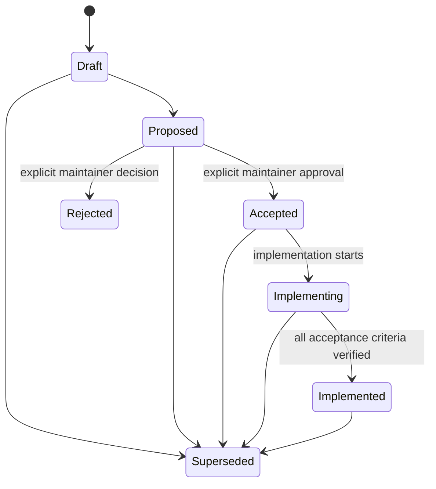

# BigShark RFC Process

Status: Current

Request for Comments (RFC) documents are the decision system for material
engineering changes. They make intent, evidence, tradeoffs, approval, rollout,
and implementation status reviewable over time.

## RFC Index

| RFC | Subject | Status | Owners |
| --- | --- | --- | --- |
| [0001](0001-engineering-architecture.md) | BigShark Engineering Architecture | Implementing | Engine, platform integrations, developer experience |
| [0002](0002-protobuf-engine-protocol.md) | Protobuf Engine Protocol | Implementing | Protocol, engine host, engine clients |
| [0003](0003-typescript-application-layer.md) | Strict TypeScript Application and Integration Layer | Implemented | Applications, platform integrations, engine clients, tools |

`0000-template.md` is the authoring template and does not consume an RFC
number.

## When an RFC Is Required

An RFC is mandatory for:

- cross-module architecture or dependency-direction changes;
- external or engine-facing protocols;
- persisted data, model artifact, or session format changes;
- platform adapter boundaries;
- production solver architecture or strategy model changes;
- long-lived extension points;
- migrations that require compatibility or rollback;
- repository-wide build, deployment, security, or observability policy.

An RFC is not required for a local bug fix, a narrow implementation detail,
or a documentation correction that preserves established contracts.

## Lifecycle



| Status | Meaning |
| --- | --- |
| `Draft` | Incomplete and not ready for a decision |
| `Proposed` | Complete and ready for explicit maintainer review |
| `Accepted` | Explicitly approved; implementation may start |
| `Implementing` | Approved implementation is in progress |
| `Implemented` | Acceptance criteria and verification are complete |
| `Rejected` | Explicitly declined |
| `Superseded` | Replaced by another numbered RFC |

An agent may author `Draft` or `Proposed`. It must never infer `Accepted`,
`Rejected`, or `Implemented`. Those transitions require explicit maintainer
approval or the implementation evidence required by the RFC.

## Metadata

Every RFC begins with quoted scalar YAML front matter:

```yaml
---
rfc: "0001"
subject: "Example Subject"
status: "Proposed"
authors: "BigShark maintainers"
created: "2026-09-13"
updated: "2026-09-13"
owners: "engine, protocol"
supersedes: ""
superseded-by: ""
---
```

- `rfc` matches the four-digit filename prefix.
- `subject` matches the top-level heading.
- `owners` names modules or ownership areas, not individual implementers.
- `supersedes` and `superseded-by` contain comma-separated RFC numbers or an
  empty string.
- Dates use `YYYY-MM-DD`.

## Required Sections

Every RFC must contain these level-two sections:

1. Summary
2. Motivation
3. Goals
4. Non-Goals
5. Current State and Evidence
6. Design Principles
7. Proposed Design
8. Dependency Rules
9. Compatibility and Migration
10. Security and Operational Impact
11. Alternatives Considered
12. Risks
13. Verification Plan
14. Rollout Plan
15. Rollback Plan
16. Open Questions
17. Acceptance Criteria
18. Decision

Use [the RFC template](0000-template.md).

## Decision Record

A `Draft` or `Proposed` RFC ends with:

```text
Pending explicit maintainer approval.
```

An accepted RFC records:

```text
Approved by: maintainer identity
Decision date: YYYY-MM-DD
```

A rejected RFC records the rejector, date, and rationale. An accepted RFC is
immutable except for status transitions, implementation evidence, factual
errata, and links to a superseding RFC. Material design changes require a new
RFC.

## Review Standard

Reviewers challenge:

- whether the expected value justifies the complexity;
- whether a smaller local solution satisfies the requirement;
- whether module ownership and dependency direction are correct;
- whether source-of-truth and generated files are clearly separated;
- whether compatibility, rollout, and rollback are credible;
- whether protocol evolution and unknown-field behavior are explicit;
- whether security, fairness, observability, and resource limits are covered;
- whether acceptance criteria are measurable;
- whether implementation can proceed without a flag day.

Current facts, assumptions, proposals, and unresolved questions must be
distinguishable without conversation context.

## Implementation Gate

No implementation of a `Proposed` RFC may begin. After explicit approval:

1. Change the RFC to `Accepted` and record approver and decision date.
2. Create an implementation plan mapped to acceptance criteria.
3. Change status to `Implementing` when implementation starts.
4. Update current architecture, design, and reference documentation as code
   lands.
5. Change status to `Implemented` only after every acceptance criterion is
   verified.

Acceptance authorizes only the scope written in the RFC.

## Automated Checks

Run:

```bash
node bin/check-rfcs.mjs
node bin/check-docs.mjs
```

The RFC check verifies metadata, filename and heading consistency, lifecycle
status, required sections, decision records, unique IDs, dates, and index
membership. It is also registered as the `rfc` CTest.

The repository skill at `.codex/skills/rfc-authoring/SKILL.md` defines the
agent workflow. `.trae/skills`, `.agents/skills`, and `.claude/skills` resolve
to the same canonical skill content.
