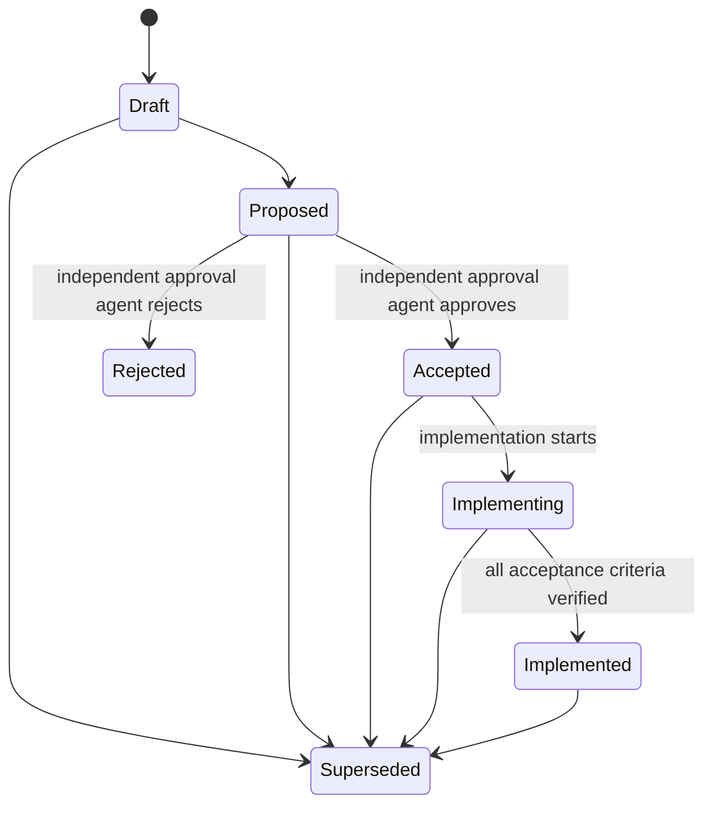

# BigShark RFC Process

Status: Current

Request for Comments (RFC) documents are the decision system for material
engineering changes. They make intent, evidence, tradeoffs, approval, rollout,
and implementation status reviewable over time.

RFC approval is delegated to a separately launched approval agent. User
confirmation is not required for RFC acceptance. The author cannot approve
their own RFC.

## RFC Index

| RFC | Subject | Status | Owners |
| --- | --- | --- | --- |
| [0001](0001-engineering-architecture.md) | BigShark Engineering Architecture | Implementing | Engine, platform integrations, developer experience |
| [0002](0002-protobuf-engine-protocol.md) | Protobuf Engine Protocol | Implementing | Protocol, engine host, engine clients |
| [0003](0003-typescript-application-layer.md) | Strict TypeScript Application and Integration Layer | Implemented | Applications, platform integrations, engine clients, tools |
| [0004](0004-heads-up-blueprint.md) | Heads-Up Multi-Size Blueprint Training | Implementing | Poker, solver, benchmarks |
| [0005](0005-strategy-artifacts-and-resolving.md) | Strategy Artifacts and Bounded Heads-Up Resolving | Accepted | Artifact boundary, solver, policy, service, protocol, host |
| [0006](0006-extended-poker-utility.md) | Extended Poker Utility and Multiway Evaluation | Implementing | Poker, solver, benchmarks, protocol, service |
| [0007](0007-preflop-profile-abstraction.md) | Preflop Profile Abstraction and Artifact Coexistence | Implementing | Poker, solver, artifact boundary, benchmarks |
| [0008](0008-unified-n-player-architecture.md) | Unified N-Player Engine Architecture | Implementing | Poker, solver, policy, service, protocol, artifact boundary |
| [0009](0009-unified-engine-delivery.md) | Unified Engine Delivery and Live Promotion | Implementing | Poker, solver, abstraction, artifact boundary, resolver, resident, protocol, engine host, River adapter, benchmarks |
| [0010](0010-multiway-frontier-evaluation.md) | Multiway Frontier Evaluation and N-Way Preflop Training | Proposed | Engine, solver, artifact boundary, benchmarks |

`0000-template.md` is the authoring template and does not consume an RFC
number.

## When an RFC Is Required

An RFC is mandatory for:

- cross-module architecture or dependency-direction changes;
- external or engine-facing protocols;
- persisted data, model artifact, or session format changes;
- platform adapter boundaries;
- production solver architecture or strategy model changes;
- long-lived extension points;
- migrations that require compatibility or rollback;
- repository-wide build, deployment, security, or observability policy.

An RFC is not required for a local bug fix, a narrow implementation detail,
or a documentation correction that preserves established contracts.

## Lifecycle



| Status | Meaning |
| --- | --- |
| `Draft` | Incomplete and not ready for a decision |
| `Proposed` | Complete and ready for independent approval-agent review |
| `Accepted` | Explicitly approved by an independent agent; implementation may start |
| `Implementing` | Approved implementation is in progress |
| `Implemented` | Acceptance criteria and verification are complete |
| `Rejected` | Explicitly declined |
| `Superseded` | Replaced by another numbered RFC |

The author may set `Draft` or `Proposed`. A separate approval agent must
explicitly approve or reject the current proposal before the author records
`Accepted` or `Rejected`. `Implemented` requires verified acceptance criteria;
approval alone is not implementation evidence.

## Metadata

Every RFC begins with quoted scalar YAML front matter:

```yaml
---
rfc: "0001"
subject: "Example Subject"
status: "Proposed"
authors: "BigShark maintainers"
created: "2026-09-13"
updated: "2026-09-13"
owners: "engine, protocol"
supersedes: ""
superseded-by: ""
---
```

- `rfc` matches the four-digit filename prefix.
- `subject` matches the top-level heading.
- `owners` names modules or ownership areas, not individual implementers.
- `supersedes` and `superseded-by` contain comma-separated RFC numbers or an
  empty string.
- Dates use `YYYY-MM-DD`.

## Required Sections

Every RFC must contain these level-two sections:

1. Summary
2. Motivation
3. Goals
4. Non-Goals
5. Current State and Evidence
6. Design Principles
7. Proposed Design
8. Dependency Rules
9. Compatibility and Migration
10. Security and Operational Impact
11. Alternatives Considered
12. Risks
13. Verification Plan
14. Rollout Plan
15. Rollback Plan
16. Open Questions
17. Acceptance Criteria
18. Decision

Use [the RFC template](0000-template.md).

## Decision Record

A `Draft` or `Proposed` RFC ends with:

```text
Pending independent approval-agent review.
```

An accepted RFC records:

```text
Author agent: author session or agent ID
Approved by: independent approval agent ID
Decision date: YYYY-MM-DD
Review outcome: Approved
Reviewed scope: RFC revision and sections reviewed
Review summary: Findings, dispositions, evidence, and remaining non-blocking risks
```

A rejected RFC uses `Rejected by:` and `Review outcome: Rejected`, with the
same author, date, scope, and review-summary fields. A request for changes
keeps the RFC `Proposed`; record the findings and resubmit after corrections.
Use actual agent identities and conclusions returned by the review tool.
Never fabricate a review or turn silence, a timeout, or a conditional approval
with unresolved blockers into acceptance.

RFCs 0001-0003 retain their existing maintainer approval records as historical
decisions. This exception is limited to those records; new decisions follow
the approval-agent rule. Changing the approval mechanism does not accept
existing Proposed RFCs or reinterpret their earlier advisory reviews.

An accepted RFC is
immutable except for status transitions, implementation evidence, factual
errata, and links to a superseding RFC. Material design changes require a new
RFC.

## Approval Agent Workflow

1. Finish the proposal and run the RFC and documentation checks.
2. Launch a separate agent that did not author or edit the proposal. Give it
   the RFC, relevant source and tests, overlapping contracts, and this review
   standard. Its task is approval, not implementation or authoring.
3. Require `Approved`, `Changes Requested`, or `Rejected`, with reviewed
   scope, evidence, findings, and residual risks. Blocking questions or
   material correctness, security, compatibility, or feasibility findings
   prevent approval. State scope exclusions explicitly.
4. Resolve requested changes and send the revised proposal back for review.
   Do not switch reviewers merely to bypass unresolved objections. A
   replacement reviewer must receive the outstanding findings and dispositions.
5. Record the independent result in the Decision section, update both
   indexes, and rerun checks. Implementation can then proceed without asking
   the user to approve the RFC.

If separate-agent tools are unavailable or the reviewer fails, retain
`Proposed`, report the blocker, and retry when an independent agent is
available. A role-played self-review is not an independent approval.

This delegation covers RFC design approval only. It does not grant credentials,
cloud spending, live poker authorization, destructive operations outside the
authorized scope, or waive separate release/removal checkpoints. The user can
override or stop work at any time.

## Review Standard

Reviewers challenge:

- whether the expected value justifies the complexity;
- whether a smaller local solution satisfies the requirement;
- whether module ownership and dependency direction are correct;
- whether source-of-truth and generated files are clearly separated;
- whether compatibility, rollout, and rollback are credible;
- whether protocol evolution and unknown-field behavior are explicit;
- whether security, fairness, observability, and resource limits are covered;
- whether acceptance criteria are measurable;
- whether implementation can proceed without a flag day.

Current facts, assumptions, proposals, and unresolved questions must be
distinguishable without conversation context.

## Implementation Gate

No implementation of a `Proposed` RFC may begin. After independent agent approval:

1. Change the RFC to `Accepted` and record the complete approval-agent decision.
2. Create an implementation plan mapped to acceptance criteria.
3. Change status to `Implementing` when implementation starts.
4. Update current architecture, design, and reference documentation as code
   lands.
5. Change status to `Implemented` only after every acceptance criterion is
   verified.

Acceptance authorizes only the scope written in the RFC.

## Automated Checks

Run:

```bash
node bin/check-rfcs.mjs
node bin/check-docs.mjs
```

The RFC check verifies metadata, filename and heading consistency, lifecycle
status, required sections, decision records, unique IDs, dates, and index
membership. Decision checks enforce nonempty review records and distinct
author/approver IDs while preserving the three historical approvals. These
structural checks cannot authenticate an agent session or judge review
quality; the orchestrator must retain actual tool evidence. The checker is
also registered as the `rfc` CTest, with decision-record regression tests in
the native Node test suite.

The repository skill at `.codex/skills/rfc-authoring/SKILL.md` defines the
agent workflow. `.trae/skills`, `.agents/skills`, and `.claude/skills` resolve
to the same canonical skill content.
